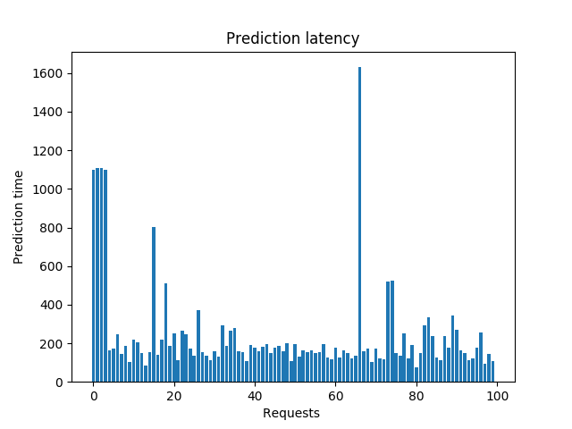

# Torchserve Model Server Benchmarking

The benchmarks measure the performance of TorchServe on various models and benchmarks. It supports either a number of built-in models or a custom model passed in as a path or URL to the .mar file. It also runs various benchmarks using these models (see benchmarks section below). The benchmarks are executed in the user machine through a python3 script in case of jmeter and a shell script in case of apache benchmark. TorchServe is run on the same machine in a docker instance to avoid network latencies. The benchmark must be run from within `serve/benchmarks`

We currently support benchmarking with JMeter, Apache Bench and Locust. One can also profile backend code with snakeviz.

* [Benchmarking with Apache Bench](#benchmarking-with-apache-bench)
* [Auto Benchmarking with Apache Bench](#auto-benchmarking-with-apache-bench)
* [Benchmarking and Profiling with JMeter](jmeter.md)

⚠️**Please Note**⚠️ In future we will deprecate Apache Bench in favor of locust.

# Benchmarking with Locust/Apache Bench

## Installation

It assumes that you have followed quick start/installation section and have required pre-requisites i.e. python3, java and docker [if needed]. If not then please refer [quick start](../README.md) for setup.

### pip dependencies

`pip install -r requirements-ab.txt`

### install apache2-utils

* Ubuntu

```
apt-get install apache2-utils
```

* macOS

Apache Bench is available on Mac by default. You can test by running ```ab -h```

* Windows
    - Download apache binaries from [Apache Lounge](https://www.apachelounge.com/download/)
    - Extract and place the contents at some location e.g.: `C:\Program Files\`
    - Add this path `C:\Program Files\Apache24\bin`to the environment variable PATH.
    NOTE - You may need to  install Visual C++ Redistributable for Visual Studio 2015-2019.

## Benchmark
### Run benchmark
This command will run the AB benchmark with default parameters. It will start a Torchserve instance locally, register Resnet-18 model, and run 100 inference requests with a concurrency of 10.
Refer [parameters section](#benchmark-parameters) for more details on configurable parameters.

`python benchmark-ab.py`

To switch between Apache Bench and Locust you can set the --benchmark-backend/-bb parameter to either "ab" or "locust".

### Run benchmark using a config file
The config parameters can be provided using cmd line args and a config json file as well.
This command will use all the configuration parameters given in config.json file.
`python benchmark-ab.py --config config.json`. The other parameters like config.properties, inference_model_url can also be added in the config.json.

### Sample config file
```json
{
  "url":"https://torchserve.pytorch.org/mar_files/squeezenet1_1.mar",
  "requests": 1000,
  "concurrency": 10,
  "input": "../examples/image_classifier/kitten.jpg",
  "exec_env": "docker",
  "gpus": "2"
}
```
### Benchmark parameters
The following parameters can be used to run the AB benchmark suite.
- url: Input model URL. Default: `https://torchserve.pytorch.org/mar_files/squeezenet1_1.mar`
- device: Execution device type. Default: cpu
- exec_env: Execution environment. Default: docker
- concurrency: Concurrency of requests. Default: 10
- requests: Number of requests. Default: 100
- batch_size: The batch size of the model. Default: 1
- batch_delay: Max batch delay of the model. Default:200
- workers: Number of worker thread(s) for model
- input: Input file for model
- content_type: Input file content type.
- image: Custom docker image to run Torchserve on. Default: Standard public Torchserve image
- docker_runtime: Specify docker runtime if required
- ts: Use Already running Torchserve instance. Default: False
- gpus: Number of gpus to run docker container with. By default it runs the docker container on CPU.
- backend_profiling: Enable backend profiling using CProfile. Default: False
- generate_graphs: Enable generation of Graph plots. Default False
- config_properties: Path to config.properties file. Default: config.properties in the benchmark directory
- inference_model_url: Inference function url - can be either for predictions or explanations. Default: predictions/benchmark.
- config: All the above params can be set using a config JSON file. When this flag is used, all other cmd line params are ignored.

### Run benchmark with a test plan
The benchmark also comes with pre-configured test plans which can be used directly to set parameters. Refer to available [test plans](#test-plans) for more details.
`python benchmark-ab.py <test plan>`

### Run benchmark with a customized test plan
This command will run Torchserve locally and perform benchmarking on the VGG11 model with test plan `soak` test plan soak has been configured with default Resnet-18 model, here we override it by providing extra parameters. Similarly, all parameters can be customized with a Test plan

`python benchmark-ab.py soak --url https://torchserve.pytorch.org/mar_files/vgg11.mar`

### Run benchmark in docker
This command will run Torchserve inside a docker container and perform benchmarking with default parameters. The docker image used here is the latest CPU based torchserve image available on the docker hub. The custom image can also be used using the `--image` parameter.
`python benchmark-ab.py --exec_env docker`

### Run benchmark in GPU docker
This command will run Torchserve inside a docker container with 4 GPUs and perform benchmarking with default parameters. The docker image used here is the latest GPU based torchserve image available on the docker hub. The custom image can also be used using the `--image` parameter.
`python benchmark-ab.py --exec_env docker --gpus 4`


### Examples

* TORCHSERVE SERVING PREDICTIONS

```
python benchmark-ab.py --url https://torchserve.pytorch.org/mar_files/mnist.mar --content_type application/png --config_properties config.properties --inference_model_url predictions/benchmark --input ../examples/image_classifier/mnist/test_data/0.png
```

* TORCHSERVE SERVING EXPLANATIONS

```
python benchmark-ab.py --url https://torchserve.pytorch.org/mar_files/mnist.mar --content_type application/png --config_properties config.properties --inference_model_url explanations/benchmark --input ../examples/image_classifier/mnist/test_data/0.png
```

* KSERVE SERVING PREDICTIONS

```
python benchmark-ab.py --url https://torchserve.pytorch.org/mar_files/mnist.mar --content_type application/json --config_properties config_kf.properties --inference_model_url v1/models/benchmark:predict --input ../kubernetes/kserve/kf_request_json/v1/mnist.json
```

- KSERVE SERVING EXPLANATIONS

```
python benchmark-ab.py --url https://torchserve.pytorch.org/mar_files/mnist.mar --content_type application/json --config_properties config_kf.properties --inference_model_url v1/models/benchmark:explain --input ../kubernetes/kserve/kf_request_json/v1/mnist.json
```

* TORCHSERVE SERVING PREDICTIONS WITH DOCKER

```
python benchmark-ab.py --url https://torchserve.pytorch.org/mar_files/mnist.mar --content_type application/png --config_properties config.properties --inference_model_url predictions/benchmark --input ../examples/image_classifier/mnist/test_data/0.png --exec_env docker
```

### Test plans
Benchmark supports pre-defined, pre-configured params that can be selected based on the use case.
1. soak: default model url with requests =100000 and concurrency=10
2. vgg11_1000r_10c: vgg11 model with requests =1000 and concurrency=10
3. vgg11_10000r_100c: vgg11 model with requests =10000 and concurrency=100
4. resnet152_batch: Resnet-152 model with batch size = 4, requests =1000 and concurrency=10
5. resnet152_batch_docker: Resnet-152 model with batch size = 4, requests =1000, concurrency=10 and execution env = docker

Note: These pre-defined parameters in test plan can be overwritten by cmd line args.

### Benchmark reports
The reports are generated at location "/tmp/benchmark/"
- CSV report: /tmp/benchmark/ab_report.csv
- latency graph: /tmp/benchmark/predict_latency.png
- torchserve logs: /tmp/benchmark/logs/model_metrics.log
- raw ab output: /tmp/benchmark/result.txt

### Sample output CSV
| Benchmark | Model | Concurrency | Requests | TS failed requests | TS throughput | TS latency P50 | TS latency P90| TS latency P90 | TS latency mean | TS error rate | Model_p50 | Model_p90 | Model_p99 |
|---|---|---|---|---|---|---|---|---|---|---|---|---| ---|
| AB | [squeezenet1_1](https://torchserve.pytorch.org/mar_files/squeezenet1_1.mar) | 10 | 100 | 0 | 15.66 | 512 | 1191 | 2024 | 638.695 | 0 | 196.57 | 270.9 | 106.53|

### Sample latency graph


# Auto Benchmarking with Apache Bench
`auto_benchmark.py` runs Apache Bench on a set of models and generates an easy to read `report.md` once [Apache bench installation](https://github.com/pytorch/serve/tree/master/benchmarks#installation-1) is done.

## How does the auto benchmark script work?
Auto Benchmarking is tool to allow users to run multiple test cases together and generates final report. Internally, the workflow is:
1. read input `benchmark_config.yaml` file
2. install TorchServe and its dependencies if input parameter `--skip false`
3. generate models' json files for `benchmark-ab.py`
4. run `benchmark-ab.py` on each test case and generate stats metrics in json format
5. save each test case logs in local `/tmp/ts_benchmark/`
6. generate final `report.md`
7. upload all test results to a local or remote object store as per `benchmark_config.yaml`

## How to Run?
```
cd serve

python benchmarks/auto_benchmark.py -h
usage: auto_benchmark.py [-h] [--input INPUT] [--skip SKIP]

optional arguments:
  -h, --help     show this help message and exit
  --input INPUT  benchmark config yaml file path
  --skip SKIP    true: skip torchserve installation. default: true

python benchmarks/auto_benchmark.py --input benchmarks/benchmark_config_template.yaml --skip true
```

- [benchmark_config_template.yaml](benchmark_config_template.yaml) is a config template yaml file for benchmark automation. Users can add test plans in "models" and create their own benchmark_config.yaml.

- Benchmark automation results are stored in local `/tmp/ts_benchmark`. `/tmp/ts_benchmark/report.md` is the final report. [Here](https://github.com/pytorch/serve/blob/master/benchmarks/sample_report.md) is a sample final report. Each test case's logs are stored in a separate directory under `/tmp/ts_benchmark`. For example:
```
 tree /tmp/ts_benchmark/
/tmp/ts_benchmark/
├── eager_mode_mnist_w4_b1
│   ├── ab_report.csv
│   ├── benchmark.tar.gz
│   └── logs.tar.gz
├── eager_mode_mnist_w4_b2
│   ├── ab_report.csv
│   ├── benchmark.tar.gz
│   └── logs.tar.gz
├── eager_mode_mnist_w8_b1
│   ├── ab_report.csv
│   ├── benchmark.tar.gz
│   └── logs.tar.gz
├── eager_mode_mnist_w8_b2
│   ├── ab_report.csv
│   ├── benchmark.tar.gz
│   └── logs.tar.gz
├── report.md
```

## Github Actions benchmarking
If you need to run your benchmarks on a specific cloud or hardware infrastructure. We highly recommend you fork this repo and leverage the benchmarks in `.github/workflows/benchmark_nightly.yml` which will run the benchmarks on a custom instance of your choice and save the results as a github artifact. To learn more about how to create your own custom runner by following instructions from Github here https://docs.github.com/en/actions/hosting-your-own-runners/adding-self-hosted-runners

The high level approach
1. Create a cloud instance in your favorite cloud provider
2. Configure it so it can talk to github actions by running some shell commands listed here https://docs.github.com/en/actions/hosting-your-own-runners/adding-self-hosted-runners
3. Tag your instances in the runners tab on Github
3. In the `.yml` make sure to use `runs-on [self-hosted, your_tag]`
4. Inspect the results in https://github.com/pytorch/serve/actions and download the artifacts for further analysis
