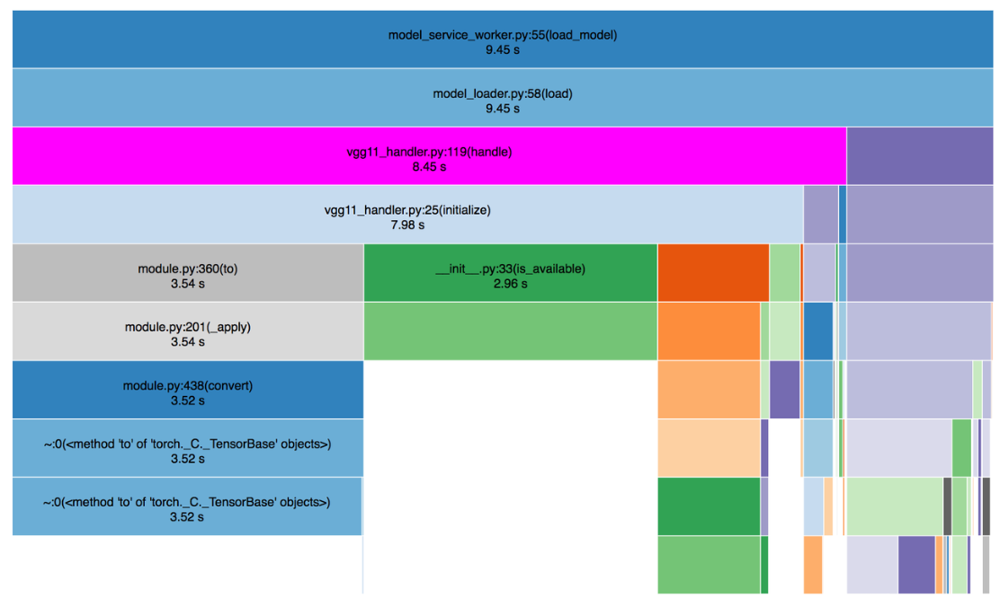

# Torchserve Model Server Benchmarking

The benchmarks measure the performance of TorchServe on various models and benchmarks.  It supports either a number of built-in models or a custom model passed in as a path or URL to the .model file.  It also runs various benchmarks using these models (see benchmarks section below).  The benchmarks are run through a python3 script on the user machine through jmeter.  TorchServe is run on the same machine in a docker instance to avoid network latencies.  The benchmark must be run from within the context of the full TorchServe repo because it executes the local code as the version of TorchServe (and it is recompiled between runs) for ease of development.

We currently support benchmarking with JMeter & Apache Bench. One can also profile backend code with snakeviz.

# Benchmarking with JMeter

## Installation

### Ubuntu

The script is mainly intended to run on a Ubuntu EC2 instance.  For this reason, we have provided an `install_dependencies.sh` script to install everything needed to execute the benchmark on this environment.  All you need to do is run this file and clone the TorchServe repo.
On CPU based instance, use `./install_dependencies.sh`.
On GPU based instance, use `./install_dependencies.sh True`.

### MacOS

For mac, you should have python3 and java installed.  If you wish to run the default benchmarks featuring a docker-based instance of TorchServe, you will need to install docker as well.  Finally, you will need to install jmeter with plugins which can be accomplished by running `mac_install_dependencies.sh`.

### Other

For other environments, manual installation is necessary.  The list of dependencies to be installed can be found below or by reading the ubuntu installation script.

The benchmarking script requires the following to run:
- python3
- A JDK and JRE
- jmeter installed through homebrew or linuxbrew with the plugin manager and the following plugins: jpgc-synthesis=2.1,jpgc-filterresults=2.1,jpgc-mergeresults=2.1,jpgc-cmd=2.1,jpgc-perfmon=2.1
- Docker-ce with the current user added to the docker group
- Nvidia-docker (for GPU)


## Models

The pre-loaded models for the benchmark can be mostly found in the [TorchServe model zoo]
TBD

## Benchmarks

We support several basic benchmarks:
- throughput: Run inference with enough threads to occupy all workers and ensure full saturation of resources to find the throughput.  The number of threads defaults to 100.
- latency: Run inference with a single thread to determine the latency
- ping: Test the throughput of pinging against the frontend
- load: Loads the same model many times in parallel.  The number of loads is given by the "count" option and defaults to 16.
- repeated_scale_calls: Will scale the model up to "scale_up_workers"=16 then down to "scale_down_workers"=1 then up and down repeatedly.
TBD :
- multiple_models: Loads and scales up three models (1. squeeze-net and 2. resnet), at the same time, runs inferences on them, and then scales them down.  Use the options "urlN", "modelN_name", "dataN" to specify the model url, model name, and the data to pass to the model respectively.  data1 and data2 are of the format "&apos;Some garbage data being passed here&apos;" and data3 is the filesystem path to a file to upload.

We also support compound benchmarks:
TBD :
- concurrent_inference: Runs the basic benchmark with different numbers of threads

## Benchmarking by launching docker container: [TBD]

## Benchmarking in dev/local environment:

#### Using local TorchServe instance:

* Install TorchServe using the [install guide](../README.md#install-torchserve)
* Start TorchServe using following command :

```bash
torchserve --start --model-store <path_to_your_model_store>
```
* To start benchmarking execute following commands

```bash
cd serve/benchmarks
python benchmark.py throughput --ts http://127.0.0.1:8080
```

#### By using external docker container for TorchServe:

* Create and start a [docker container for TorchServe](../docker/README.md).
* To start benchmarking execute following commands

```bash
cd serve/benchmarks
python benchmark.py throughput --ts http://127.0.0.1:8080
```

Note:
1) Refer the examples below to run different benchmarking suites on TorchServe.

## Accessing benchmark reports :

The benchmark reports are available at /tmp/TSBenchmark/

## Examples

Run basic latency test on default resnet-18 model\
```./benchmark.py latency```


Run basic throughput test on default resnet-18 model.\
```./benchmark.py throughput```


Run all benchmarks\
```./benchmark.py --all```


Run using the squeeze-net model\
```./benchmark.py latency -m squeeze-net```


Run on GPU (4 gpus)\
```./benchmark.py latency -g 4```


Run with a custom image\
```./benchmark.py latency -i {imageFilePath}```


Run with a custom model (works only for CNN based models, which accept image as an input for now. We will add support for more input types in future to this command. )\
```./benchmark.py latency -c {modelUrl} -i {imageFilePath}```


Run with custom options\
```./benchmark.py repeated_scale_calls --options scale_up_workers 100 scale_down_workers 10```


Run against an already running instance of TorchServe\
```./benchmark.py latency --ts 127.0.0.1``` (defaults to http, port 80, management port = port + 1)\
```./benchmark.py latency --ts 127.0.0.1:8080 --management-port 8081```\
```./benchmark.py latency --ts https://127.0.0.1:8443```


Run verbose with only a single loop\
```./benchmark.py latency -v -l 1```


## Benchmark options

The full list of options can be found by running with the -h or --help flags.

# Benchmarking with Apache Bench

## Installation 

### For Ubuntu

```
apt-get install apache2-utils

```

Apache Bench is installed in Mac by default. You can test by running ```ab -h```

## Benchmark 

To run benchmarks execute benchmark script as follows 

```
./benchmark-ab.sh --model  vgg11 --url https://torchserve-mar-files.s3.amazonaws.com/vgg11.mar --bsize 1 --bdelay 50 --worker 4 --input ../examples/image_classifier/kitten.jpg --requests 20 --concurrency 10
```

This would produce a output similar to in /tmp/benchmark/report.txt

```
Preparing config...
starting torchserve...
Waiting for torchserve to start...
torchserve started successfully
Registering model ...
{
  "status": "Workers scaled"
}
Executing Apache Bench tests ...
Executing inference performance test
Unregistering model ...
{
  "status": "Model \"vgg11\" unregistered"
}
Execution completed
Grabing performance numbers

CPU/GPU: cpu
Model: vgg11
Concurrency: 10
Requests: 20
Model latency P50: 269.49
Model latency P90: 369.21
Model latency P99: 370.55
TS throughput: 12.57
TS latency P50: 702
TS latency P90: 907
TS latency P99: 1012
TS latency mean: 795.813
TS error rate: 0.000000%
CSV : cpu, vgg11, 1, 10, 20, 269.49, 369.21, 370.55, 12.57, 702, 907, 907, 1012, 795.813, 0.000000
```


# Profiling

## Frontend

The benchmarks can be used in conjunction with standard profiling tools such as JProfiler to analyze the system performance.  JProfiler can be downloaded from their [website](https://www.ej-technologies.com/products/jprofiler/overview.html).  Once downloaded, open up JProfiler and follow these steps:

1. Run TorchServe directly through gradle (do not use docker).  This can be done either on your machine or on a remote machine accessible through SSH.
2. In JProfiler, select "Attach" from the ribbon and attach to the ModelServer.  The process name in the attach window should be "com.amazonaws.ml.ts.ModelServer".  If it is on a remote machine, select "On another computer" in the attach window and enter the SSH details.  For the session startup settings, you can leave it with the defaults.  At this point, you should see live CPU and Memory Usage data on JProfiler's Telemetries section.
3. Select Start Recordings in JProfiler's ribbon
4. Run the Benchmark script targeting your running TorchServe instance.  It might run something like `./benchmark.py throughput --ts https://127.0.0.1:8443`.  It can be run on either your local machine or a remote machine (if you are running remote), but we recommend running the benchmark on the same machine as the model server to avoid confounding network latencies.
5. Once the benchmark script has finished running, select Stop Recordings in JProfiler's ribbon

Once you have stopped recording, you should be able to analyze the data.  One useful section to examine is CPU views > Call Tree and CPU views > Hot Spots to see where the processor time is going.

## Backend

The benchmarks can also be used to analyze the backend performance using cProfile. To benchmark a backend code, 

1. Enable Benchmarks in TorchServe code with a boolean flag.
2. Install TorchServe with the updated flag & start torchserve.
3. Register a model & perform inference to collect profiling data. This can be done with the benchmark script described in the previous section.
4. Visualize SnakeViz results. 

#### Enable Benchmarks in TorchServe code with a boolean flag

In the file `ts/model_service_worker.py`, set the constant BENCHMARK to true at the top to enable benchmarking.

If running inside docker,

```
    cd docker
    git clone https://github.com/pytorch/serve.git
    cd serve
    ## set BENCHMARK flag to true
    vim ts/model_service_worker.py
    cd ..
```

#### Install TorchServe with the updated flag & Start Torchserve

```
    pip install .
```

If running inside docker

```
    DOCKER_BUILDKIT=1 docker build --file Dockerfile_dev.cpu -t torchserve:dev .
```
then start docker with /tmp directory mapped to local /tmp
    
#### Register a model & perform inference to collect profiling data.

```
python benchmark.py throughput --ts http://127.0.0.1:8080
```

#### Visualize SnakeViz results
 
To visualize the profiling data using `snakeviz` use following commands:

```bash
pip install snakeviz
snakeviz tsPythonProfile.prof
```


It should start up a web server on your machine and automatically open the page. Note that tha above command will fail if executed on a server where no browser is installed. The backend profiling should generate a visualization similar to the pic shown above. 
