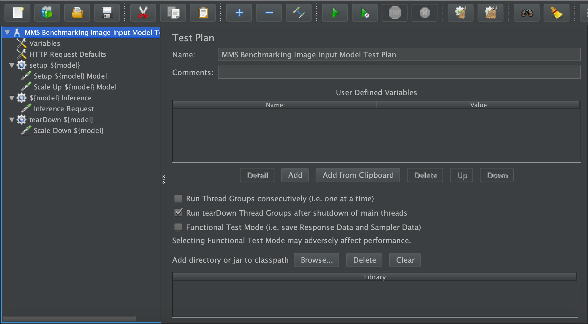
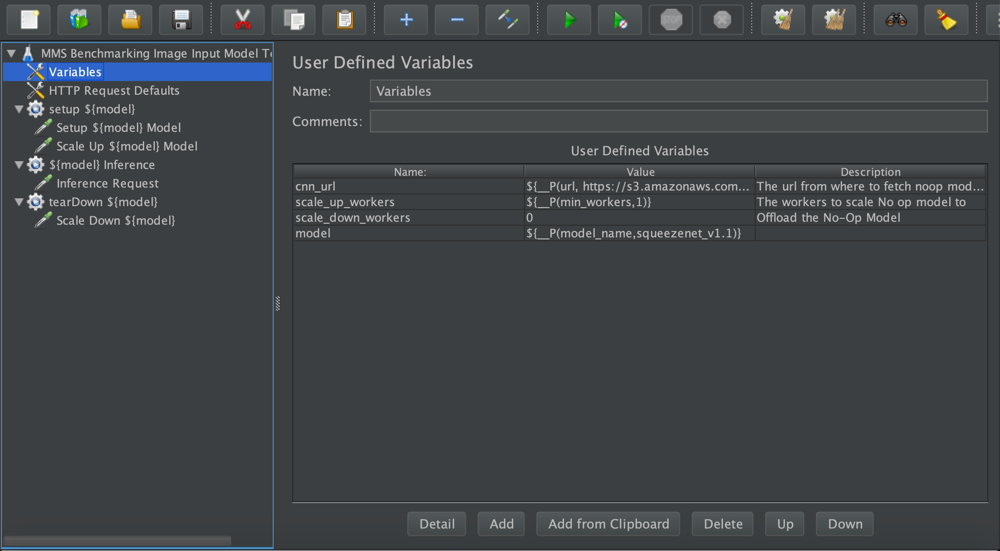
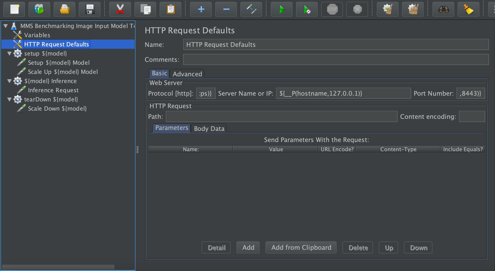
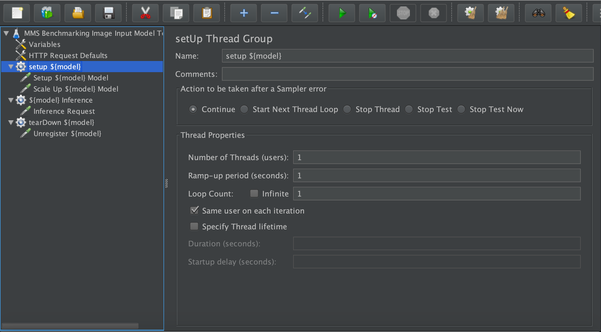
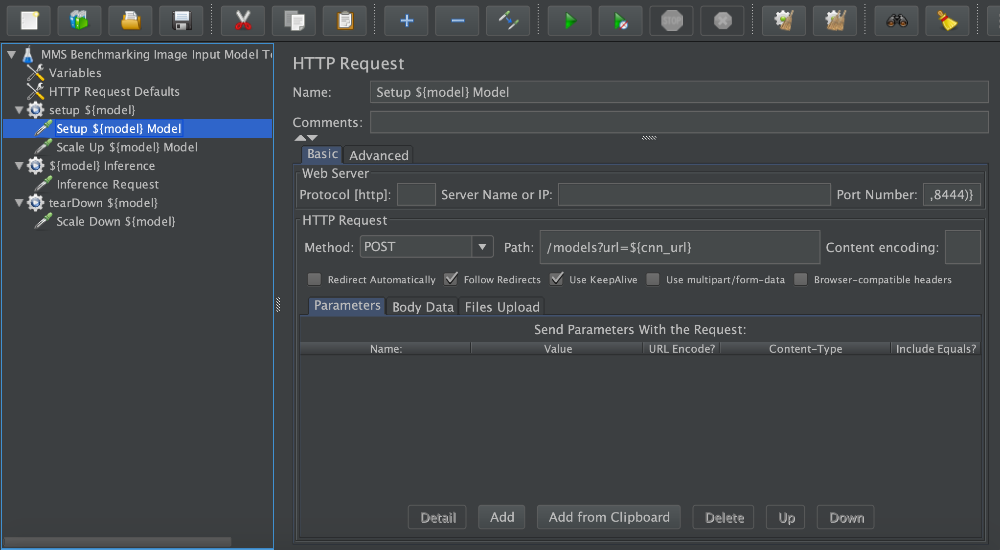
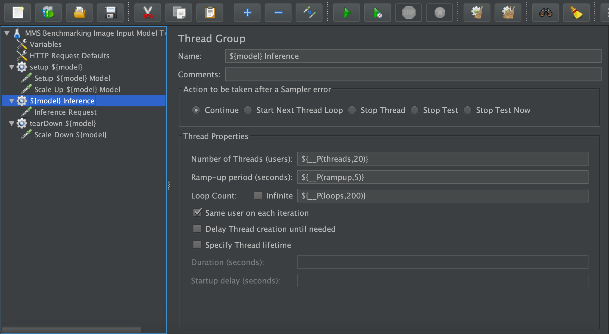
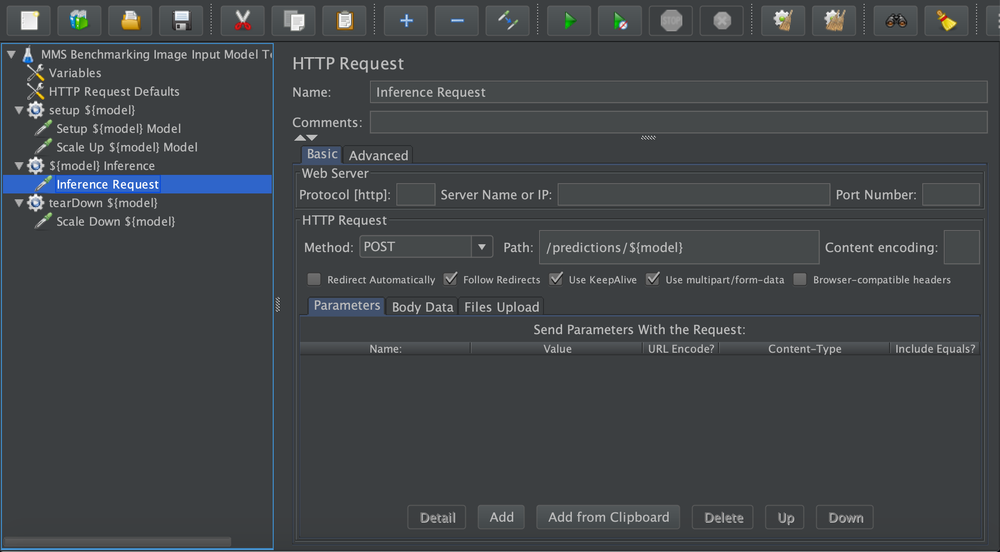
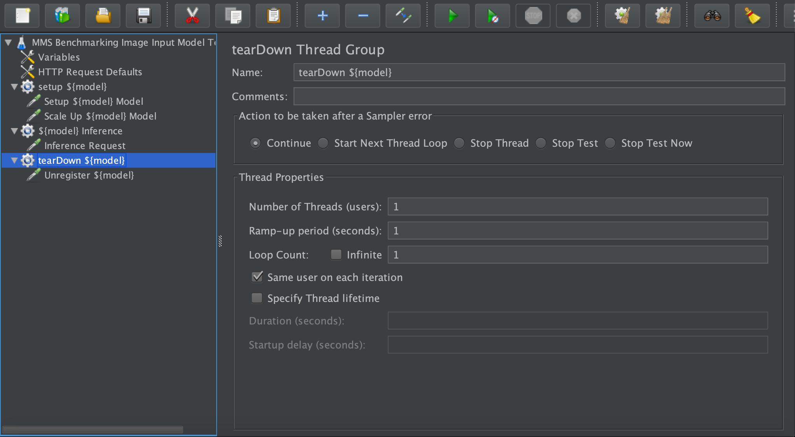
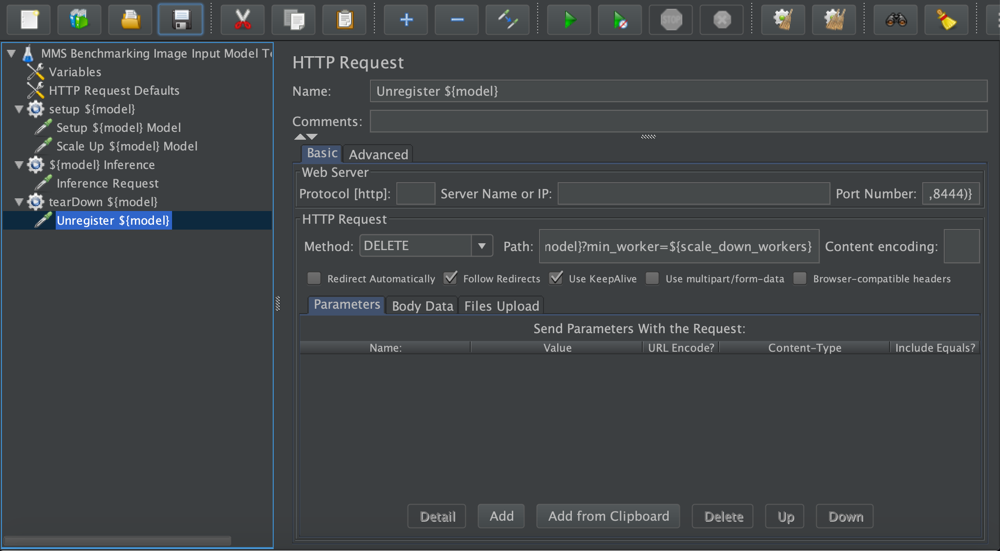

## Adding a new test plan for torchserve

A new Jmeter test plan for torchserve benchmark can be added as follows:

* Assuming you know how to create a jmeter test plan. If not then please use this jmeter [guide](https://jmeter.apache.org/usermanual/build-test-plan.html)
* Here, we will show you how 'MMS Benchmarking Image Input Model Test Plan' plan can be added.
This test plan does following: 
  
    * Register a model - `default is resnet-18`
    * Scale up to add workers for inference
    * Send Inference request in a loop
    * Unregister a model
    
    (NOTE - This is an existing plan in `serve/benchmarks`)
* Open jmeter GUI
e.g. on macOS, type `jmeter` on commandline
* Add new test plan by clicking `+` button and name it as `MMS Benchmarking Image Input Model Test Plan`

* Right Click on test plan to add `User Defined Variables` and Initialize variables which will be used in different sections of this test plan

* Right Click on test plan to add `HTTP Request Defaults` and Initialize HTTP request defaults which will be used for register model, scale-up, inference and unregister request

* Right Click on test plan to add `setup Thread Group` and configured required details indicated in the following screenshot

* Right Click on `setup Thread Group` to add `HTTP Request` and configure `register` request per given screenshot

* Right Click on `setup Thread Group` to add `HTTP Request` and configure `scale-up` request per given screenshot

* Right Click on test plan to add `Thread Group` for inference request loop and configured required details indicated in the following screenshot

* Right Click on inference `Thread Group` to add `HTTP Request` and configure `inference` request per given screenshot

* Right Click on test plan to add `tearDown Thread Group` and configured required details indicated in the following screenshot

* Right Click on `tearDown Thread Group` to add `HTTP Request` and configure `unregister` request per given screenshot

* Once the test plan is ready, save it as <test-plan-name.jmx> in benchmarks/jmx folder.

* Accordingly, make changes to benchmarks/benchmark.py to include support for your new test plan.

## Arguments to jmeter
Following are the arguments passed to jmeter via `benchmark.py` script.
You can create variables or use them directly in your test plan.
* hostname - torchserve hostname
* port - torchserve port
* protocol - http or https
* url - model url to be registered for prediction
* model_name - name of the model
* rampup - rampup period (seconds)
* loop - loop count
* threads - number of jmeter threads
* input_filepath - input image file for prediction
* min_workers - minimum workers to be launch for serving inference request

NOTE - 

* In above, screenshot, some variables/input box are partially displayed. You can view details by opening an existing test cases from serve/benchmarks/jmx for details.
* Apart from above argument, you can define custom arguments specific to you test plan if needed. Refer `benchmark.py` for details