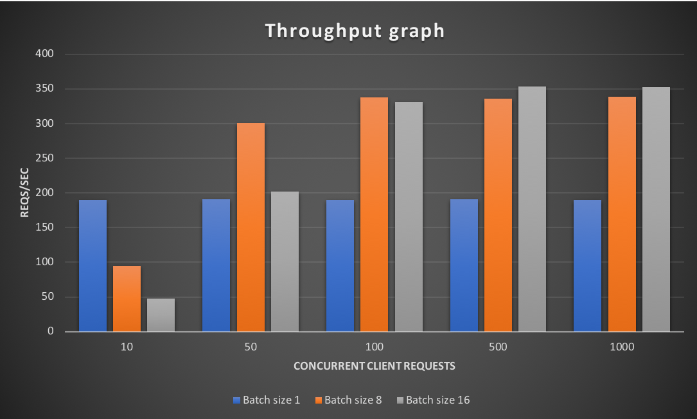

# Batch Inference with Model Server

## Contents of this Document
* [Introduction](#introduction)
* [Batching example](#batch-inference-with-mms-using-resnet-152-model)
  * [Model Handler Code](#model-handler-a.k.a.-entry-point)
    * [Initialization logic](#initialization-logic)
    * [Preprocess logic](#preprocess-logic)
    * [Inference logic](#inference-logic)
    * [Postprocess logic](#postprocess-logic)
  * [MMS Model Configuration](#mms-model-configuration)
* [Demo](#demo-to-configure-mms-with-batch-supported-model)
  * [Prerequisites](#pre-requisites)
  * [Running MMS with batch inference](#loading-resnet-152-which-handles-batch-inferences)
* [Performance results](#performance-benchmarking)
* [Conclusion](#conclusion)   

## Introduction

Batching in the Machine-Learning/Deep-Learning is a process of aggregating inference-requests and sending this aggregated requests through the ML/DL framework for inference at once.
Model Server (MMS) was designed to natively support batching of incoming inference requests. This functionality provides customer using MMS to optimally utilize their host resources, because most ML/DL frameworks
are optimized for batch requests. This optimal utilization of host resources in turn reduces the operational expense of hosting an inference service using MMS. In this document we will go through an example of how this is done
and compare the performance of running a batched inference against running single inference.

## Prerequisites:
Before jumping into this document, please go over the following docs
1. [What is MMS?](../README.md)
1. [What is custom service code?](custom_service.md)

## Batch Inference with MMS using ResNet-152 model
To support batching of inference requests, MMS needs the following:
1. MMS Model Configuration: MMS provides means to configure "Max Batch Size" and "Max Batch Delay" through "POST /models" API. 
   MMS needs to know the maximum batch size that the model can handle and the maximum delay that MMS should wait for, to form this request-batch. 
2. Model Handler code: MMS requires the Model Handler to handle the batch of inference requests. 

In this section we will go over the configuration of MMS to handle batching and the actual code changes required at the model level to handle batching. 

Lets begin with the "Model Handler Code" component and see how we can convert an existing Resnet-152 model from the [MMS Model Zoo](https://github.com/awslabs/mxnet-model-server/blob/master/docs/model_zoo.md#resnet-152)
into a model which can process a batch of requests. For a full working code, refer to [mxnet_vision_batching.py](https://github.com/awslabs/mxnet-model-server/blob/master/examples/model_service_template/mxnet_vision_batching.py)

### Model Handler a.k.a. entry-point

The handler method is the entrypoint to the model. When MMS receives a request for a model, MMS forwards this request to the `handler` method associated with the model.
A model's `handler` entry-point is expected to have the following logic:
1. Loading Model: The handler code should have logic to load the model-artifacts onto the DL/ML Framework, as a part of initialization. In our example, the DL Framework is MXNet
1. Once initialized, this handler method is given requests for processing. So, the handler is expected to have the logic for: 
    1. Logic for `preprocess`ing request: The handler converts the incoming request to a format understandable by the ML/DL framework. In our example, that is an NDArray.
    1. Logic for `inference`: The handler should take the preprocessed data and pass it through through the DL Framework for inference.
    1. Logic for `postprocess`ing: The handler should take the output of the inference-logic and `postprocess` this data. This is then sent back the clients as the final result.

Let's look into how we define the `initialize`, `preprocess`, `inference` and `postprocess` logic in detail.

#### Initialization logic
As a part of the handler's parameters, MMS sends a `context` object to the handler. Besides everything else, this `context` object also contains the batch-size that this model was configured to handle. 
The configuration for the model comes from the `POST /models` call and this is explained in detail in the below section [MMS Model Configuration](#mms-model-configuration). Lets look at a code snippet,

```python
class MXNetVisionServiceBatching(object):
...
    def initialize(self, context):
        ...
        self._batch_size = context.system_properties["batch_size"]
        data_shapes = []
        # Read the data shape
        data_shapes[0] = self._batch_size
        ...
        # Bind the MXNet module with the data shape NCHW where N is the batch size
        self.mx_model.bind(for_training=False, data_shapes=data_shapes)
        ...
...        
```
This initialization logic binds the MXNet module with a batch-size that the model is configured with. For example, if the incoming requests are images with RGB layers and the input to the network is
or size [3,224, 224], the batch adds an additional dimension to this data. If the batch size configured with `POST /models` API is 8, the input to the DL Framework becomes [8, 3, 224, 224]. 

#### Preprocess logic
Once a model is initialized, the DL framework (in our case MXNet) expects a `batch_size` number of requests. Hence, the preprocessing logic should make sure that no matter how many requests
come into the handler, it always returns the `batch_size` number of NDArray elements to be used in the inference logic. Lets look at a sample `preprocess` logic below 

```python
import mxnet as mx

class MXNetVisionServiceBatching(object):
...
    def initialize(self, context):
    ...
...
    def preprocess(self, request):
        img_list = []
        param_name = self.signature['inputs'][0]['data_name']
        input_shape = self.signature['inputs'][0]['data_shape']
        # We are assuming input shape is NCHW
        [c, h, w] = input_shape[1:]

        for idx, data in enumerate(request):
            img = data.get(param_name)
            if img is None:
                img = data.get("body")

            if img is None:
                img = data.get("data")

            if img is None or len(img) == 0:
                logging.error("Error processing request")
                self.erroneous_reqs.add(idx)
                continue

            try:
                img_arr = mx.image.imdecode(img, 1, True, None)
            except Exception as e:
                logging.error(e, exc_info=True)
                self.erroneous_reqs.add(idx)
                continue

            img_arr = mx.image.imresize(img_arr, w, h, 2)
            img_arr = mx.nd.transpose(img_arr, (2, 0, 1))
            self._num_requests = idx + 1
            img_list.append(img_arr)
        
        logging.debug("Worker :{} received {} requests".format(os.getpid(), self._num_requests))
        reqs = mx.nd.stack(*img_list)
        reqs = reqs.as_in_context(self.mxnet_ctx)

        if (self._batch_size - self._num_requests) != 0:
            padding = mx.nd.zeros((self._batch_size - self._num_requests, c, h, w), self.mxnet_ctx, 'uint8')
            reqs = mx.nd.concat(reqs, padding, dim=0)

        return reqs
```
**NOTE: The above code handles the case where the `handler` doesn't receive a `batch_size` number of requests. This is because MMS waits for a `max_batch_delay` amount of time to receive 
`batch_size` number of requests. If the `max_batch_delay` timer times out before receiving `batch_size` number of requests, MMS bundles what ever requests it received
and sends it to the handler for processing.**

#### Inference logic
The inference logic is similar to the inference logic of processing single requests. Since this isn't as interesting, we will skip explaining this in detail. Sample logic is shown below for
completeness of this document.

```python
import mxnet as mx
from collections import namedtuple

class MXNetVisionServiceBatching(object):
...
    def initialize(self, context):
        ...
...
    def preprocess(self, request):
        ...
...
    def inference(self, model_input):
        batch = namedtuple('Batch', ['data'])
        if self.error is not None:
            return None

        self.mx_model.forward(batch([model_input]), is_train=False)
        outputs = self.mx_model.get_outputs()
        res = mx.ndarray.split(outputs[0], axis=0, num_outputs=outputs[0].shape[0])
        res = [res] if not isinstance(res, list) else res
        return res
...    
``` 

Lets move onto post-processing. 

 
#### Postprocess logic
The output of inference logic is fed to the post-processing logic. As we saw before, during preprocessing, if there aren't `batch_size` number of requests, preprocessing logic
pads the difference with 0's. These are artificially created requests sent to the module for inference. **In post-process we should ignore these artificially padded requests**. 
Lets look at the sample logic

```python
import mxnet as mx
from collections import namedtuple

class MXNetVisionServiceBatching(object):
...
    def initialize(self, context):
        ...
...
    def preprocess(self, request):
        ...
...
    def inference(self, model_input):
        ...
    def postprocess(self, data):
        res = []
        for idx, resp in data[:self._num_requests]:
            if idx not in self.erroneous_reqs:
                res.append(self.top_probability(resp, self.labels, top=5))
            else:
                res.append(ts)
        return res
...
```

In the above code, we iterate only until **self._num_requests**. This variable is assigned a value during the preprocessing step. This logic ensures that the postprocess logic is run only
for the actual requests coming from external clients.


### MMS Model Configuration
To configure MMS to use the batching feature, you would have to provide the batch configuration information through [**POST /models** API](https://github.com/awslabs/mxnet-model-server/blob/master/docs/management_api.md#register-a-model).
The configuration that we are interested in is the following: 
1. `batch_size`: This is the maximum batch size that a model is expected to handle. 
2. `max_batch_delay`: This is the maximum batch delay time MMS waits to receive `batch_size` number of requests. If MMS doesn't receive `batch_size` number of requests
before this timer time's out, it sends what ever requests that were received to the model `handler`.

Let's look at an example using this configuration
```bash
# The following command will register a model "resnet-152.mar" and configure MMS to use a batch_size of 8 and a max batch delay of 50 milli seconds. 
curl -X POST "localhost:8081/models?url=resnet-152.mar&batch_size=8&max_batch_delay=50"
```
 
These configurations are used both in MMS and in the model's custom-service-code (a.k.a the handler code).
1. MMS: MMS associates the batch related configuration with each model. The frontend then tries to aggregate the batch-size number of requests and send it to the backend.
2. Model Custom Handler Code: The handler code is given the information about the batch-size. The handler then uses this information to tell the DL framework about the expected batch size.


## Demo to configure MMS with batch-supported model
In this section lets bring up model server and launch Resnet-152 model, which has been built to handle a batch of request. 

### Pre-requisites
Follow the main [Readme](https://github.com/awslabs/mxnet-model-server/blob/master/README.md) and install all the required packages including "mxnet-model-server"

### Loading Resnet-152 which handles batch inferences
* Start the model server. In this example, we are starting the model server to run on inference port 8080 and management port 8081.
```text
$ cat config.properties
...
inference_address=http://0.0.0.0:8080
management_address=http://0.0.0.0:8081
...
$ mxnet-model-server --start
```

* Verify that the MMS is up and running
```text
$ curl localhost:8080/ping
{
  "status": "Healthy"
}
```

* Now lets launch resnet-152 model, which we have built to handle batch inference. Since this is an example, we are going to launch 1 worker which handles a batch size of 8
with a max-batch-delay of 10ms. 
```text
$ curl -X POST "localhost:8081/models?url=https://s3.amazonaws.com/model-server/model_archive_1.0/examples/resnet-152-batching/resnet-152.mar&batch_size=8&max_batch_delay=10&initial_workers=1"
{
  "status": "Processing worker updates..."
}
```

* Verify that the workers were started properly
```text
$ curl localhost:8081/models/resnet-152
{
  "modelName": "resnet-152",
  "modelUrl": "https://s3.amazonaws.com/model-server/model_archive_1.0/examples/resnet-152-batching/resnet-152.mar",
  "runtime": "python",
  "minWorkers": 1,
  "maxWorkers": 1,
  "batchSize": 8,
  "maxBatchDelay": 10,
  "workers": [
    {
      "id": "9008",
      "startTime": "2019-02-19T23:56:33.907Z",
      "status": "READY",
      "gpu": false,
      "memoryUsage": 607715328
    }
  ]
}
```

* Now let's test this service. 
  * Get an image to test this service
    ```text
    $ curl -O https://s3.amazonaws.com/model-server/inputs/kitten.jpg
    ``` 
  * Run inference to test the model
    ```text
      $ curl -X POST localhost/predictions/resnet-152 -T kitten.jpg
      {
        "probability": 0.7148938179016113,
        "class": "n02123045 tabby, tabby cat"
      },
      {
        "probability": 0.22877725958824158,
        "class": "n02123159 tiger cat"
      },
      {
        "probability": 0.04032370448112488,
        "class": "n02124075 Egyptian cat"
      },
      {
        "probability": 0.00837081391364336,
        "class": "n02127052 lynx, catamount"
      },
      {
        "probability": 0.0006728120497427881,
        "class": "n02129604 tiger, Panthera tigris"
      }
    ```
    
* Now that we have the service up and running, we could run performance tests with the same kitten image as follows. There are multiple tools to measure performance of web-servers. We will use 
[apache-bench](https://httpd.apache.org/docs/2.4/programs/ab.html) to run our performance tests. We chose `apache-bench` for our tests because of the ease of installation and ease of running tests.
Before running this test, we need to first install `apache-bench` on our System. Since we were running this on a ubuntu host, we installed apache-bench as follows
```bash
$ sudo apt-get udpate && sudo apt-get install apache2-utils
```   
Now that installation is done, we can run performance benchmark test as follows. 
```text
$ ab -k -l -n 10000 -c 1000 -T "image/jpeg" -p kitten.jpg localhost:8080/predictions/resnet-152
```
The above test simulates MMS receiving 1000 concurrent requests at once and a total of 10,000 requests. All of these requests are directed to the endpoint "localhost:8080/predictions/resnet-152", which assumes
that resnet-152 is already registered and scaled-up on MMS. We had done this registration and scaling up in the above steps.

## Performance benchmarking
We benchmarked MMS with batch-inference enabled Resnet-152 on a *P3.8xlarge* instance, which is a AWS provided GPU EC2 instance. 
We ran MMS in our [GPU container](https://hub.docker.com/r/awsdeeplearningteam/mxnet-model-server/tags) which hosted the above resnet-152 model. 
We ran the tests for batch sizes 1, 8 and 16 and captured the results. 
We saw a significant gain in throughput and also saw that the GPU resources were utilized more optimally. Attached is the graph showing the throughput gains. The 
experiment was done with the following configuration. To understand the details of this configuration please refer the [Configuration document](configuration.md)

```bash
# MMS configuration
$ cat config.properties
model_store=/opt/ml/model
inference_address=http://0.0.0.0:8080
management_address=http://0.0.0.0:8081
number_of_netty_threads=32
job_queue_size=1000
async_logging=true
```

```bash
# To load the model run the following command
$ curl -X POST "localhost:81/models?url=https://s3.amazonaws.com/model-server/model_archive_1.0/examples/resnet-152-batching/resnet-152.mar&batch_size=8&max_batch_delay=50&initial_workers=8"

```
As seen from the above command, the number of workers was set at 8 (2 per GPU), and `max_batch_delay` was set at 50 ms.  

```bash
# Apache bench performance test command
$ ab -k -l -n 10000 -c 1000 -T "image/jpeg" -p kitten.jpg localhost:8080/predictions/resnet-152
```
We set the `batch_size` in the above `curl` command at 1, 8 and 16 and captured the results of `ab` command by setting the `-c` option, or concurrency, at 10, 50, 100, 500 and 1000 for each of the `batch_size`s.



As we can see from the above diagram, batching is not a one-size-fits-all solution. For example, when the rate of requests received at MMS is lower, look at 10 concurrent clients,
the batch size of 1 out performs batch size of 8 or 16. This is because, some requests would wait until the 50ms timeout occured before getting scheduled to be processed 
by the model handlers. Whereas, by definition, batch size of 1 wouldn't wait for this timeout to occur and the model handler is given the request to handle as and when
the requests come in.

We tried to show in an intuitive way as to why we get lower TPS when batch size is 8 or 16 as compared to batch size of 1, when the number of concurrent requests sent to MMS was set at 10.
For this, we kept the batch-size at 8, number of backend workers at 8 and kept the number of concurrent requests coming in at 10 and varied the `max_batch_delay` and ran `ab`. As we can see from the graph below, as
the max_batch_delay was set closer to 0, the TPS increased and gets closer to being similar to `batch_size` 1.

 

## Conclusion
The take away from the experiments is that batching is a very useful feature. In cases where the services receive heavy load of requests or each request has high I/O, its advantageous
to batch the requests. This allows for maximally utilizing the compute resources, especially GPU compute which are also more often than not more expensive. But customers should
do their due diligence and perform enough tests to find optimal batch size depending on the number of GPUs available and number of models loaded per GPU. Customers should also
analyze their traffic patterns before enabling the batch-inference. As shown in the above experiments, services receiving TPS lesser than the batch size would lead to consistent
"batch delay" timeouts and cause the response latency per request to spike. As any cutting edge technology, batch-inference is definitely a double edged sword. 

   
