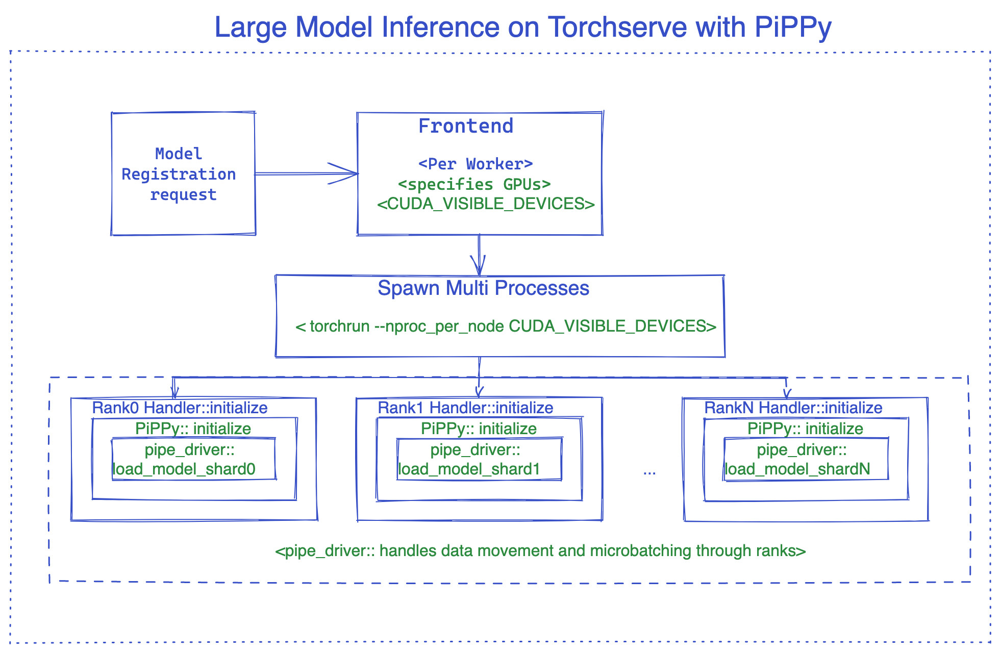

# Serving large models with Torchserve

This document explain how Torchserve supports large model serving, here large model refers to the models that are not able to fit into one gpu so they need be split in multiple partitions over multiple gpus.

## How it works?

During deployment a worker of a large model, TorchServe utilizes [torchrun](https://pytorch.org/docs/stable/elastic/run.html) to set up the distributed environment for model parallel processing. TorchServe has the capability to support multiple workers for a large model. By default, TorchServe uses a round-robin algorithm to assign GPUs to a worker on a host. In case of large models inference GPUs assigned to each worker is automatically calculated based on number of GPUs specified in the model_config.yaml. CUDA_VISIBLE_DEVICES is set based this number.

For instance, suppose there are eight GPUs on a node and one worker needs 4 GPUs (ie, nproc-per-node=4) on a node. In this case, TorchServe would assign CUDA_VISIBLE_DEVICES="0,1,2,3" to worker1 and CUDA_VISIBLE_DEVICES="4,5,6,7" to worker2.

In addition to this default behavior, TorchServe provides the flexibility for users to specify GPUs for a worker. For instance, if the user sets "deviceIds: [2,3,4,5]" in the [model config YAML file](https://github.com/pytorch/serve/blob/5ee02e4f050c9b349025d87405b246e970ee710b/model-archiver/README.md?plain=1#L164), and nproc-per-node is set to 2, then TorchServe would assign CUDA_VISIBLE_DEVICES="2,3" to worker1 and CUDA_VISIBLE_DEVICES="4,5" to worker2.

Using Pippy integration as an example, the image below illustrates the internals of the TorchServe large model inference.



## PiPPy (PyTorch Native solution for large model inference)

PiPPy provides pipeline parallelism for serving large models that would not fit into one gpu. It takes your model and splits it into equal sizes (stages) partitioned over the number devices you specify. Then uses microbatching to run your batched input for inference ( its is more optimal for batch sizes >1).

### How to use PiPPy in Torchserve

To use Pippy in Torchserve, we need to use a custom handler which inherits from base_pippy_handler and put our setting in model-config.yaml.

Customer handler in Torchserve is simply a python script that defines model loading, preprocess, inference and postprocess logic specific to your workflow.

It would look like below:

Create `custom_handler.py` or any other descriptive name.

```python
#DO import the necessary packages along with following
from ts.torch_handler.distributed.base_pippy_handler import BasePippyHandler
from ts.handler_utils.distributed.pt_pippy import initialize_rpc_workers, get_pipline_driver
class ModelHandler(BasePippyHandler, ABC):
    def __init__(self):
        super(ModelHandler, self).__init__()
        self.initialized = False

    def initialize(self, ctx):
        model = # load your model from model_dir
        self.device = self.local_rank %  torch.cuda.device_count()# being used to move model inputs to (self.device)
        self.model = get_pipline_driver(model,self.world_size, ctx)

```

Here is what your `model-config.yaml` needs, this config file is very flexible, you can add setting related to frontend, backend and handler.

```yaml
#frontend settings
minWorkers: 1
maxWorkers: 1
maxBatchDelay: 100
responseTimeout: 120
deviceType: "gpu"
parallelType: "pp" # options depending on the solution, pp(pipeline parallelism), tp(tensor parallelism), pptp ( pipeline and tensor parallelism)
                   # This will be used to route input to either rank0 or all ranks from fontend based on the solution (e.g. DeepSpeed support tp, PiPPy support pp)
torchrun:
    nproc-per-node: 4 # specifies the number of processes torchrun starts to serve your model, set to world_size or number of
                      # gpus you wish to split your model
#backend settings
pippy:
    chunks: 1 # This sets the microbatch sizes, microbatch = batch size/ chunks
    input_names: ['input_ids'] # input arg names to the model, this is required for FX tracing
    model_type: "HF" # set the model type to HF if you are using Huggingface model other wise leave it blank or any other model you use.
    rpc_timeout: 1800
    num_worker_threads: 512 #set number of threads for rpc worker init.

handler:
    max_length: 80 # max length of tokens for tokenizer in the handler
```

**How to access it in the handler?** here is an example:

```python
def initialize(self, ctx):
    model_type = ctx.model_yaml_config["pippy"]["model_type"]

```

The rest is as usual in Torchserve, basically packaging your model and starting the server.

Example of the command for packaging your model, make sure you pass model-config.yaml

```bash
torch-model-archiver --model-name bloom --version 1.0 --handler pippy_handler.py --extra-files $MODEL_CHECKPOINTS_PATH -r requirements.txt --config-file model-config.yaml --archive-format tgz

```

Tensor Parallel support in progress and will be added as soon as ready.

## DeepSpeed

[DeepSpeed-Inference](https://www.deepspeed.ai/inference/) is an open source project of MicroSoft. It provides model parallelism for serving large transformer based PyTorch models that would not fit into one gpu memory.


### How to use DeepSpeed in TorchServe

To use DeepSpeed in TorchServe, we need to use a custom handler which inherits from base_deepspeed_handler and put our setting in model-config.yaml.

It would look like below:

Create `custom_handler.py` or any other descriptive name.

```python
#DO import the necessary packages along with following
from ts.handler_utils.distributed.deepspeed import get_ds_engine
from ts.torch_handler.distributed.base_deepspeed_handler import BaseDeepSpeedHandler
class ModelHandler(BaseDeepSpeedHandler, ABC):
    def __init__(self):
        super(ModelHandler, self).__init__()
        self.initialized = False

    def initialize(self, ctx):
        model = # load your model from model_dir
        ds_engine = get_ds_engine(self.model, ctx)
        self.model = ds_engine.module
        self.initialized = True
```

Here is what your `model-config.yaml` needs, this config file is very flexible, you can add setting related to frontend, backend and handler.

```yaml
#frontend settings
minWorkers: 1
maxWorkers: 1
maxBatchDelay: 100
responseTimeout: 120
deviceType: "gpu"
parallelType: "tp" # options depending on the solution, pp(pipeline parallelism), tp(tensor parallelism), pptp ( pipeline and tensor parallelism)
                   # This will be used to route input to either rank0 or all ranks from fontend based on the solution (e.g. DeepSpeed support tp, PiPPy support pp)
torchrun:
    nproc-per-node: 4 # specifies the number of processes torchrun starts to serve your model, set to world_size or number of
                      # gpus you wish to split your model
#backend settings
deepspeed:
    config: ds-config.json # DeepSpeed config json filename.
                           # Details:https://www.deepspeed.ai/docs/config-json/
handler:
    max_length: 80 # max length of tokens for tokenizer in the handler
```

Here is an example of `ds-config.json`

```json
{
  "dtype": "torch.float16",
  "replace_with_kernel_inject": true,
  "tensor_parallel": {
    "tp_size": 2
  }
}
```

**Install DeepSpeed**

*Method1*: requirements.txt

*Method2*: pre-install via command (Recommended to speed up model loading)

```bash
# See https://www.deepspeed.ai/tutorials/advanced-install/
DS_BUILD_OPS=1 pip install deepspeed
```

The rest is as usual in Torchserve, basically packaging your model and starting the server.

Example of the command for packaging your model, make sure you pass model-config.yaml

```bash
# option 1: Using model_dir
torch-model-archiver --model-name bloom --version 1.0 --handler deepspeed_handler.py --extra-files $MODEL_CHECKPOINTS_PATH,ds-config.json -r requirements.txt --config-file model-config.yaml --archive-format tgz

# option 2: Using HF model_name
torch-model-archiver --model-name bloom --version 1.0 --handler deepspeed_handler.py --extra-files ds-config.json -r requirements.txt --config-file model-config.yaml --archive-format
```

## Best Practice

#### To reduce model loading latency, we recommend
* Pre-install the model parallel library such as Deepspeed on the container or host.
* Pre-download the model checkpoints. For example, if using HuggingFace pretrained model can be pre-downloaded via [Download_model.py](https://github.com/pytorch/serve/blob/75f66dc557b3b67a3ab56536a37d7aa21582cc04/examples/large_models/deepspeed/opt/Readme.md?plain=1#L7)
  * Set environment variable [HUGGINGFACE_HUB_CACHE](https://huggingface.co/docs/huggingface_hub/guides/manage-cache#understand-caching) and [TRANSFORMERS_CACHE](https://huggingface.co/transformers/v4.0.1/installation.html#caching-models)
  * Download model to the HuggingFace cache dir via tool [Download_model.py](https://github.com/pytorch/serve/blob/4fe5273cd6f98fb5abc570f802b402ac32ecd105/examples/large_models/Huggingface_pippy/Readme.md?plain=1#L20)

#### Tune "[responseTimeout](https://github.com/pytorch/serve/blob/5ee02e4f050c9b349025d87405b246e970ee710b/docs/configuration.md?plain=1#L216)" (see [model config YAML file](https://github.com/pytorch/serve/blob/5ee02e4f050c9b349025d87405b246e970ee710b/model-archiver/README.md?plain=1#L164)) if high model loading or inference latency causes response timeout.

#### Tune torchrun parameters
User is able to tune torchrun parameters in [model config YAML file](https://github.com/pytorch/serve/blob/2f1f52f553e83703b5c380c2570a36708ee5cafa/model-archiver/README.md?plain=1#L179). The supported parameters are defined at [here](https://github.com/pytorch/serve/blob/2f1f52f553e83703b5c380c2570a36708ee5cafa/frontend/archive/src/main/java/org/pytorch/serve/archive/model/ModelConfig.java#L329). For example, by default, `OMP_NUMNER_T?HREADS` is 1. It can be modified in the YAML file.
```yaml
#frontend settings
torchrun:
    nproc-per-node: 4 # specifies the number of processes torchrun starts to serve your model, set to world_size or number of
                      # gpus you wish to split your model
    OMP_NUMBER_THREADS: 2
```
#### Feature Job ticket is recommended for the use case of inference latency sensitive
When the job ticket feature is enabled, TorchServe verifies the availability of a model's active worker for processing a client's request. If an active worker is available, the request is accepted and processed immediately without waiting time incurred from job queue or dynamic batching; otherwise, a 503 response is sent back to client.

This feature help with use cases where inference latency can be high, such as generative models, auto regressive decoder models like chatGPT. This feature help such applications to take effective actions, for example, routing the rejected request to a different server, or scaling up model server capacity, based on the business requirements. Here is an example of enabling job ticket.
```yaml
minWorkers: 2
maxWorkers: 2
jobQueueSize: 2
useJobTicket: true
```
In this example, a model has 2 workers with job queue size 2. An inference request will be either processed by TorchServe immediately, or rejected with response code 503.
