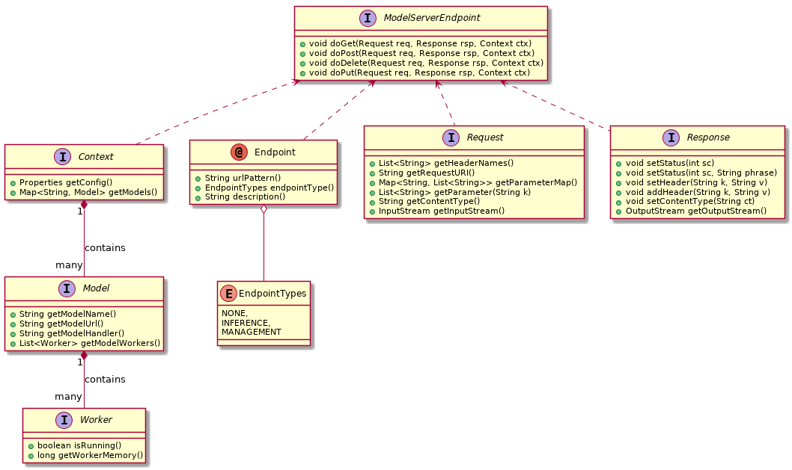
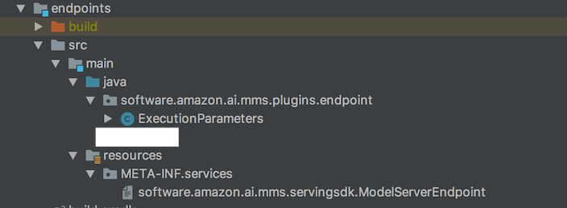

# Introduction 
In this document, we will go over how to build and load custom endpoints for MMS. We will go over the plugins based
architecture for MMS and user experience.

# Plugins SDK
MMS currently provides an SDK for customers to develop their custom URL endpoints and drop those endpoints into
MMS for custom URL handling. The SDK is currently published through Maven Central. Let's go over what is 
available in the SDK and how we could use this SDK to build our custom Endpoint.

# Plugins SDK
The Model Server plugins SDK is distributed through Maven Central. 
Find it on [Nexus Repository Manager](https://oss.sonatype.org/#nexus-search;quick~software.amazon.ai)
The plugins SDK has multiple components. The following are the main classes:
1. **ModelServerEndpoint** - This is the main class used to create a custom endpoint.
2. **Context** - This contains the context for model-server. Context object contains methods to read and modify the 
behavior of model-server.
3. **Worker** - This object contains all the information pertaining to a worker

# Plugins architecture
### MMS plugins loading at startup
At startup, MMS reads the configuration file to get the plugins directory. This plugins directory
contains endpoint jars. MMS loads all the jars implementing endpoints.


As seen in the above diagram, MMS loads all the endpoint "jars" implementing "ModelServerEndpoint"
and registers them to "Management" or "Inference" channels. 

### MMS plugins at runtime
When the client invokes "endpoint_1", which was loaded at startup time above, MMS looks up the registered
endpoints and validates if the request is valid. If the request is valid, the custom endpoint
is scheduled in a separate thread-pool. Once the custom endpoint finishes running, the output
is sent back to the client by the thread pool.


## Class diagram of the MMS custom-endpoint SDK:


# Writing your own custom endpoint
In this section we will go cover how we could develop our own endpoint and test the endpoint with MMS.
We will be developing an endpoint called "GET /execution-parameters" endpoint, which will return a set of 
configuration parameters such as "MAX_CONCURRENT_TRANSFORMS", "BATCH_STRATEGY", "MAX_PAYLOAD_IN_MB",
"BATCH".

## Include Maven dependencies for your project

In the Maven dependency section, include the following to get the plugins-sdk for MMS.

```xml
<dependency>
  <groupId>software.amazon.ai</groupId>
  <artifactId>mms-plugins-sdk</artifactId>
  <version>1.0.1</version>
</dependency>
```

This will bring in Plugins SDK for MMS into your project.

Now we are ready to build our custom endpoint!

## Build endpoint and register the endpoint as service
We create a project with a java file called "ExecutionParameters" and also 
create a "META-INF/services/software.amazon.ai.mms.servingsdk.ModelServerEndpoint" file which acts as registration 
for this service. Lets look into what goes into each of these folders.

### Project structure


### ExecutionParameters 

Here we define the the behavior of the endpoint as following
```java
@Endpoint(
        urlPattern = "execution-parameters",
        endpointType = EndpointTypes.INFERENCE,
        description = "Execution parameters endpoint")
public class ExecutionParameters extends ModelServerEndpoint {
    @Override
    public void doGet(Request req, Response rsp, Context ctx) throws IOException {
        Properties prop = ctx.getConfig();
        HashMap<String, String> r = new HashMap<>();
        r.put("MAX_CONCURRENT_TRANSFORMS", prop.getProperty("NUM_WORKERS", "1"));
        r.put("BATCH_STRATEGY", "SINGLE_RECORD");
        r.put("MAX_PAYLOAD_IN_MB", prop.getProperty("max_request_size"));
        r.put("BATCH", "true");
        rsp.getOutputStream()
                .write(
                        new GsonBuilder()
                                .setPrettyPrinting()
                                .create()
                                .toJson(r)
                                .getBytes(StandardCharsets.UTF_8));
    }
}
```

Here we have annotated the class with the name of the URL as "execution-parameters" and the type of the 
endpoint as "INFERENCE". This endpoint only implements a "doGet" method. In other words, this endpoint only
supports "GET" method. The endpoint also returns the output by writing it to the output stream. 

### Service file software.amazon.ai.mms.servingsdk.ModelServerEndpoint
The service file is used for service loading on the MMS. The contents of this file are as follows

```text
software.amazon.ai.mms.plugins.endpoint.ExecutionParameters
``` 
  
As the contents show, when loading this JAR, MMS loads the "ExecutionParameters" class, which in turn defines
the functionality of "execution-parameters" endpoint.


### Getting the endpoint jar
Once the project is built, the generated JAR is the custom endpoint jar. The project in this example builds
"**execution-parameters.jar**" . 

# Loading the custom endpoint on MMS
* Lets place this JAR in "/tmp/plugins" directory
```bash
$ ls /tmp/plugins
execution-parameters.jar
```  
* Configure MMS to load all the endpoints in plugins directory.
Contents of **config.properties** are:
```properties
plugins_path=/tmp/plugins
```
* Start model server with this configuration file
```bash
mxnet-model-server --start --mms-config config.properties
```
* MMS will load the endpoints configured in this directory and be ready to serve requests to this endpoint.

* Test the endpoint
```bash
curl -v 4 localhost:8080/execution-parameters
* TCP_NODELAY set
* Connected to localhost (::1) port 8080 (#1)
> GET /execution-parameters HTTP/1.1
> Host: localhost:8080
> User-Agent: curl/7.54.0
> Accept: */*
>
< HTTP/1.1 200 OK
< x-request-id: de5b2255-33ff-4d75-bed4-b24eb7820dec
< Pragma: no-cache
< Cache-Control: no-cache; no-store, must-revalidate, private
< Expires: Thu, 01 Jan 1970 00:00:00 UTC
< content-length: 94
< connection: keep-alive
<
{
  "BATCH_STRATEGY": "SINGLE_RECORD",
  "MAX_CONCURRENT_TRANSFORMS": "1",
  "BATCH": "true"
}
* Connection #1 to host localhost left intact
```

## Conclusion

For more implementations of the custom endpoints, please refer the [plugins](../plugins) repository. 