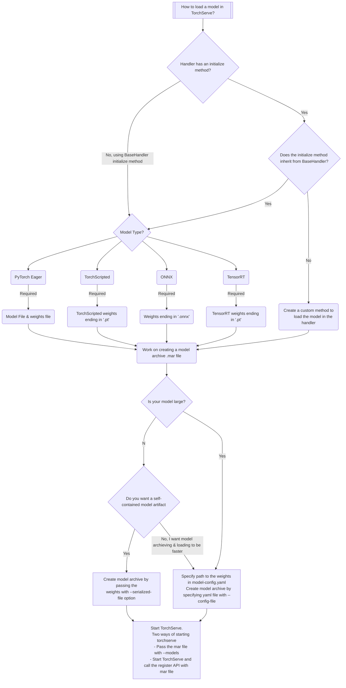

# How to load a model in TorchServe

There are multiple ways to load to model in TorchServe. The below flowchart tries to simplify the process and shows the various options

```mermaid
flowchart TD
    id1[[How to load a model in TorchServe?]] --> id13{Handler has an initialize method?}
    id13{Handler has an initialize method?} -- No, using BaseHandler initialize method --> id2{Model Type?} --> id3(PyTorch Eager)  & id4(TorchScripted) & id5(ONNX) & id6(TensorRT)
    id3(PyTorch Eager) --Required--> id7(Model File & weights file)
    id4(TorchScripted) --Required--> id8(TorchScripted weights ending in '.pt')
    id5(ONNX) --Required --> id9(Weights ending in '.onnx')
    id6(TensorRT) --Required--> id10(TensorRT weights ending in '.pt')
    id7(Model File & weights file) & id8(TorchScripted weights ending in '.pt') &  id9(Weights ending in '.onnx') & id10(TensorRT weights ending in '.pt') --> id11(Created a model archive .mar file)
    id13{Handler has an initialize method?} --Yes--> id21{"Does the initialize method inherit from BaseHandler?"}
    id21{"Does the initialize method inherit from BaseHandler?"} -- Yes --> id2{Model Type?}
    id21{Does the initialize method inherit from BaseHandler?} -- No --> id20("Create a custom method to
         load the model in the handler") --> id11(Create a model archive .mar file)
    id15["Create model archive by passing the
    weights with --serialized-file option"]
    id16["Specify path to the weights in model-config.yaml
    Create model archive by specifying yaml file with --config-file "]
	id11(Work on creating a model archive .mar file) --> id14{"Is your model large?"} --No--> id22{Do you want a self-contained model artifact}  --Yes--> id15
	id14{"Is your model large?"} --Yes--> id16
	id22{Do you want a self-contained model artifact} --No, I want model archieving & loading to be faster--> id16
	id15 & id16 --> id17["Start TorchServe.
	Two ways of starting torchserve
	- Pass the mar file with --models
	- Start TorchServe and call the register API with mar file"]


```
