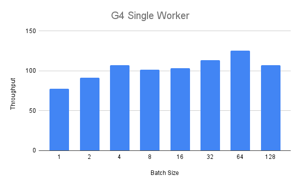
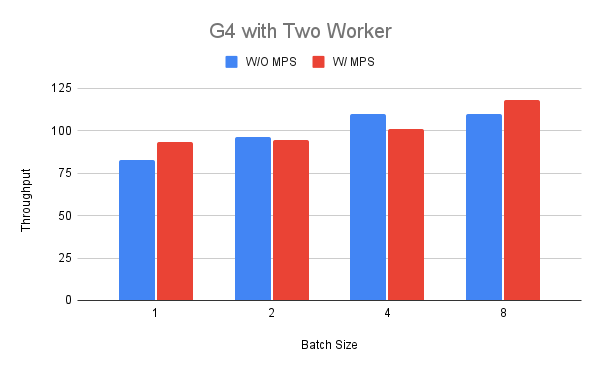
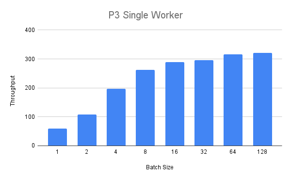
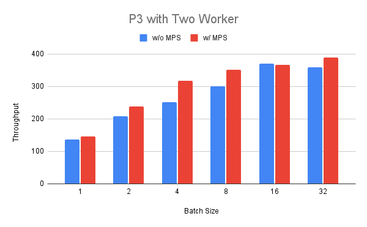

# Enabling NVIDIA MPS in TorchServe
Intro text
## Motivation
Why MPS and other considerations
## Benchmarks
To show the performance of TorchServe with activated MPS we will perform some benchmarks with representative workloads.
Primarily, we want to investigate how the throughput of a worker evolves with activated MPS for different operation points.
As an example work load for our benchmark we select the [HuggingFace Transformers Sequence Classification example](https://github.com/pytorch/serve/tree/master/examples/Huggingface_Transformers#sequence-classification).
We perform the benchmark on a g4dn.4xlarge as well as a p3.2xlarge instance on AWS.
For the benchmark we concentrate on the model throughput as measured by the [benchmark-ab.py](https://github.com/pytorch/serve/tree/master/benchmarks/benchmark-ab.py) tool.

First, we measure the throughput of a single worker for different batch size as it will show us at which point the compute resources of the GPU are fully occupied.
Second, we measure the throughput with two deployed workers for the batch size where we expect the GPUs to have still some resources left over to share.
For each benchmark we perform five runs and take the median over the runs.

We use the following config.json for the benchmark, only overwriting the number of workers and the batch size accordingly.

```
{
    "url":"/home/ubuntu/serve/examples/Huggingface_Transformers/model_store/BERTSeqClassification",
    "requests": 10000,
    "concurrency": 600,
    "input": "/home/ubuntu/serve/examples/Huggingface_Transformers/Seq_classification_artifacts/sample_text_captum_input.txt",
    "gpus": "1",
    "workers": "1"
}

```

### G4 Instance
We first perform the single worker benchmark for the G4 instance.
In the figure below we see that up to a batch size of four we see a steady increase of the throughput over the batch size.



Next, we in crease the number of workers to two in order to compare the throughput with and without MPS running.
To enable MPS for the second set of runs we first set the exclusive processing mode for the GPU and then start the MPS daemon:
```
sudo nvidia-smi -c 3
nvidia-cuda-mps-control -d
```
We select the batch size between one and eight according to our previous finding.
In the figure we can see that the performance in terms of throughput can be better in base of batch size 1 and 8 (up to +18%) while it can be worse for others (-11%).
An interpretation of this result could be that the G4 instance has not much resources to share when we run a BERT model in one of the workers.



### P3 instance
Next, we will run the same experiment with the bigger p3.2xlarge instance.
With a single worker we get the following throughput values:



We can see that the throughput steady increases but for a batch size over eight we see diminishing returns.
Finally, we deploy two workers on the P3 instance and compare running them with and without MPS.
We can see that for batch size between 1 and 32 the throughput is consistently higher (up to +25%) for MPS enabled with the exception of batch size 16.



## Summary
In the previous section we saw that by enabling MPS for two workers running the same model we can mixed results.
For the smaller G4 instance we only saw benefits in certain operation points while we saw more consistent improvements for the bigger P3 instance.
This suggests that the benefits for running a deployment with MPS are highly workload and environment dependent and need to be determined for specific situations using appropriate benchmarks and tools.
It should be noted that the previous benchmark solely focused on throughput and neglected latency and memory footprint.
As using MPS will only create a single CUDA context more workers can be packed to the same GPU which needs to be considered as well.
