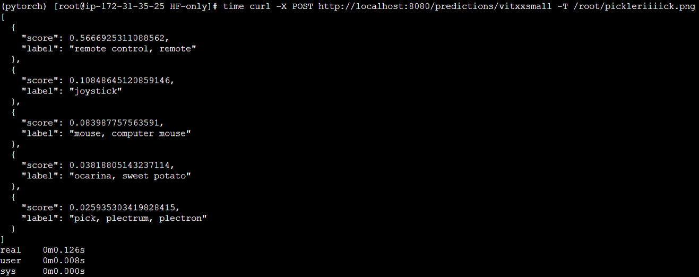

# HF only

## Setup
Log into the terminal of an AWS EC2 `t2.micro` instance with a base AWS Deep Learning PyTorch AMI (as it includes [`torch-model-archiver`](https://github.com/pytorch/serve/tree/master/model-archiver) and `docker`)

The `Using Torchserve Docker containers on EC2 for inference` section of [this Notion blog](https://www.notion.so/Day-2-3-Torchserve-custom-handlers-and-Docker-containers-02665de910a64aedab2b907a9a0cc9b0#3825849dfb8942379df2cdce8a729d9a) by me can be followed for logging into the appropriate AWS EC2 instance.


## Running the Torchserve server
Within the AWS EC2 instance, activate the PyTorch environment and navigate to the current folder after cloning this repo: 

```
source activate pytorch
git clone https://github.com/tripathiarpan20/HF-torchserve-pipeline
cd HF-torchserve-pipeline/HF-only/
```

Build a Torchserve CPU Docker container (or GPU/IPEX containers following the [original guide](https://github.com/pytorch/serve/tree/master/docker#create-torchserve-docker-image)):
```
git clone https://github.com/pytorch/serve.git
cd serve/docker
./build_image.sh -bt production -t torchserve-cpu-prod
cd ../..
rm -rf serve
```

Check whether the Torchserve image is present in the list of Docker images:
```
docker images
```

Run the Torchserve server container with Docker and archived model (refer to [this](https://github.com/pytorch/serve/tree/master/docker#create-torch-model-archiver-from-container) and [this](https://github.com/pytorch/serve/blob/fd4e3e8b72bed67c1e83141265157eed975fec95/docs/use_cases.md#secure-model-serving) for more details):

```
mkdir -p HF-models
mkdir -p model-store
docker run -d --rm -it --shm-size=50g -p 8080:8080 -p 8081:8081 --name torchserve-cpu-prod --mount type=bind,source=$(pwd)/scripts/config.properties,target=/home/model-server/config.properties --mount type=bind,source=$(pwd)/model-store,target=/home/model-server/model-store --mount type=bind,source=$(pwd)/HF-models,target=/home/model-server/HF-models torchserve-cpu-prod torchserve --ncs --model-store=/home/model-server/model-store --ts-config config.properties
```

Check whether the model was started properly (keep trying repeatedly for a few seconds while server boots up):
```
curl http://127.0.0.1:8080/ping
#OR
curl http://127.0.0.1:8081/models/
```

Install git-lfs to be able to download 🤗 models from the hub ([reference](https://stackoverflow.com/questions/71448559/git-large-file-storage-how-to-install-git-lfs-on-aws-ec2-linux-2-no-package)):
```
sudo yum install -y amazon-linux-extras
sudo amazon-linux-extras install epel -y
sudo yum-config-manager --enable epel
sudo yum install git-lfs
```

## Registering a 🤗 model from the [hub](https://huggingface.co/models)

Download the 🤗 model repo with git-lfs ([example](https://huggingface.co/apple/mobilevit-xx-small)) along with all the model dependencies like checkpoints, vocabulary, config etc:
```
git lfs install
git clone https://huggingface.co/apple/mobilevit-xx-small HF-models/vitxxsmall/
cd HF-models/vitxxsmall/
git lfs install
git lfs pull
cd ../..
```

⚠️ **IMPORTANT NOTE** ⚠️: The folder in which the 🤗 model repo is cloned & the name of the `.mar` file should be EXACTLY the same, this constraint was necessary to register new models with `curl POST` requests flexibly (i.e, during server intialization as well as afterwards).


Create a Torchserve model archive with the model handler file (`scripts/torchserve_vitxxsmall_handler.py` in our example) along with relevant dependencies in `requirements.txt` (like 🤗 transformers).  

**NOTE:** Since we are not giving a pretrained checkpoint as a `.pth` file (as it would be downloaded from 🤗 in the `initialize` method of our `torchserve_vitxxsmall_handler.py`), the `--serialized-file` option is redundant as we do not use the context in our handler. 
```
touch dummy_file.pth
torch-model-archiver --model-name vitxxsmall --serialized-file dummy_file.pth --version 1.0 --handler scripts/torchserve_vitxxsmall_handler.py --export-path model-store -r requirements.txt
rm -f dummy_file.pth
```

Since the `load_models` attribute of `config.properties` (that was passed to the `docker run` command while starting the Torchserve server) is set to "standalone", the Torchserve server is initialized without any models initially (even though `model-store` might contain `.mar` files). 

Registering the MobileViT XX Small model on the Torchserve server (more details [here](https://github.com/pytorch/serve/blob/master/docs/management_api.md#register-a-model)) with `max_batch_delay` in milliseconds, which is the time the Torchserve server waits to bundle concurrent inference requests into a batch with maximum size of `batch_size` (i.e, `preprocess` of the handler always receives list of requests with length <= `batch_size`):
```
curl -X POST "localhost:8081/models?url=vitxxsmall.mar&batch_size=8&max_batch_delay=10&initial_workers=1"
```

In case of bugs, recently created container can be accessed to check the logs for debugging, metrics etc(check the [logging documentation](https://github.com/pytorch/serve/blob/master/docs/logging.md) for details).  
In case `torch-model-archiver` is unavailable in the AMI (or any cloud instance), the Torchserve container can be accessed to create the model archive in the `model-store`, which is mounted as shared memory between the AMI/VM and container (might need modifications to [`mount`](https://docs.docker.com/storage/bind-mounts/#choose-the--v-or---mount-flag) flag )


```
serve_cont_id=$(docker ps -l -q) 
docker exec -it $serve_cont_id /bin/bash
cat logs/model_log.log
```

## Managing registered models

Run the following commands to check the registered models :
```
curl http://127.0.0.1:8081/models/

curl http://127.0.0.1:8081/models/vitxxsmall/
```

The models running on the Torchserver server can be managed with a [gRPC API](https://github.com/pytorch/serve/blob/master/docs/management_api.md#scale-workers).

For instance, the following command allows the model `vitxxsmall` to increase its number of workers, i.e, number of identical instances of the model (to process more inference requests per unit time) to 4.
```
curl -v -X PUT "http://localhost:8081/models/vitxxsmall?max_worker=4"
```


## Inferencing and Benchmarking

Example of a command to send inference requests to the registered models:
```
curl -X POST http://localhost:8080/predictions/vitxxsmall -T /root/pickleriiiick.png
```

The above command leads to the following output, indicating an inference time of 126 ms:


However, in real scenarios, the registered model would receive many concurrent requests and hence, we need a better benchmarking approach. We provide several utilities that can be used to perform real-time benchmarking even with custom metrics ([reference](https://github.com/pytorch/serve/tree/master/benchmarks#torchserve-model-server-benchmarking)).  

## Instructions to use ***any*** 🤗 model from the [hub](https://huggingface.co/models) for ***any*** task supported by the 🤗 pipeline

Most of the 🤗 model [pipelines](https://huggingface.co/docs/transformers/v4.21.2/en/main_classes/pipelines) takes `List[pipeline_input]` as input and outputs `List[pipeline_output]`, the exact format of `pipeline_inputs` specific to the *task* can be found in the [docs](https://huggingface.co/docs/transformers/main_classes/pipelines#transformers.pipeline.task). 

The high level approach to use any of the 🤗 pipelines for a desired [*task*](https://huggingface.co/docs/transformers/v4.21.2/en/main_classes/pipelines#transformers.pipeline.task) is as follows: 
* In `scripts/torchserve_vitxxsmall_handler.py` , modify the `preprocess`, `inference` and `postprocess` methods appropriately in a progressive manner:
  * The `preprocess` method takes `data` as list of raw inputs from the POST requests (each raw input is sent by *clients* in formats like .txt, .jpeg etc) and converts them into `List[pipeline_inputs]`, it can be modified according to the *task* by taking reference from [official Torchserve handlers](https://github.com/pytorch/serve/tree/master/ts/torch_handler).
  * The `inference` method takes the preprocessed input from `preprocess` as `List[pipeline_inputs]` and passes the output to `postprocess` method as `List[pipeline_outputs]`, a few [exceptions](https://huggingface.co/docs/transformers/main_classes/pipelines#pipeline-chunk-batching) would need a few more lines of code to be added to `inference` method.
  * The `postprocess` method takes input from the `inference` method and is responsible to return a serializable `List[output]` to the under-the-hood part of Torchserve that returns the outputs to *clients* individually.

* Note: It is also possible to provide support for [multiple inputs](https://github.com/pytorch/serve/issues/1783) and return [multiple outputs](https://github.com/pytorch/serve/issues/1647) for each inference request by the *clients*.

* Follow the instructions in `Setup` and `Running the Torchserve server` sections above to run the Torchserve server container.

* Decide a name (variable `$modelName` below) for the task (variable `$task` below) supported by a 🤗 model that supports the task (its repo link as variable `$repoUrl` below), then run the below commands to download the models and create the `.mar` file:
```
modelName="vitxxsmall"
task="image-classification"
framework="pt"       #should be either "pt" (for PyTorch) or "tf" (for Tensorflow) and the .pt or .tf
repoUrl="https://huggingface.co/apple/mobilevit-xx-small"

chmod +x prepare_mar_from_hf.sh 
./prepare_mar_from_hf.sh -t $task -n $modelName -f $framework -u $repoUrl
```

* After waiting for a few seconds for the server to boot up, register the downloaded model on the Torchserve server:
```
curl -X POST "localhost:8081/models?url=$modelName.mar&batch_size=8&max_batch_delay=10&initial_workers=1"
```

* Refer to the `Managing registered models` and `Inferencing and Benchmarking` sections above for rest of the details.