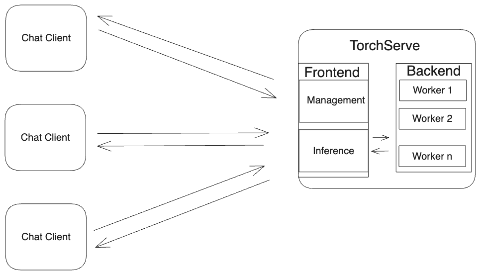
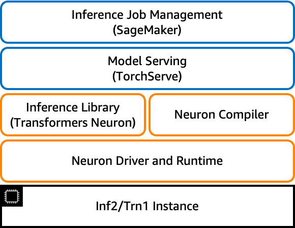

# Meta Llama: Next generation of Meta's Language Model

TorchServe supports serving Meta Llama in a number of ways. The examples covered in this document range from someone new to TorchServe learning how to serve Meta Llama with an app, to an advanced user of TorchServe using micro batching and streaming response with Meta Llama.

## 🦙💬 Meta Llama Chatbot

### [Example Link](https://github.com/pytorch/serve/tree/master/examples/LLM/llama/chat_app)

This example shows how to deploy a llama chat app using TorchServe.
We use [streamlit](https://github.com/streamlit/streamlit) to create the app

This example is  using [llama-cpp-python](https://github.com/abetlen/llama-cpp-python).

You can run this example on your laptop to understand how to use TorchServe, how to scale up/down TorchServe backend workers and play around with batch_size to see its effect on inference time

## Meta Llama with HuggingFace

### [Example Link](https://github.com/pytorch/serve/tree/master/examples/large_models/Huggingface_accelerate/llama)

This example shows how to serve meta-llama/Meta-Llama-3-70B-Instruct model with limited resource using [HuggingFace](https://huggingface.co/meta-llama/Meta-Llama-3-70B-Instruct). It shows the following optimizations
    1) HuggingFace `accelerate`. This option can be activated with `low_cpu_mem_usage=True`.
    2) Quantization from [`bitsandbytes`](https://github.com/TimDettmers/bitsandbytes)  using `load_in_8bit=True`
The model is first created on the Meta device (with empty weights) and the state dict is then loaded inside it (shard by shard in the case of a sharded checkpoint).

## Llama 2 on Inferentia

### [Example Link](https://github.com/pytorch/serve/tree/master/examples/large_models/inferentia2/llama2)

### [PyTorch Blog](https://pytorch.org/blog/high-performance-llama/)

This example shows how to serve the [Llama 2](https://huggingface.co/meta-llama) model on [AWS Inferentia2](https://aws.amazon.com/ec2/instance-types/inf2/) for text completion with [micro batching](https://github.com/pytorch/serve/tree/96450b9d0ab2a7290221f0e07aea5fda8a83efaf/examples/micro_batching) and [streaming response](https://github.com/pytorch/serve/blob/96450b9d0ab2a7290221f0e07aea5fda8a83efaf/docs/inference_api.md#curl-example-1) support.

Inferentia2 uses [Neuron SDK](https://aws.amazon.com/machine-learning/neuron/) which is built on top of PyTorch XLA stack. For large model inference [`transformers-neuronx`](https://github.com/aws-neuron/transformers-neuronx) package is used that takes care of model partitioning and running inference.

