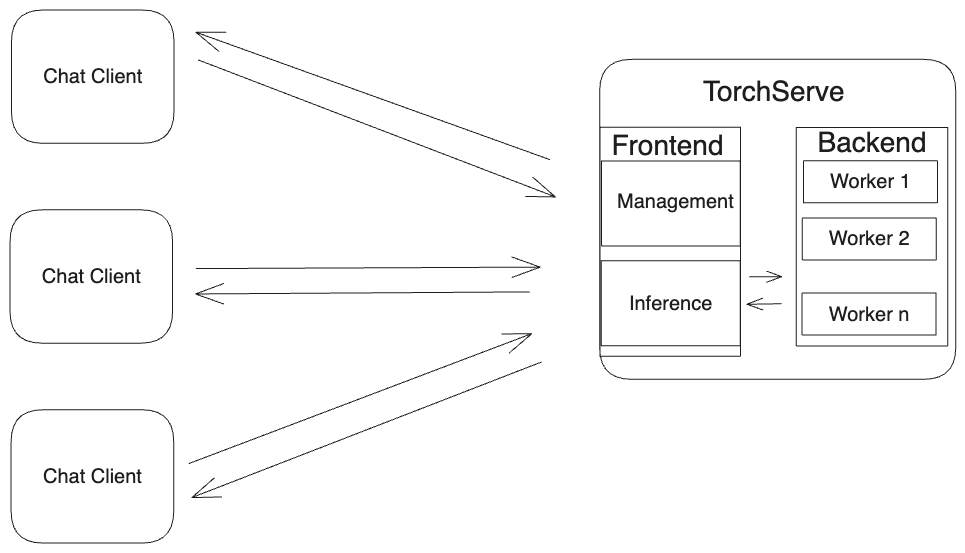

# Llama 2: Next generation of Meta's Language Model

TorchServe supports serving Llama 2 in a number of ways. The examples covered in this document range from someone new to TorchServe learning how to serve Llama 2 with an app, to an advanced user of TorchServe using micro batching and streaming response with Llama 2

## 🦙💬 Llama 2 Chatbot

### [Example Link](https://github.com/pytorch/serve/tree/master/examples/LLM/llama2/chat_app)

This example shows how to deploy a llama2 chat app using TorchServe.
We use [streamlit](https://github.com/streamlit/streamlit) to create the app

This example is  using [llama-cpp-python](https://github.com/abetlen/llama-cpp-python).

You can run this example on your laptop to understand how to use TorchServe, how to scale up/down TorchServe backend workers and play around with batch_size to see its effect on inference time

## Llama 2 with HuggingFace

### [Example Link](https://github.com/pytorch/serve/tree/master/examples/large_models/Huggingface_accelerate/llama2)

This example shows how to serve Llama 2 - 70b model with limited resource using [HuggingFace](https://huggingface.co/meta-llama/Llama-2-70b-chat-hf). It shows the following optimizations
    1) HuggingFace `accelerate`. This option can be activated with `low_cpu_mem_usage=True`.
    2) Quantization from [`bitsandbytes`](https://github.com/TimDettmers/bitsandbytes)  using `load_in_8bit=True`
The model is first created on the Meta device (with empty weights) and the state dict is then loaded inside it (shard by shard in the case of a sharded checkpoint).

## Llama 2 on Inferentia

### [Example Link](https://github.com/pytorch/serve/tree/master/examples/large_models/inferentia2/llama2)

### [PyTorch Blog](https://pytorch.org/blog/high-performance-llama/)

This example shows how to serve the [Llama 2](https://huggingface.co/meta-llama) model on [AWS Inferentia2](https://aws.amazon.com/ec2/instance-types/inf2/) for text completion with [micro batching](https://github.com/pytorch/serve/tree/96450b9d0ab2a7290221f0e07aea5fda8a83efaf/examples/micro_batching) and [streaming response](https://github.com/pytorch/serve/blob/96450b9d0ab2a7290221f0e07aea5fda8a83efaf/docs/inference_api.md#curl-example-1) support.

Inferentia2 uses [Neuron SDK](https://aws.amazon.com/machine-learning/neuron/) which is built on top of PyTorch XLA stack. For large model inference [`transformers-neuronx`](https://github.com/aws-neuron/transformers-neuronx) package is used that takes care of model partitioning and running inference.

