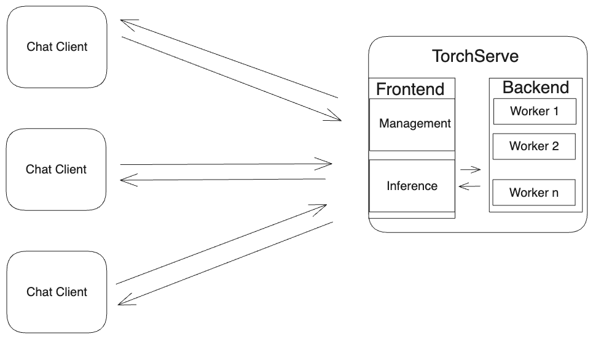

# TorchServe Llama 2 Chatapp

This is an example showing how to deploy a llama2 chat app using TorchServe.
We use [streamlit](https://github.com/streamlit/streamlit) to create the app

We are using [llama-cpp-python](https://github.com/abetlen/llama-cpp-python) in this example

You can run this example on your laptop to understand how to use TorchServe


## Architecture




## Pre-requisites

The following example has been tested on M1 Mac.
Before you install TorchServe, make sure you have the following installed
1) JDK 17

Make sure your javac version is `17.x.x`
```
javac --version
javac 17.0.8
```
You can download it from [java](https://www.oracle.com/java/technologies/downloads/#jdk17-mac)
2) Install conda with support for arm64

3) Since we are running this example on Mac, we will use the 7B llama2 model.
Download llama2-7b weights by following instructions [here](https://github.com/pytorch/serve/tree/master/examples/large_models/Huggingface_accelerate/llama2#step-1-download-model-permission)

4) Install streamlit with

```
python -m pip install -r requirements.txt
```


### Steps

#### Install TorchServe
Install TorchServe with the following steps

```
python ts_scripts/install_dependencies.py
pip install torchserve torch-model-archiver torch-workflow-archiver
```

#### Package model for TorchServe

Run this script to create `llamacpp.tar.gz` to be loaded in TorchServe

```
source package_llama.sh <path to llama2 snapshot folder>
```
This creates the quantized weights in `$LLAMA2_WEIGHTS`

For subsequent runs, we don't need to regenerate these weights. We only need to package the handler, model-config.yaml in the tar file.

Hence, you can skip the model generation by running the script as follows

```
source package_llama.sh <path to llama2 snapshot folder>  false
```

You might need to run the below command if the script output indicates it.
```
sudo xcodebuild -license
```

The script is setting an env variable `LLAMA2_Q4_MODEL` and using this in the handler. In an actual use-case, you would set the path to the weights in `model-config.yaml`

```
handler:
    model_name: "llama-cpp"
    model_path: "<absolute path to the weights file"
```


#### Start TorchServe

We launch a streamlit app to configure TorchServe. This opens a UI in your browser, which you can use to start/stop TorchServe, register model, change some of the TorchServe parameters

```
streamlit run torchserve_server_app.py
```

You can check the model status on the app to make sure the model is ready to receive requests


#### Client Chat App

We launch a streamlit app from which a client can send requests to TorchServe. The reference app used is [here](https://blog.streamlit.io/how-to-build-a-llama-2-chatbot/)

```
streamlit run client_app.py
```

You can change the model parameters and ask the server questions in the following format

```
Question: What is the closest star to Earth ? Answer:
```
results in

```
Question: What is the closest star to Earth ? Answer: The closest star to Earth is Proxima Centauri, which is located about 4. nobody knows if there is other life out there similar to ours or not, but it's pretty cool that we know of a star so close to us!
```


### Experiments

You can launch a second client app from another terminal.

You can send requests simultaneously to see how quickly TorchServe responds

#### Dynamic Batching

Batching requests is a strategy used to make efficient use of compute resources. TorchServe supports dynamic batching, where the frontend can batch requests if the requests arrive within the max_batch_delay time.
You can make use of dynamic batching in TorchServe by configuring the `batch_size` and `max_batch_delay` parameters in TorchServe. You can do this on the Server app.

You can read more about batching in TorchServe [here](https://github.com/pytorch/serve/blob/master/docs/batch_inference_with_ts.md)


#### Backend Workers

TorchServe's backend workers perform the actual model inference.
You can increase the number of backend workers in TorchServe by configuring  `min_workers` parameter in TorchServe. You can do this on the Server app.

The number of workers can be autoscaled based on the traffic and usage patterns.

Number of workers = Number of TorchServe python processes

So to reduce latency and improve performance, we can increase the number of workers for parallel processing of requests.


