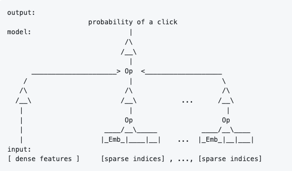

# [Examples showcasing TorchServe Features and Integrations](#torchserve-internals)

## TorchServe Internals

* [Creating mar file for an eager mode model](#creating-mar-file-for-eager-mode-model)
* [Creating mar file for torchscript mode model](#creating-mar-file-for-torchscript-mode-model)
* [Serving custom model with custom service handler](#serving-custom-model-with-custom-service-handler)
* [Serving model using Docker Container](image_classifier/mnist/Docker.md)
* [Creating a Workflow](Workflows/dog_breed_classification)
* [Custom Metrics](custom_metrics)
* [Dynamic Batch Processing](image_classifier/resnet_152_batch)
* [Dynamic Batched Async Requests](image_classifier/near_real_time_video)

## TorchServe Integrations

### Kubernetes 

* [Serving HuggingFace faster transformers model in K8s](../kubernetes/examples/FasterTransformer_HuggingFace_Bert.md)

### KServe 

* [Serving HuggingFace BERT model using KServe](https://github.com/kserve/kserve/blob/master/docs/samples/v1beta1/custom/torchserve/bert-sample/hugging-face-bert-sample.md)

### Hugging Face 

* [Serving HuggingFace transformers model](Huggingface_Transformers)

### PiPPy [Serving Large Models with PyTorch Native Solution PiPPy](large_models/Huggingface_pippy/Readme.md)

### MLFlow 

* [Deploy models using `mlflow-torchserve` plugin](https://github.com/mlflow/mlflow-torchserve/tree/master/examples)

### Captum 

* [Model Explainability with Captum](captum)

### ONNX 

* [Example for ONNX Integration](../test/pytest/test_onnx.py)

### TensorRT

* [Support for TensorRT optimizations](../docs/performance_guide.md#tensorrt-and-nvfuser-support)

### Microsoft DeepSpeed-MII 

* [HuggingFace Stable Diffusion Model with Microsoft DeepSpeed-MII](large_models/deepspeed_mii/Readme.md)

### Prometheus and mtail 

* [Custom Metrics with mtail and Prometheus](custom_metrics) 

### Intel® Extension for PyTorch
* [ Boost Performance on Intel Hardware](intel_extension_for_pytorch)

### TorchRec DLRM


* [Serving Torchrec DLRM (Recommender Model)](torchrec_dlrm)

### TorchData
* [Serving Image Classifier model and loading image data using TorchData (datapipes)](image_classifier/mnist/torchdata)

### PyTorch 2.0
* [PyTorch 2.0 Integration](pt2)

### Stable Diffusion 
* [Stable Diffusion using HuggingFace Diffusers](diffusers)

### HuggingFace Large Models with Accelerate 
* [HuggingFace Large Models with constrained resources](large_models/Huggingface_accelerate/Readme.md)

## UseCases

### Vision
#### Image Classification
* [Serving torchvision image classification models](image_classifier)
* [Serving Image Classifier model for on-premise near real-time video](image_classifier/near_real_time_video)

#### Object Detection
* [Serving object detection model](object_detector)
* [Serving image segmentation model](image_segmenter)

#### GAN
* [Serving image generator model](dcgan_fashiongen)

### Text
#### Neural Machine Translation


* [Serving machine translation model](nmt_transformer)
* [Serving Neural Machine Translation Workflow](Workflows/nmt_transformers_pipeline)

#### Text Classification
* [Serving text classification model](text_classification)
* [Serving text classification model with scriptable tokenizer](text_classification_with_scriptable_tokenizer)

#### Text to Speech
* [Serving waveglow text to speech synthesizer model](speech2text_wav2vec2)

### MultiModal
* [Serving multi modal framework model](MMF-activity-recognition)

# TorchServe Examples

The following are examples on how to create and serve model archives with TorchServe.

## Creating mar file for eager mode model

Following are the steps to create a torch-model-archive (.mar) to execute an eager mode torch model in TorchServe :

* Pre-requisites to create a torch model archive (.mar) :
    * serialized-file (.pt) : This file represents the `state_dict` in case of eager mode model.
    * model-file (.py) : This file contains model class extended from `torch nn`.modules representing the model architecture. This parameter is mandatory for eager mode models. This file must contain only one class definition extended from [torch.nn.Module](https://pytorch.org/docs/stable/generated/torch.nn.Module.html).
    * index_to_name.json : This file contains the mapping of predicted index to class. The default TorchServe handles returns the predicted index and probability. This file can be passed to model archiver using --extra-files parameter.
    * version : Model's version.
    * handler : TorchServe default handler's name or path to custom inference handler(.py)
* Syntax

    ```bash
    torch-model-archiver --model-name <model_name> --version <model_version_number> --model-file <path_to_model_architecture_file> --serialized-file <path_to_state_dict_file> --handler <path_to_custom_handler_or_default_handler_name> --extra-files <path_to_index_to_name_json_file>
    ```

## Creating mar file for torchscript mode model

Following are the steps to create a torch-model-archive (.mar) to execute a torchscript mode torch model in TorchServe :

* Pre-requisites to create a torch model archive (.mar) :
    * serialized-file (.pt) : This file represents the state_dict in case of eager mode model or an executable `ScriptModule` in case of TorchScript.
    * index_to_name.json : This file contains the mapping of predicted index to class. The default TorchServe handles returns the predicted index and probability. This file can be passed to model archiver using --extra-files parameter.
    * version : Model's version.
    * handler : TorchServe default handler's name or path to custom inference handler(.py)

* Syntax

    ```bash
    torch-model-archiver --model-name <model_name> --version <model_version_number> --serialized-file <path_to_executable_script_module> --extra-files <path_to_index_to_name_json_file> --handler <path_to_custom_handler_or_default_handler_name>
    ```

## Serving image classification models
The following example demonstrates how to create image classifier model archive, serve it on TorchServe and run image prediction using TorchServe's default image_classifier handler :

* [Image classification models](image_classifier)

## Serving custom model with custom service handler

The following example demonstrates how to create and serve a custom NN model with custom handler archives in TorchServe :

* [Digit recognition with MNIST](image_classifier/mnist)

## Serving text classification model

The following example demonstrates how to create and serve a custom text_classification NN model with default text_classifier handler provided by TorchServe :

* [Text classification example](text_classification)

## Serving text classification model with scriptable tokenizer

This example shows how to combine a text classification model with a scriptable tokenizer into a single, scripted artifact to serve with TorchServe. A scriptable tokenizer is a tokenizer compatible with TorchScript.
* [Scriptable Tokenizer example with scriptable tokenizer](text_classification_with_scriptable_tokenizer)

## Serving object detection model

The following example demonstrates how to create and serve a pretrained fast-rcnn NN model with default object_detector handler provided by TorchServe :

* [Object detection example](object_detector)

## Serving image segmentation model

The following example demonstrates how to create and serve a pretrained fcn NN model with default image_segmenter handler provided by TorchServe :

* [Image segmentation example](image_segmenter)


## Serving Huggingface Transformers

The following example demonstrates how to create and serve a pretrained transformer models from Huggingface such as BERT, RoBERTA, XLM

* [Hugging Face Transformers](Huggingface_Transformers)

## Captum Integration

The following example demonstrates TorchServe's integration with Captum, an open source, extensible library for model interpretability built on PyTorch

* [Captum](captum)

## Example to serve GAN model

The following example demonstrates how to create and serve a pretrained DCGAN model from [facebookresearch/pytorch_GAN_zoo](https://github.com/facebookresearch/pytorch_GAN_zoo)

* [GAN Image Generator](dcgan_fashiongen)

## Serving Neural Machine Translation

The following example demonstrates how to create and serve a neural translation model using fairseq

* [Neural machine translation ](nmt_transformer)

## Serving Waveglow text to speech synthesizer

The following example demonstrates how to create and serve the waveglow text to speech synthesizer

* [Waveglow text to speech synthesizer](text_to_speech_synthesizer)

## Serving Multi modal model

The following example demonstrates how to create and serve a multi modal model including audio, text and video

* [Multi modal framework](MMF-activity-recognition)

## Serving Image Classification Workflow

The following example demonstrates how to create and serve a complex image classification workflow for dog breed classification

* [Image classification workflow](Workflows/dog_breed_classification)

## Serving Neural Machine Translation Workflow

The following example demonstrates how to create and serve a complex neural machine translation workflow

* [Neural machine Translation workflow](Workflows/nmt_transformers_pipeline)

## Serving Torchrec DLRM (Recommender Model)
This example shows how to deploy a Deep Learning Recommendation Model (DLRM) with [TorchRec](https://github.com/pytorch/torchrec)

* [Torchrec DLRM](torchrec_dlrm)

## Serving Image Classifier Model for on-premise near real-time video

The following example demonstrates how to serve an image classification model with batching for near real-time video

* [Near Real-Time Video Batched Image Classification](image_classifier/near_real_time_video)

## Serving Image Classifier Model with TorchData datapipes

The following example demonstrates how to integrate TorchData with torchserve

* [Torchdata integration with torchserve an image classification example](image_classifier/mnist/torchdata)
