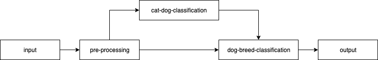

# Workflow pipeline example for classifying dog breed

This workflow uses two models, first to classify if an image is of a dog or a cat. If it is a dog the second model does breed classification.
To change the default batch size and batch delay the yaml file for the workflow can to be changed. This cannot currently be set via the REST API.

## Flow

In the flow described below, the pre_processing node base64 encodes the image and passes it to two model nodes in the flow. The encoded data is available to both these nodes for classification. The second node i.e. dog-breed-classification takes the original input from the pre_processing node along-with the response from the cat-dog-classification node to do further classification of the dog breed if required.



## Commands to create the models and the workflow
The notebooks for training the [dog-cat classification](cat_dog_classification.ipynb) model and the [dog breed classification](dog_breed_classification.ipynb) models are provided in this example. Once the models are trained you can download the corresponding .pth files and use them to generate the mar files for serving inference requests as below.

The [dog-cat classification](https://torchserve.pytorch.org/mar_files/cat_dog_classification.mar) and [dog breed classification](https://torchserve.pytorch.org/mar_files/dog_breed_classification.mar) mar files can also be downloaded directly.

```
$ cd $TORCH_SERVE_DIR/examples/Workflows/dog_breed_classification
$ mkdir model_store wf_store
$ torch-model-archiver -f --model-name cat_dog_classification --version 1.0 --model-file cat_dog_classification_arch.py --serialized-file /<path_to_model_files>/cat_dog_classification.pth --handler cat_dog_classification_handler.py --export-path model_store
$ torch-model-archiver -f --model-name dog_breed_classification --version 1.0 --model-file dog_breed_classification_arch.py --serialized-file /<path_to_model_files>/dog_breed_classification.pth --handler dog_breed_classification_handler.py --extra-files index_to_name.json --export-path model_store
$ torch-workflow-archiver -f --workflow-name dog_breed_wf --spec-file workflow_dog_breed_classification.yaml --handler workflow_dog_breed_classification_handler.py --export-path wf_store/
```

## Serve the workflow
```
$ torchserve --start --model-store model_store/ --workflow-store wf_store/ --ncs --disable-token-auth  --enable-model-api
$ curl -X POST "http://127.0.0.1:8081/workflows?url=dog_breed_wf.war"
{
  "status": "Workflow dog_breed_wf has been registered and scaled successfully."
}

$ curl https://raw.githubusercontent.com/pytorch/serve/master/docs/images/kitten_small.jpg -o Cat.jpg
$ curl http://127.0.0.1:8080/wfpredict/dog_breed_wf -T Cat.jpg
It's a cat!

$ curl https://raw.githubusercontent.com/udacity/dog-project/master/images/Labrador_retriever_06457.jpg -o Dog1.jpg
$ curl http://127.0.0.1:8080/wfpredict/dog_breed_wf -T Dog1.jpg
{
  "Kuvasz": 0.9941568374633789,
  "American_water_spaniel": 0.0041659059934318066,
  "Glen_of_imaal_terrier": 0.0014263634802773595,
  "Cavalier_king_charles_spaniel": 0.0001453325676266104,
  "Plott": 2.3177999537438154e-05
}

$ curl https://raw.githubusercontent.com/udacity/dog-project/master/images/Brittany_02625.jpg -o Dog2.jpg
$ curl http://127.0.0.1:8080/wfpredict/dog_breed_wf -T Dog1.jpg -o 1.txt& \
curl http://127.0.0.1:8080/wfpredict/dog_breed_wf -T Cat.jpg -o 2.txt& \
curl http://127.0.0.1:8080/wfpredict/dog_breed_wf -T Dog2.jpg -o 3.txt

$ cat *.txt
{
  "Kuvasz": 0.9941568374633789,
  "American_water_spaniel": 0.004165907856076956,
  "Glen_of_imaal_terrier": 0.0014263641787692904,
  "Cavalier_king_charles_spaniel": 0.0001453325676266104,
  "Plott": 2.3178021365310997e-05
}It's a cat!{
  "Icelandic_sheepdog": 0.6199535131454468,
  "Briard": 0.3671875298023224,
  "Cardigan_welsh_corgi": 0.010016526095569134,
  "Tibetan_mastiff": 0.0010873654391616583,
  "English_springer_spaniel": 0.0004755705886054784
}

$ curl -X DELETE "http://127.0.0.1:8081/workflows/dog_breed_wf"
{
  "status": "Workflow \"dog_breed_wf\" unregistered"
}
```
