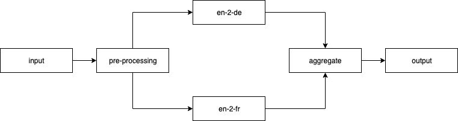

# Workflow pipeline example using nmt transformer nlp model

This example uses the existing [nmt_transformers](../../nmt_transformer) standalone example to create a workflow. We use three models, in two examples to demonstrate stringing them together in a workflow.
The default batch size and delay can only be changed via the YAML file. This cannot currently be set via the REST API.

_NOTE: This example currently works with Python 3.6 only due to fairseq dependency on dataclasses [issue](https://github.com/huggingface/transformers/issues/8638#issuecomment-790772391). This example currently doesn't work on Windows_

## Flow

### Example 1: Dual translation

In the case of dual translation we use a preprocessing node as a dummy node to pass the input to both the English to French and English to German translators. The output from both the translations are converted into a single output by the aggregate-output node and returned to the user.



### Example 2: Back-translation

In the case of back translation we pass the input to an English to German translation model. The output is cleaned up by the intermediate-input-processing node and converted into a format which is expected by the German to English translation model. The post-processing node takes the final output and converts the keys of the output dictionary to be relevant to the workflow.


## Commands to create the models and the workflow
```
$ cd $TORCH_SERVE_DIR/examples/nmt_transformer/
$ ./create_mar.sh de2en_model
$ ./create_mar.sh en2de_model
$ ./create_mar.sh en2fr_model

$ cd $TORCH_SERVE_DIR/examples/Workflows/nmt_transformers_pipeline/
$ mkdir model_store wf_store
$ mv $TORCH_SERVE_DIR/examples/nmt_transformer/model_store/*.mar model_store/
$ torch-workflow-archiver -f --workflow-name nmt_wf_dual --spec-file nmt_workflow_dualtranslation.yaml --handler nmt_workflow_handler_dualtranslation.py --export-path wf_store/
$ torch-workflow-archiver -f --workflow-name nmt_wf_re --spec-file nmt_workflow_retranslation.yaml --handler nmt_workflow_handler_retranslation.py --export-path wf_store/
$ torchserve --start --model-store model_store/ --workflow-store wf_store/ --ncs --ts-config config.properties --disable-token-auth  --enable-model-api
```

## Serve the workflow
### Example 1:
```
$ curl -X POST "http://127.0.0.1:8081/workflows?url=nmt_wf_dual.war"
{
  "status": "Workflow nmt_wf_dual has been registered and scaled successfully."
}

# Single input
$ curl http://127.0.0.1:8080/wfpredict/nmt_wf_dual -T model_input/sample.txt
{
  "english_input": "Hi James, when are you coming back home? I am waiting for you.\nPlease come as soon as possible.",
  "german_translation": "Hallo James, wann kommst du nach Hause? Ich warte auf dich. Bitte komm so bald wie m\u00f6glich.",
  "french_translation": "Bonjour James, quand rentrerez-vous chez vous, je vous attends et je vous prie de venir le plus t\u00f4t possible."
}

# Batched input
$ curl http://127.0.0.1:8080/wfpredict/nmt_wf_dual -T model_input/sample1.txt& \
curl http://127.0.0.1:8080/wfpredict/nmt_wf_dual -T model_input/sample2.txt& \
curl http://127.0.0.1:8080/wfpredict/nmt_wf_dual -T model_input/sample3.txt& \
curl http://127.0.0.1:8080/wfpredict/nmt_wf_dual -T model_input/sample4.txt&
{
  "english_input": "Hi James, when are you coming back home? I am waiting for you.\nPlease come as soon as possible.\n",
  "german_translation": "Hallo James, wann kommst du nach Hause? Ich warte auf dich. Bitte komm so bald wie m\u00f6glich.",
  "french_translation": "Bonjour James, quand rentrerez-vous chez vous, je vous attends et je vous prie de venir le plus t\u00f4t possible."
}{
  "english_input": "I\u2019m sorry, I don\u2019t remember your name. You are you?\n",
  "german_translation": "Es tut mir leid, ich erinnere mich nicht an Ihren Namen. Sie sind es?",
  "french_translation": "Je vous prie de m'excuser, je ne me souviens pas de votre nom."
}{
  "english_input": "I\u2019m well. How are you?\nIt\u2019s going well, thank you. How are you doing?\nFine, thanks. And yourself?\n",
  "german_translation": "Mir geht es gut. Wie geht es Ihnen? Es l\u00e4uft gut, danke. Wie geht es Ihnen? Gut, danke. Und sich selbst?",
  "french_translation": "Je me sens bien. Comment allez-vous ? \u00c7a va bien, merci. Comment allez-vous ?"
}{
  "english_input": "Hello World !!!\n",
  "german_translation": "Hallo Welt!!!",
  "french_translation": "Bonjour le monde ! ! !"
}

# Unregister workflow
$ curl -X DELETE "http://127.0.0.1:8081/workflows/nmt_wf_dual"
{
  "status": "Workflow \"nmt_wf_dual\" unregistered"
}
```

#### Example 2:
```
$ curl -X POST "http://127.0.0.1:8081/workflows?url=nmt_wf_re.war"
{
  "status": "Workflow nmt_wf_re has been registered and scaled successfully."
}

# Single input
$ curl http://127.0.0.1:8080/wfpredict/nmt_wf_re -T model_input/sample.txt
{
  "german_translation": "Hallo James, wann kommst du nach Hause? Ich warte auf dich. Bitte komm so bald wie m\u00f6glich.",
  "english_re_translation": "Hi James, when are you coming home? I am waiting for you. Please come as soon as possible."
}

# Batched input
$ curl http://127.0.0.1:8080/wfpredict/nmt_wf_re -T model_input/sample1.txt& \
curl http://127.0.0.1:8080/wfpredict/nmt_wf_re -T model_input/sample2.txt& \
curl http://127.0.0.1:8080/wfpredict/nmt_wf_re -T model_input/sample3.txt& \
curl http://127.0.0.1:8080/wfpredict/nmt_wf_re -T model_input/sample4.txt&
{
  "german_translation": "Hallo Welt!!!",
  "english_re_translation": "Hello world!!!"
}{
  "german_translation": "Hallo James, wann kommst du nach Hause? Ich warte auf dich. Bitte komm so bald wie m\u00f6glich.",
  "english_re_translation": "Hi James, when are you coming home? I am waiting for you. Please come as soon as possible."
}{
  "german_translation": "Mir geht es gut. Wie geht es Ihnen? Es l\u00e4uft gut, danke. Wie geht es Ihnen? Gut, danke. Und sich selbst?",
  "english_re_translation": "How are you? It's going well, thank you. How are you? Good, thank you. And yourself?"
}{
  "german_translation": "Es tut mir leid, ich erinnere mich nicht an Ihren Namen. Sie sind es?",
  "english_re_translation": "I'm sorry, I don't remember your name. Is it you?"
}

# Unregister workflow
$ curl -X DELETE "http://127.0.0.1:8081/workflows/nmt_wf_re"
{
  "status": "Workflow \"nmt_wf_re\" unregistered"
}
```
