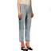
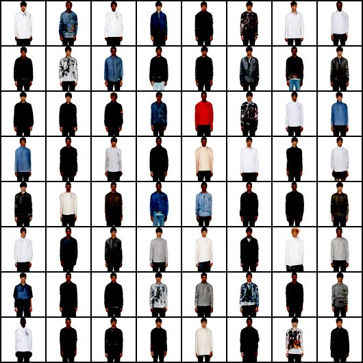
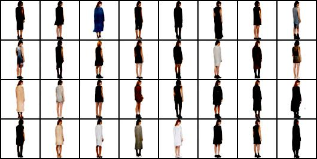

# GAN(Generative Adversarial Networks) models using TorchServe
- In this example we will demonstrate how to serve a GAN model using TorchServe.
- We have used a pretrained DCGAN model from [facebookresearch/pytorch_GAN_zoo](https://github.com/facebookresearch/pytorch_GAN_zoo)
  (Introduction to [DCGAN on FashionGen](https://pytorch.org/hub/facebookresearch_pytorch-gan-zoo_dcgan/))

### 1. Create a Torch Model Archive
Execute the following command to create _dcgan_fashiongen.mar_ :
```
./create_mar.sh
```
The [create_mar.sh](create_mar.sh) script does the following :
- Download the model's [source code](https://github.com/facebookresearch/pytorch_GAN_zoo/tree/b75dee40918caabb4fe7ec561522717bf096a8cb/models), extract the relevant directory and zip it. (`--extra-files`)
- Download a checkpoint file [DCGAN_fashionGen-1d67302.pth](https://dl.fbaipublicfiles.com/gan_zoo/DCGAN_fashionGen-1d67302.pth).  (`--serialized-file`)
- Provide a custom handler - [dcgan_fashiongen_handler.py](dcgan_fashiongen_handler.py). (`--handler`)

Alternatively, you can directly [download the dcgan_fashiongen.mar](https://torchserve.s3.amazonaws.com/mar_files/dcgan_fashiongen.mar)

### 2. Start TorchServe and Register Model
```
mkdir modelstore
mv dcgan_fashiongen.mar modelstore/
torchserve --start --ncs --model-store ./modelstore --models dcgan_fashiongen.mar --disable-token-auth --enable-model-api
```

### 3. Generate Images
Invoke the predictions API and pass following payload(JSON)
- **number_of_images** :  Number of images to generate
- **input_gender** : OPTIONAL; If specified, needs to be one of - `Men`, `Women`
- **input_category** : OPTIONAL; If specified, needs to be one of - One of - `SHIRTS`, `SWEATERS`, `JEANS`, `PANTS`, `TOPS`, `SUITS & BLAZERS`, `SHORTS`, `JACKETS & COATS`, `SKIRTS`, `JUMPSUITS`, `SWIMWEAR`, `DRESSES`
- **input_pose** : OPTIONAL; If specified, needs to be one of - `id_gridfs_1`, `id_gridfs_2`, `id_gridfs_3`, `id_gridfs_4`

#### Example
1. **Create a single image (random gender, category, pose)**
   ```
   curl -X POST -d '{"number_of_images":1}' -H "Content-Type: application/json" http://localhost:8080/predictions/dcgan_fashiongen -o img1.jpg
   ```
   > Result image should be similar to the one below -
   > 

2. **Create '64' images of 'Men' wearing 'Shirts' in 'id_gridfs_1' pose**
   ```
   curl -X POST -d '{"number_of_images":64, "input_gender":"Men", "input_category":"SHIRTS", "input_pose":"id_gridfs_1"}' -H "Content-Type: application/json" http://localhost:8080/predictions/dcgan_fashiongen -o img2.jpg
   ```
   > Result image should be similar to the one below -
   > 

3. **Create '32' images of 'Women' wearing 'Dresses' in 'id_gridfs_3' pose**
   ```
   curl -X POST -d '{"number_of_images":32, "input_gender":"Women", "input_category":"DRESSES", "input_pose":"id_gridfs_3"}' -H "Content-Type: application/json" http://localhost:8080/predictions/dcgan_fashiongen -o img3.jpg
   ```
   > Result image should be similar to the one below -
   > 
