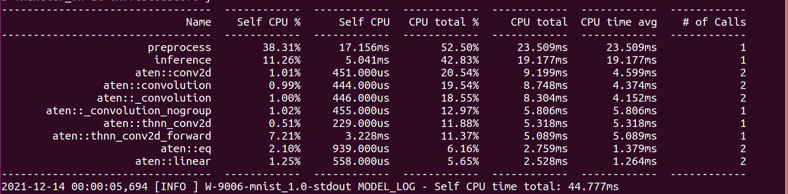
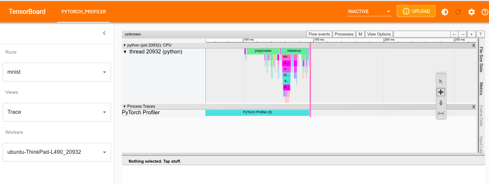

# Digit recognition model with MNIST dataset

In this example, we show how to use a pre-trained custom MNIST model to performing real time Digit recognition with TorchServe.

The inference service would return the digit inferred by the model in the input image.

We used the following pytorch example to train the basic MNIST model for digit recognition :
https://github.com/pytorch/examples/tree/master/mnist

# Objective
1. Demonstrate how to package a custom trained model with custom handler into torch model archive (.mar) file
2. Demonstrate how to create model handler code
3. Demonstrate how to load model archive (.mar) file into TorchServe and run inference.

# Serve a custom model on TorchServe

Run the commands given in following steps from the parent directory of the root of the repository. For example, if you cloned the repository into /home/my_path/serve, run the steps from /home/my_path

 * Step - 1: Create a new model architecture file which contains model class extended from [torch.nn.Module](https://pytorch.org/docs/stable/generated/torch.nn.Module.html). In this example we have created [mnist model file](mnist.py).
 * Step - 2: Train a MNIST digit recognition model using https://github.com/pytorch/examples/blob/master/mnist/main.py and save the state dict of model. We have added the pre-created [state dict](mnist_cnn.pt) of this model.
 * Step - 3: Write a custom handler to run the inference on your model. In this example, we have added a [custom_handler](mnist_handler.py) which runs the inference on the input grayscale images using the above model and recognizes the digit in the image.
 * Step - 4: Create a torch model archive using the torch-model-archiver utility to archive the above files.

    ```bash
    torch-model-archiver --model-name mnist --version 1.0 --model-file examples/image_classifier/mnist/mnist.py --serialized-file examples/image_classifier/mnist/mnist_cnn.pt --handler  examples/image_classifier/mnist/mnist_handler.py
    ```

  Step 5 is optional. Perform this step to use pytorch profiler

  * Step - 5: To enable pytorch profiler, set the following environment variable.

        ```
        export ENABLE_TORCH_PROFILER=true
        ```

 * Step - 6: Register the model on TorchServe using the above model archive file and run digit recognition inference

    ```bash
    mkdir model_store
    mv mnist.mar model_store/
    torchserve --start --model-store model_store --models mnist=mnist.mar --ts-config config.properties --disable-token-auth --enable-model-api
    curl http://127.0.0.1:8080/predictions/mnist -T examples/image_classifier/mnist/test_data/0.png
    ```

# Profiling inference output

The profiler information is printed in the torchserve logs / console



By default the pytorch profiler trace files are generated under "/tmp/pytorch_profiler/<model_name>" directory.

The path can be overridden by setting `on_trace_ready` parameter in `profiler_args` - [Example here](../../../test/pytest/profiler_utils/resnet_profiler_override.py)

And the trace files can be loaded in tensorboard using torch-tb-profiler. Check the following link for more information - https://github.com/pytorch/kineto/tree/main/tb_plugin

Install torch-tb-profiler and run the following command to view the results in UI

```
tensorboard --logdir /tmp/pytorch_profiler/mnist/
```

The pytorch profiler traces can be viewed as below



For captum Explanations on the Torchserve side, use the below curl request:
```bash
curl http://127.0.0.1:8080/explanations/mnist -T examples/image_classifier/mnist/test_data/0.png
```

In order to run Captum Explanations with the request input in a json file, follow the below steps:

In the config.properties, specify `service_envelope=body` and make the curl request as below:
```bash
curl -H "Content-Type: application/json" --data @examples/image_classifier/mnist/mnist_ts.json http://127.0.0.1:8080/explanations/mnist_explain
```
When a json file is passed as a request format to the curl, Torchserve unwraps the json file from the request body. This is the reason for specifying service_envelope=body in the config.properties file

### Captum Explanations

The explain is called with the following request api `http://127.0.0.1:8080/explanations/mnist_explain`

Torchserve supports Captum Explanations for Eager models only.

Captum/Explain doesn't support batching.

#### The handler changes:

1. The handlers should initialize.
```python
self.ig = IntegratedGradients(self.model)
```
in the initialize function for the captum to work.(It is initialized in the base class-vision_handler)

2. The Base handler handle uses the explain_handle method to perform captum insights based on whether user wants predictions or explanations. These methods can be overriden to make your changes in the handler.

3. The get_insights method in the handler is called by the explain_handle method to calculate insights using captum.

4. If the custom handler overrides handle function of base handler, the explain_handle function should be called to get captum insights.

### Running KServe

Refer the [MNIST Readme for KServe](https://github.com/pytorch/serve/blob/master/kubernetes/kserve/kserve_wrapper/README.md) to run it locally.

Refer the [End to End KServe document](https://github.com/pytorch/serve/blob/master/kubernetes/kserve/README.md) to run it in the cluster.
