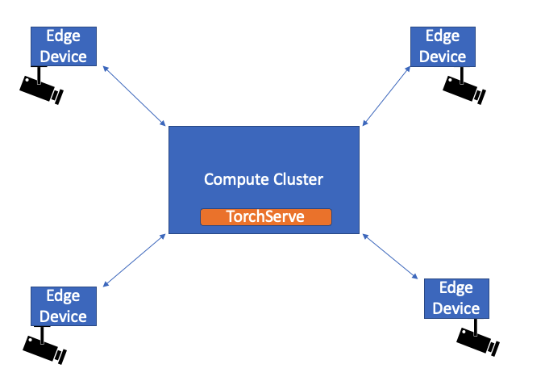
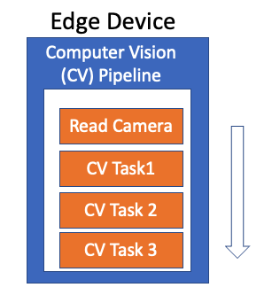

# On-premise Near Real-Time Video Inference

Consider a use-case where we have cameras connected to edge devices. These devices are connected to a compute cluster where TorchServe is running. Each edge device has a computer vision pipeline running, where we read frames from the camera and we need to perform tasks as Image Classification, Pose Estimation, Activity Recognition etc on the read frames. In order to make efficient use of hardware resources, we might want to do batching of the frames for efficient inference

This example shows how this can be achieved using TorchServe with the following 2 approaches
- [TorchServe Batching](#with-torchserve-batching)
- [Client-Side Batching](#with-client-side-batching)

The architecture diagram is shown below





### Client application using [OpenCV](https://opencv.org/)

In this example, we are using OpenCV to send frames on the client side.
Install OpenCV with the following command
```
pip install opencv-python
```

To make use of TorchServe's dynamic batching feature, we need to send asynchronous http requests. Hence, we are using [requests-futures](https://github.com/ross/requests-futures) in this example.
Install requests-futures with the following command
```
pip install requests-future
```

## With TorchServe batching

On the client side, we have one thread for reading frames from a video source and another thread which sends the read frames as http request to TorchServe for image classification inference. We are using an asynchronous http requests as we want to make use of TorchServe batching.
We send one frame in each request and let TorchServe handle the batching
TorchServe is setup to process batch size of 4 in this example.
TorchServe receives individual requests, batches the requests to make a single inference request and sends out individual responses to the requests received.


### Create a resnet-18 eager mode model archive, register it on TorchServe and run inference on a real time video

Run the commands given in following steps from the parent directory of the root of the repository. For example, if you cloned the repository into `/home/my_path/serve`, run the steps from `/home/my_path`

```bash
python examples/image_classifier/near_real_time_video/create_mar_file.py

torchserve --start --model-store model_store --models resnet-18=resnet-18.mar --ts-config examples/image_classifier/near_real_time_video/config.properties --disable-token-auth  --enable-model-api

python examples/image_classifier/near_real_time_video/request.py
```

The default batch size is 4.
On the client side, we should see the following output

```bash
With Batch Size 4, FPS at frame number 20 is 24.7
{
  "tabby": 0.5186409950256348,
  "tiger_cat": 0.29040342569351196,
  "Egyptian_cat": 0.10797449946403503,
  "lynx": 0.01395314373075962,
  "bucket": 0.006002397276461124
}
{
  "tabby": 0.5186409950256348,
  "tiger_cat": 0.29040342569351196,
  "Egyptian_cat": 0.10797449946403503,
  "lynx": 0.01395314373075962,
  "bucket": 0.006002397276461124
}
{
  "tabby": 0.5186409950256348,
  "tiger_cat": 0.29040342569351196,
  "Egyptian_cat": 0.10797449946403503,
  "lynx": 0.01395314373075962,
  "bucket": 0.006002397276461124
}
{
  "tabby": 0.5186409950256348,
  "tiger_cat": 0.29040342569351196,
  "Egyptian_cat": 0.10797449946403503,
  "lynx": 0.01395314373075962,
  "bucket": 0.006002397276461124
}
```

## With Client-Side batching

On the client side, we have one thread for reading frames from a video source and another thread which batches(size n) the read frames and sends the request to TorchServe for image classification inference.
To send the batched data, we create a json payload of n frames.
On the TorchServe side, we read the json payload and preprocess the n frames. The postprocess function in the handler returns the output as a list of length 1.


### Create a resnet-18 eager mode model archive, register it on TorchServe and run inference on a real time video

Run the commands given in following steps from the parent directory of the root of the repository. For example, if you cloned the repository into `/home/my_path/serve`, run the steps from `/home/my_path`

```bash
python examples/image_classifier/near_real_time_video/create_mar_file.py --client-batching

torchserve --start --model-store model_store --models resnet-18=resnet-18.mar --disable-token-auth  --enable-model-api

python examples/image_classifier/near_real_time_video/request.py --client-batching
```
The default batch size is 4.
On the client side, we should see the following output
```bash
With Batch Size 4, FPS at frame number 20 is 26.3
[
  {
    "tabby": 0.5211764574050903,
    "tiger_cat": 0.2896695137023926,
    "Egyptian_cat": 0.10781702399253845,
    "lynx": 0.013975325040519238,
    "bucket": 0.006072630640119314
  },
  {
    "tabby": 0.521255373954773,
    "tiger_cat": 0.28875237703323364,
    "Egyptian_cat": 0.10762253403663635,
    "lynx": 0.0139595502987504,
    "bucket": 0.005917856469750404
  },
  {
    "tabby": 0.5212978720664978,
    "tiger_cat": 0.28904619812965393,
    "Egyptian_cat": 0.10735585540533066,
    "lynx": 0.013928638771176338,
    "bucket": 0.005905763246119022
  },
  {
    "tabby": 0.521538496017456,
    "tiger_cat": 0.28848880529403687,
    "Egyptian_cat": 0.10753455013036728,
    "lynx": 0.013951676897704601,
    "bucket": 0.005931478925049305
  }
]
```

To set batch_size = 10, we use the following command
```
python examples/image_classifier/near_real_time_video/request.py --client-batching --batch_size 10
```

If you have a camera connected, you can run inference on real time video from the camera as follows

```
python examples/image_classifier/near_real_time_video/request.py --client-batching --batch_size 10 --input 0
```
