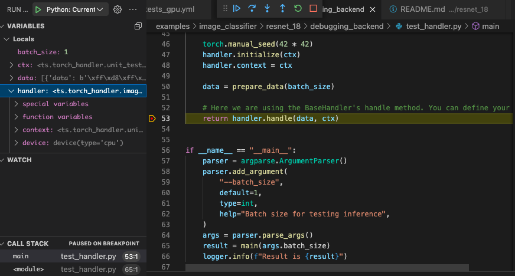

#### Sample commands to create a resnet-18 eager mode model archive, register it on TorchServe and run image prediction

Run the commands given in following steps from the parent directory of the root of the repository. For example, if you cloned the repository into /home/my_path/serve, run the steps from /home/my_path/serve

```bash
wget https://download.pytorch.org/models/resnet18-f37072fd.pth
torch-model-archiver --model-name resnet-18 --version 1.0 --model-file ./examples/image_classifier/resnet_18/model.py --serialized-file resnet18-f37072fd.pth --handler image_classifier --extra-files ./examples/image_classifier/index_to_name.json
mkdir model_store
mv resnet-18.mar model_store/
torchserve --start --model-store model_store --models resnet-18=resnet-18.mar --disable-token-auth  --enable-model-api
curl http://127.0.0.1:8080/predictions/resnet-18 -T ./examples/image_classifier/kitten.jpg
```

#### TorchServe inference with torch.compile of Resnet18 model
This example shows how to take eager model of `Resnet18`, configure TorchServe to use `torch.compile` and run inference using `torch.compile`.

Change directory to the examples directory
Ex:  `cd  examples/image_classifier/resnet_18`

##### torch.compile config
`torch.compile` supports a variety of config and the performance you get can vary based on the config. You can find the various options [here](https://pytorch.org/docs/stable/generated/torch.compile.html).

In this example , we use the following config

```
echo "pt2:
  compile:
    enable: True
    backend: inductor
    mode: reduce-overhead" > model-config.yaml
```

##### Sample commands to create a Resnet18 torch.compile model archive, register it on TorchServe and run image prediction

```bash
wget https://download.pytorch.org/models/resnet18-f37072fd.pth
torch-model-archiver --model-name resnet-18 --version 1.0 --model-file model.py --serialized-file resnet18-f37072fd.pth --handler image_classifier --extra-files ../index_to_name.json --config-file model-config.yaml
mkdir model_store
mv resnet-18.mar model_store/
torchserve --start --model-store model_store --models resnet-18=resnet-18.mar --disable-token-auth  --enable-model-api
curl http://127.0.0.1:8080/predictions/resnet-18 -T ../kitten.jpg
```

produces the output
```
{
  "tabby": 0.40966343879699707,
  "tiger_cat": 0.346704363822937,
  "Egyptian_cat": 0.13002890348434448,
  "lynx": 0.023919545114040375,
  "bucket": 0.011532172560691833
}
```

#### TorchScript example using Resnet18 image classifier:

* Save the Resnet18 model in as an executable script module or a traced script:

1. Save model using scripting
   ```python
   #scripted mode
   from torchvision import models
   import torch
   model = models.resnet18(pretrained=True)
   sm = torch.jit.script(model)
   sm.save("resnet-18.pt")
   ```

2. Save model using tracing
   ```python
   #traced mode
   from torchvision import models
   import torch
   model = models.resnet18(pretrained=True)
   model.eval()
   example_input = torch.rand(1, 3, 224, 224)
   traced_script_module = torch.jit.trace(model, example_input)
   traced_script_module.save("resnet-18.pt")
   ```

* Use following commands to register Resnet18 torchscript model on TorchServe and run image prediction

    ```bash
    torch-model-archiver --model-name resnet-18 --version 1.0  --serialized-file resnet-18.pt --extra-files ./serve/examples/image_classifier/index_to_name.json --handler image_classifier
    mkdir model_store
    mv resnet-18.mar model_store/
    torchserve --start --model-store model_store --models resnet-18=resnet-18.mar --disable-token-auth  --enable-model-api
    curl http://127.0.0.1:8080/predictions/resnet-18 -T ./serve/examples/image_classifier/kitten.jpg
    ```

### Debug TorchServe Backend

If you want to test your handler code, you can use the example in `debugging_backend/test_handler.py`

```
python debugging_backend/test_handler.py --batch_size 2
```

results in

```
Torch TensorRT not enabled
DEBUG:ts.torch_handler.base_handler:Model file /home/ubuntu/serve/examples/image_classifier/resnet_18/resnet-18.pt loaded successfully
INFO:__main__:Result is [{'tabby': 0.4096629023551941, 'tiger_cat': 0.34670525789260864, 'Egyptian_cat': 0.13002872467041016, 'lynx': 0.02391958236694336, 'bucket': 0.011532173492014408}, {'tabby': 0.4096629023551941, 'tiger_cat': 0.34670525789260864, 'Egyptian_cat': 0.13002872467041016, 'lynx': 0.02391958236694336, 'bucket': 0.011532173492014408}]
```

If this doesn't work, you can use a debugger to find the problem in your backend handler code.
Once you are confident this works, you can use your handler to deploy the model using TorchServe

Below is a screenshot of debugger running with this handler



You can also use this with pytest

```
pytest debugging_backend/test_handler.py
```

results in

```
================================================================================== test session starts ===================================================================================
platform linux -- Python 3.8.18, pytest-7.3.1, pluggy-1.0.0
rootdir: /home/ubuntu/serve
plugins: mock-3.10.0, anyio-3.6.1, cov-4.1.0, hypothesis-6.54.3
collected 1 item

debugging_backend/test_handler.py .                                                                                                                                                [100%]

==================================================================================== warnings summary ====================================================================================
../../../../anaconda3/envs/torchserve/lib/python3.8/site-packages/ts/torch_handler/base_handler.py:13
  /home/ubuntu/anaconda3/envs/torchserve/lib/python3.8/site-packages/ts/torch_handler/base_handler.py:13: DeprecationWarning: pkg_resources is deprecated as an API. See https://setuptools.pypa.io/en/latest/pkg_resources.html
    from pkg_resources import packaging

../../../../anaconda3/envs/torchserve/lib/python3.8/site-packages/pkg_resources/__init__.py:2871
  /home/ubuntu/anaconda3/envs/torchserve/lib/python3.8/site-packages/pkg_resources/__init__.py:2871: DeprecationWarning: Deprecated call to `pkg_resources.declare_namespace('mpl_toolkits')`.
  Implementing implicit namespace packages (as specified in PEP 420) is preferred to `pkg_resources.declare_namespace`. See https://setuptools.pypa.io/en/latest/references/keywords.html#keyword-namespace-packages
    declare_namespace(pkg)

../../../../anaconda3/envs/torchserve/lib/python3.8/site-packages/pkg_resources/__init__.py:2871
../../../../anaconda3/envs/torchserve/lib/python3.8/site-packages/pkg_resources/__init__.py:2871
  /home/ubuntu/anaconda3/envs/torchserve/lib/python3.8/site-packages/pkg_resources/__init__.py:2871: DeprecationWarning: Deprecated call to `pkg_resources.declare_namespace('ruamel')`.
  Implementing implicit namespace packages (as specified in PEP 420) is preferred to `pkg_resources.declare_namespace`. See https://setuptools.pypa.io/en/latest/references/keywords.html#keyword-namespace-packages
    declare_namespace(pkg)

-- Docs: https://docs.pytest.org/en/stable/how-to/capture-warnings.html
============================================================================= 1 passed, 4 warnings in 2.29s ==============================================================================
```
