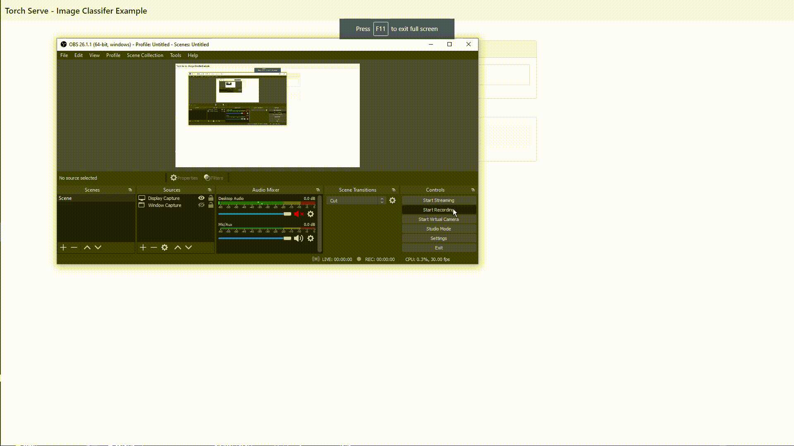
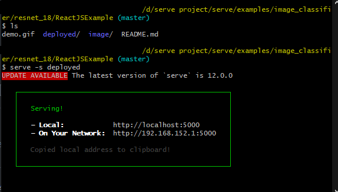
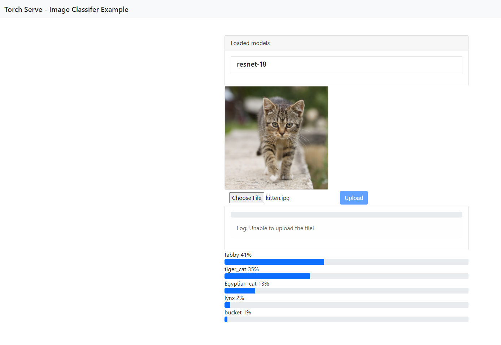

Instructions

Step1: Setup the config.properties file.

Make a file called config.properties and put these two lines in the file as text.

```
cors_allowed_origin=*
cors_allowed_methods=GET, POST, PUT, OPTIONS
```

Step2: Follows the step to sets up the backend torch serve server.

```bash

wget https://download.pytorch.org/models/resnet18-f37072fd.pth
torch-model-archiver --model-name resnet-18 --version 1.0 --model-file ./examples/image_classifier/resnet_18/model.py --serialized-file resnet18-f37072fd.pth --handler image_classifier --extra-files ./examples/image_classifier/index_to_name.json
mkdir model_store
mv resnet-18.mar model_store/
torchserve --start --model-store model_store --models resnet-18=resnet-18.mar --ts-config config.properties --disable-token-auth  --enable-model-api

```

Step3: Run the frontend ReactApp at the parent directory of the build folder.

```bash

serve -s deployed

```




