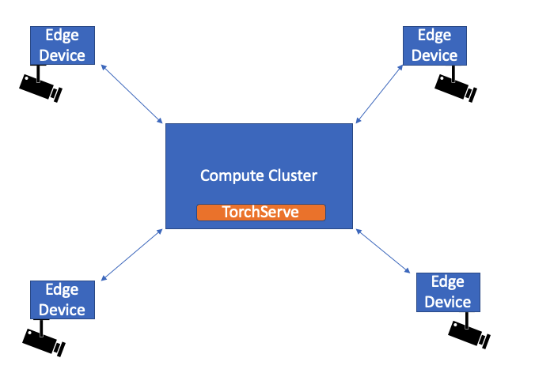

# Streaming Video Inference

Consider a use-case where we have cameras connected to edge devices. These devices are connected to a compute cluster where TorchServe is running. Each edge device has a computer vision pipeline running, where we read frames from the camera and we need to perform tasks as Image Classification, Pose Estimation, Activity Recognition etc on the read frames.

This example shows how this can be achieved using TorchServe.

The architecture diagram is shown below




### Client application using [OpenCV](https://opencv.org/)

In this example, we are using OpenCV to send frames on the client side.
Install OpenCV with the following command
```
pip install opencv-python
```

To make use of TorchServe's dynamic batching feature, we need to send asychronous http requests. Hence, we are using [requests-futures](https://github.com/ross/requests-futures) in this example.
Install requests-futures with the following command
```
pip install requests-future
```

## With TorchServe batching

On the client side, we have one thread for reading frames from a video source and another thread which sends the read frames as httprequest to TorchServe for image classification inference. We are using an asynchronous http requests as we want to make use of TorchServe batching.
We send one frame in each request and let TorchServe handle the batching
TorchServe is setup to process batch size of 4 in this example.
TorchServe receives individual requests, batches the requests to make a single inference request and sends out individual responses to the requests received.


### Create a resnet-18 eager mode model archive, register it on TorchServe and run inference on a streaming video

Run the commands given in following steps from the parent directory of the root of the repository. For example, if you cloned the repository into /home/my_path/serve, run the steps from /home/my_path

```bash
python examples/image_classifier/streaming_video/create_mar_file_batch.py

torchserve --start --model-store model_store --models resnet-18=resnet-18.mar --ts-config examples/image_classifier/streaming_video/config.properties

python examples/image_classifier/streaming_video/request_ts_batching.py
```

The default batch size is 4.
On the client side, we should see the following output

```bash
With Batch Size 4, FPS at frame number 20 is 24.7
{
  "tabby": 0.5186409950256348,
  "tiger_cat": 0.29040342569351196,
  "Egyptian_cat": 0.10797449946403503,
  "lynx": 0.01395314373075962,
  "bucket": 0.006002397276461124
}
{
  "tabby": 0.5186409950256348,
  "tiger_cat": 0.29040342569351196,
  "Egyptian_cat": 0.10797449946403503,
  "lynx": 0.01395314373075962,
  "bucket": 0.006002397276461124
}
{
  "tabby": 0.5186409950256348,
  "tiger_cat": 0.29040342569351196,
  "Egyptian_cat": 0.10797449946403503,
  "lynx": 0.01395314373075962,
  "bucket": 0.006002397276461124
}
{
  "tabby": 0.5186409950256348,
  "tiger_cat": 0.29040342569351196,
  "Egyptian_cat": 0.10797449946403503,
  "lynx": 0.01395314373075962,
  "bucket": 0.006002397276461124
}
```

## With client-side batching

On the client side, we have one thread for reading frames from a video source and another thread which batches(size n) the read frames and sends the request to TorchServe for image classification inference.
To send the batched data, we create a json payload of n frames.
On the TorchServe side, we read the json payload and preprocess the n frames. The postprocess function in the handler returns the output as a list of length 1.


### Create a resnet-18 eager mode model archive, register it on TorchServe and run inference on a streaming video

Run the commands given in following steps from the parent directory of the root of the repository. For example, if you cloned the repository into /home/my_path/serve, run the steps from /home/my_path

```bash
python examples/image_classifier/streaming_video/create_mar_file.py

torchserve --start --model-store model_store --models resnet-18=resnet-18.mar

python examples/image_classifier/streaming_video/request_client_batching.py
```
The default batch size is 1.
On the client side, we should see the following output
```
With Batch Size 1, FPS at frame number 20 is 25.1
With Batch Size 1, FPS at frame number 40 is 27.8
With Batch Size 1, FPS at frame number 60 is 22.4
With Batch Size 1, FPS at frame number 80 is 28.2
With Batch Size 1, FPS at frame number 100 is 22.4
With Batch Size 1, FPS at frame number 120 is 28.2
With Batch Size 1, FPS at frame number 140 is 27.9
With Batch Size 1, FPS at frame number 160 is 22.1
With Batch Size 1, FPS at frame number 180 is 28.4
With Batch Size 1, FPS at frame number 200 is 22.0
With Batch Size 1, FPS at frame number 220 is 29.1
With Batch Size 1, FPS at frame number 240 is 28.4
With Batch Size 1, FPS at frame number 260 is 29.2
With Batch Size 1, FPS at frame number 280 is 28.6
With Batch Size 1, FPS at frame number 300 is 28.5
With Batch Size 1, FPS at frame number 320 is 29.0
With Batch Size 1, FPS at frame number 340 is 28.9
With Batch Size 1, FPS at frame number 360 is 27.7
Done reading 375 frames
Length of queue is 0 , snd_cnt is 375
With Batch Size 1, FPS at frame number 375 is 28.9
```

If we print the response from TorchServe, we should see the following output
```
[
  {
    "tabby": 0.5186409950256348,
    "tiger_cat": 0.29040342569351196,
    "Egyptian_cat": 0.10797449946403503,
    "lynx": 0.01395314373075962,
    "bucket": 0.006002399604767561
  }
]
```

To set batch_size = 10, we use the following command
```
python examples/image_classifier/streaming_video_client_side_batching/request.py --batch_size 10
```

If you have a camera connected, you can run inference on streaming video from the camera as follows

```
python examples/image_classifier/streaming_video_client_side_batching/request.py --batch_size 10 --input 0
```
