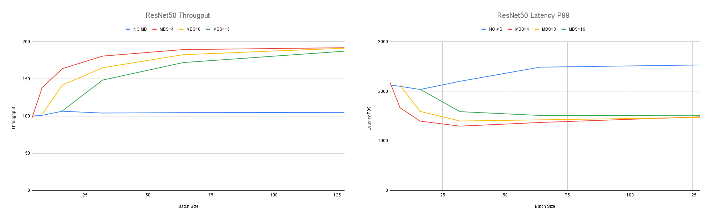

# Micro Batching
Accelerators like GPUs can be used most cost efficiently for inference if they are steadily fed with incoming data.
TorchServe currently allows a single batch to be processed per backend worker.
In each worker the three computation steps (preprocess, inference, postprocess) are executed sequentially.
Because pre- and postprocessing are often carried out on the CPU the GPU sits idle until the two CPU bound steps are executed and the worker receives a new batch.
The following example will show how to make better use of an accelerator in high load scenarios.

For this we are going to assume that there are a lot of incoming client requests and we can potentially fill a bigger batch size within the batch delay time frame where the frontend collects requests for the next batch.
Given this precondition we are going to increase the batch size which the backend worker receives and subsequently split the big batch up into smaller *micro* batches to perform the processing.
We can then perform the computation on the micro batches in parallel as more than one batches are available to the worker.
This way we can already process a micro batch on the GPU while the preprocessing is applied to remaining micro batches.
The pros and cons of this approach are as follow:

Pros:

*  Higher throughput by better utilizing the available accelerator
*  Lower overall latency when enough requests are available for computation

Cons:

* Potentially higher latency and lower throughput if not enough requests are available

## Implementation
This example implements micro batching using a custom handler which overwrites the *handle* method with a MicroBatching object defined in __ts.utils.micro_batching__.
```python
class MicroBatchingHandler(ImageClassifier):
    def __init__(self):
        mb_handle = MicroBatching(self)
        self.handle = mb_handle
```
The MicroBatching object takes the custom handler as an input and spins up a number of threads.
Each thread will work on one of the processing steps (preprocess, inference, postprocess) of the custom handler while multiple threads can be assigned to process the same step in parallel.
The number of threads as well as the size of the micro batch size is configurable through the [model yaml config](config.yaml):
```yaml
batchSize: 32
micro_batching:
  micro_batch_size: 4
  parallelism:
    preprocess: 2
    inference: 1
    postprocess: 2
```
Each number in the *parallelism* dictionary represents the number of threads created for the respective step on initialization.
The micro_batch_size parameter should be chosen much smaller than the batch size configured through the TorchServe API (e.g. 64 vs 4)

## Example
The following example will take a ResNet18 image classification model and run the pre- and postprocessing in parallel which includes resizing and cropping the image.

First, we need to download the model weights:
```bash
$ cd <TorchServe main folder>
$ wget https://download.pytorch.org/models/resnet18-f37072fd.pth
```
Second, we create the MAR file while including the necessary source and config files as additional files:
```bash
$ torch-model-archiver --model-name resnet-18_mb --version 1.0 --model-file ./examples/image_classifier/resnet_18/model.py --serialized-file resnet18-f37072fd.pth --handler examples/micro_batching/micro_batching_handler.py --extra-files ./examples/image_classifier/index_to_name.json --config-file examples/micro_batching/config.yaml
```
Our MicroBatchingHandler defined in [micro_batching_handler.py](micro_batching_handler.py) inherits from ImageClassifier which already defines the necessary pre- and postprocessing.

Third, we move the MAR file to our model_store and start TorchServe.
```bash
$ mkdir model_store
$ mv resnet-18_mb.mar model_store/
$ torchserve --start --ncs --model-store model_store --models resnet-18_mb.mar --disable-token-auth --enable-model-api
```

Finally, we test the registered model with a request:
```bash
$ curl http://127.0.0.1:8080/predictions/resnet-18_mb -T ./examples/image_classifier/kitten.jpg
```
In the next section we will have a look at how the throughput and latency of the model behave by benchmarking it with TorchServe's benchmark tool.

## Results
For the following benchmark we use [benchmark-ab.py](../../benchmarks/benchmark-ab.py) and a ResNet50 instead of the smaller ResNet18.
We ran this benchmark on an AWS g4dn.4xlarge instance with a single T4 GPU.
After creating the MAR file as described above we extract it into the model_store so we do not need to upload the file.
```bash
$ unzip -d model_store/resnet-50_mb model_store/resnet-50_mb.mar
```
Subsequently, we can run the benchmark with:
```bash
$ python3 benchmarks/benchmark-ab.py --config benchmarks/config.json
```
The config.json for the benchmark has the following content:
```json
{
    "url":"/home/ubuntu/serve/model_store/resnet-50_mb/",
    "requests": 50000,
    "concurrency": 200,
    "input": "/home/ubuntu/serve/examples/image_classifier/kitten.jpg",
    "workers": "1",
    "batch_size": 64
}
```
This will run the model with a batch size of 64 and a micro batch size of 4 as configured in the config.yaml.
For this section we ran the benchmark with different batch sizes and micro batch sized (marked with "MBS=X") as well as different number of threads to create the following diagrams.
As a baseline we also ran the vanilla ImageClassifier handler without micro batching which is marked as "NO MB".

In the diagrams we see the throughput and P99 latency plotted over the batch size (as configured through TorchServe API).
Each curve represents a different micro batch size as configured through [config.yaml](config.yaml).
We can see that the throughput stays flat for the vanilla ImageClassifier (NO MB) which suggests that the inference is preprocessing bound and the GPU is underutilized which can be confirmed with a look at the nvidia-smi output.
By interleaving the three compute steps and using two threads for pre- and postprocessing we see that the micro batched variants (MBS=4-16) achieve a higher throughput and even a lower batch latency as the GPU is better utilized due to the introduction of micro batches.
For this particular model we can achieve a throughput of up to 250 QPS by increasing the number of preprocessing threads to 4 and choosing 128 and 8 as batch size and micro batch size, respectively.
The actual achieved speedup will depend on the specific model as well as the intensity of the pre- and postprocessing steps.
Image scaling and decompression for example is usually more compute intense than text preprocessing.

## Summary
In summary we can see that micro batching can help to increase the throughput of a model while decreasing its latency.
This is especially true for workloads with compute intense pre- or postprocessing as well as smaller models.
The micro batching approach can also be used to save memory in a CPU use case by scaling the number if inference threads to >1 which allows to run multiple instances of the model which all share the same underlying weights.
This is in contrast to running multiple TorchServe worker which each create their own model instance which can not share their weights as they reside in different processes.
