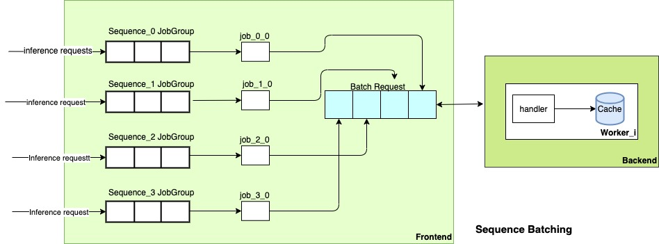

# Stateful Inference

A stateful model possesses the ability to leverage interdependencies between successive inference requests. This type of model maintains a persistent state across inference requests, thereby establishing a linkage between the outcomes of prior inquiries and those that follow. Notable illustrations of stateful models encompass online speech recognition systems, such as the Long Short-Term Memory (LSTM) model. Employing stateful inference mandates that the model server adheres to the sequential order of inference requests, ensuring predictions build upon the previous outcomes.

Within this context, TorchServe offers a mechanism known as sequence batching. This approach involves the retrieval of an individual inference request from a particular sequence, followed by the combination of multiple requests originating from different sequences into a unified batch. Each request is associated with a unique sequence ID, which can be extracted using the "get_sequence_id" function of context.py. This `sequence ID` serves as a key employed by custom handlers to store and retrieve values within the backend cache store, fostering efficient management of stateful inference processes. Client can also reuse the `sequence ID` when a connection resumes as long as the sequence is not expired on the TorchServe side.

The following picture show the workflow of stateful inference. A job group has a job queue which stores incoming inference requests from a streaming. The max capacity of a job queue is defined by `maxSequenceJobQueueSize`. A sequence batch aggregator polls an inference request from each job group. A batch of requests is sent to backend.



This example serves as a practical showcase of employing stateful inference via sequence batching. Underneath the surface, the backend leverages an [LRU dictionary](https://github.com/amitdev/lru-dict), functioning as a caching layer. Users can choose different caching library in the handler implementation based on their own use cases.

### Step 1: Implement handler

stateful_handler.py is an example of stateful handler. It creates a cache `self.cache` by calling `[LRU](https://github.com/amitdev/lru-dict)`.

```python
    def initialize(self, ctx: Context):
        """
        Loads the model and Initializes the necessary artifacts
        """

        super().initialize(ctx)
        if self.context.model_yaml_config["handler"] is not None:
            try:
                self.cache = LRU(
                    int(self.context.model_yaml_config["handler"]["cache"]["capacity"]))
            except KeyError:
                logger.warn("No cache capacity was set! Using default value.")
                self.cache = LRU(StatefulHandler.DEFAULT_CAPACITY)

        self.initialized = True
```

Handler uses sequenceId (ie., `sequence_id = self.context.get_sequence_id(idx)`) as key to store and fetch values from `self.cache`.

```python
    def preprocess(self, data):
        """
        Preprocess function to convert the request input to a tensor(Torchserve supported format).
        The user needs to override to customize the pre-processing

        Args :
            data (list): List of the data from the request input.

        Returns:
            tensor: Returns the tensor data of the input
        """

        self.sequence_ids = {}
        results = []
        for idx, row in enumerate(data):
            sequence_id = self.context.get_sequence_id(idx)

            prev = int(0)
            if self.cache.has_key(sequence_id):
                prev = int(self.cache[sequence_id])

            request = row.get("data") or row.get("body")
            if isinstance(request, (bytes, bytearray)):
                request = request.decode("utf-8")

            val = prev + int(request)
            self.cache[sequence_id] = val
            results.append(val)

        return results
```

### Step 2: Model configuration

Stateful inference has two parameters. TorchServe is able to process (maxWorkers * batchSize) sequences of inference requests of a model in parallel.
* sequenceMaxIdleMSec: the max idle in milliseconds of a sequence inference request of this stateful model. The default value is 0 (ie. this is not a stateful model.) TorchServe does not process the new inference request if the max idle timeout.
* maxSequenceJobQueueSize: the job queue size of an inference sequence of this stateful model. The default value is 1.


```yaml
#cat model-config.yaml

minWorkers: 2
maxWorkers: 2
batchSize: 4
sequenceMaxIdleMSec: 60000
maxSequenceJobQueueSize: 10
sequenceBatching: true

handler:
  cache:
    capacity: 4
```

### Step 3: Generate mar or tgz file

```bash
torch-model-archiver --model-name stateful --version 1.0 --model-file model.py --serialized-file model_cnn.pt --handler stateful_handler.py -r ../requirements.txt --config-file model-config.yaml
```

### Step 4: Build GRPC Client
The details can be found at [here](https://github.com/pytorch/serve/blob/master/docs/grpc_api.md).
* Install gRPC python dependencies
```bash
git submodule init
pip install -U grpcio protobuf grpcio-tools googleapis-common-protos
```

* Generate python gRPC client stub using the proto files
```bash
cd ../../..
python -m grpc_tools.protoc -I third_party/google/rpc --proto_path=frontend/server/src/main/resources/proto/ --python_out=ts_scripts --grpc_python_out=ts_scripts frontend/server/src/main/resources/proto/inference.proto frontend/server/src/main/resources/proto/management.proto
```

### Step 5: Run inference
* Start TorchServe

```bash
torchserve --ncs --start --disable-token-auth --model-store models --model stateful.mar --ts-config examples/stateful/config.properties
```

* Run sequence inference via GRPC client
```bash
python ts_scripts/torchserve_grpc_client.py  infer_stream2 stateful seq_0 examples/stateful/sample/sample1.txt,examples/stateful/sample/sample2.txt,examples/stateful/sample/sample3.txt
```

* Run sequence inference via HTTP
```bash
curl -H "ts_request_sequence_id: seq_0" http://localhost:8080/predictions/stateful -T examples/stateful/sample/sample1.txt
```
