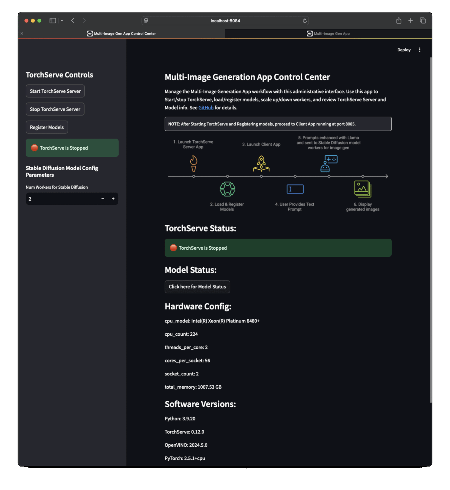
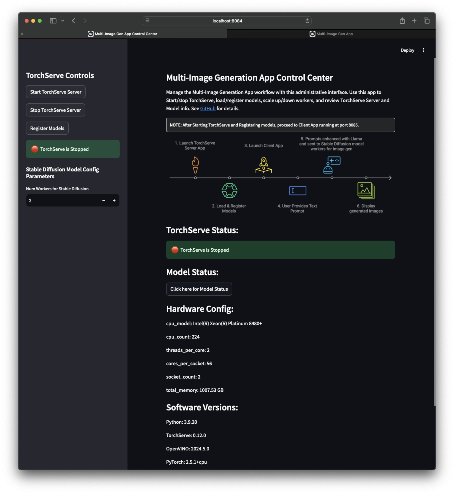
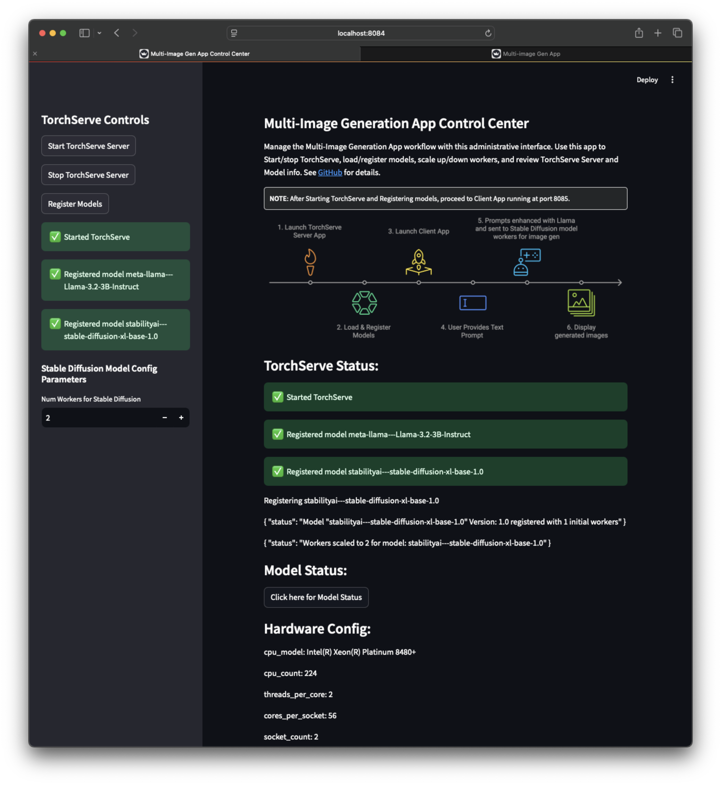
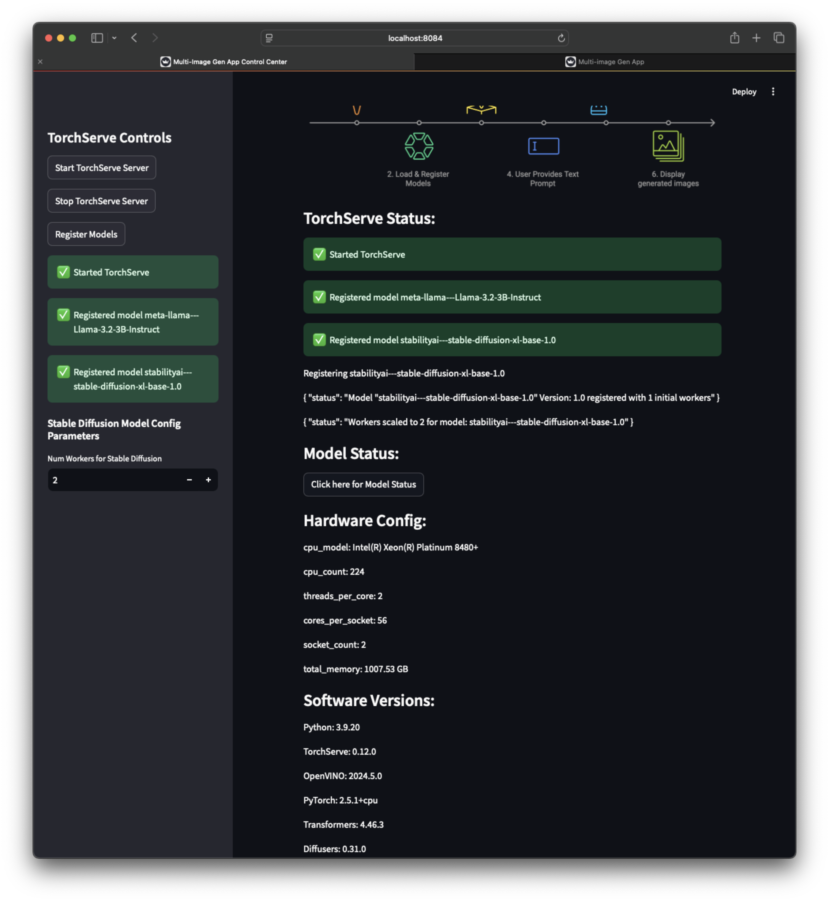
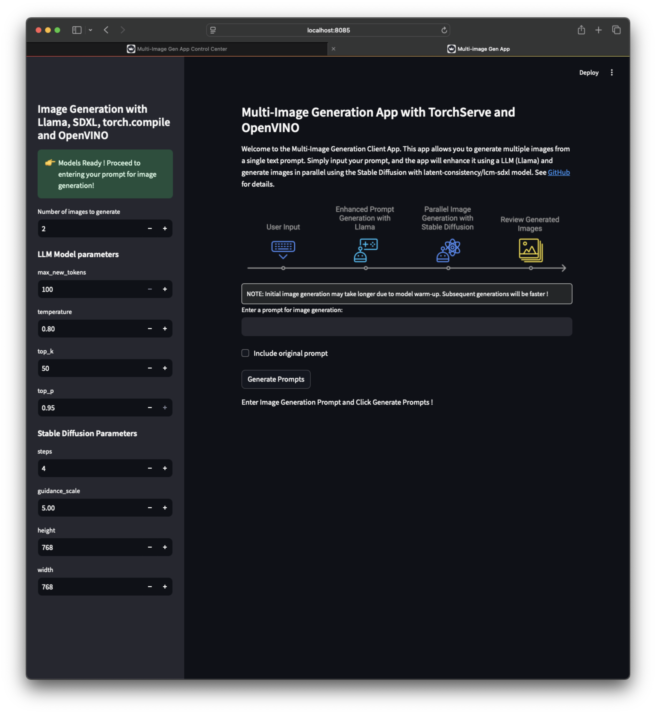
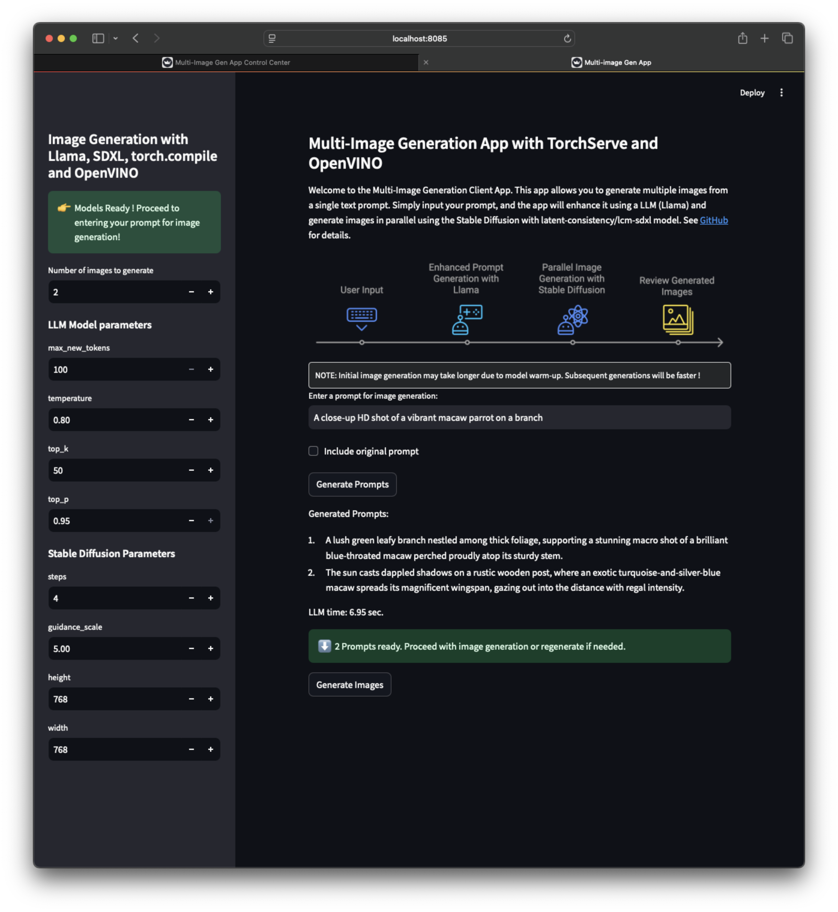
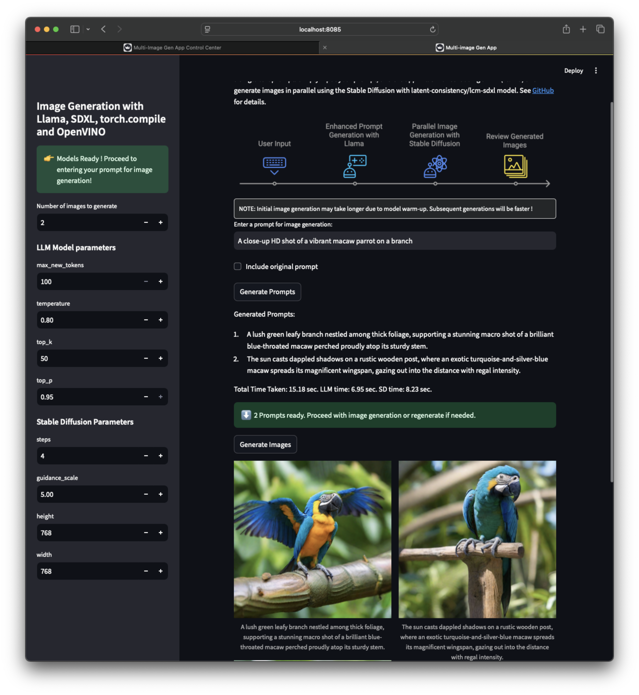

## Multi-Image Generation Streamlit App: Chaining LLaMA & Stable Diffusion using TorchServe, torch.compile & OpenVINO

This Multi-Image Generation Streamlit app is designed to generate multiple images based on a provided text prompt. Instead of using Stable Diffusion directly, this app chains LLaMA and Stable Diffusion to enhance the image generation process. Here’s how it works:
- The app takes a user prompt and uses [Meta-LLaMA-3.2](https://huggingface.co/meta-llama) to create multiple interesting and relevant prompts.
- These generated prompts are then sent to Stable Diffusion with [latent-consistency/lcm-sdxl](https://huggingface.co/latent-consistency/lcm-sdxl) model, to generate images.
- For performance optimization, the models are compiled using [torch.compile using OpenVINO backend.](https://docs.openvino.ai/2024/openvino-workflow/torch-compile.html)
- The application leverages [TorchServe](https://pytorch.org/serve/) for efficient model serving and management.


## Quick Start Guide

**Prerequisites**: 
- Docker installed on your system
- Hugging Face Token: Create a Hugging Face account and obtain a token with access to the [meta-llama/Llama-3.2-3B-Instruct](https://huggingface.co/meta-llama/Llama-3.2-3B-Instruct) model.

To launch the Multi-Image Generation App, follow these steps:
```bash
# 1: Set HF Token as Env variable
export HUGGINGFACE_TOKEN=<HUGGINGFACE_TOKEN>

# 2: Build Docker image for this Multi-Image Generation App
git clone https://github.com/pytorch/serve.git
cd serve
./examples/usecases/llm_diffusion_serving_app/docker/build_image.sh

# 3: Launch the streamlit app for server & client
# After the Docker build is successful, you will see a "docker run" command printed to the console. 
# Run that "docker run" command to launch the Streamlit app for both the server and client.
```

#### Sample Output:
```console
ubuntu@ip-10-0-0-137:~/serve$ ./examples/usecases/llm_diffusion_serving_app/docker/build_image.sh 
EXAMPLE_DIR: .//examples/usecases/llm_diffusion_serving_app/docker
ROOT_DIR: /home/ubuntu/serve
DOCKER_BUILDKIT=1 docker buildx build --platform=linux/amd64 --file .//examples/usecases/llm_diffusion_serving_app/docker/Dockerfile --build-arg BASE_IMAGE="pytorch/torchserve:latest-cpu" --build-arg EXAMPLE_DIR=".//examples/usecases/llm_diffusion_serving_app/docker" --build-arg HUGGINGFACE_TOKEN=hf_<token> --build-arg HTTP_PROXY= --build-arg HTTPS_PROXY= --build-arg NO_PROXY= -t "pytorch/torchserve:llm_diffusion_serving_app" .
[+] Building 1.4s (18/18) FINISHED                                                                                                                                                               docker:default
 => [internal] load .dockerignore                                                                                                                                                                          0.0s
 .
 .
 .
 => [server 13/13] RUN chmod +x /usr/local/bin/dockerd-entrypoint.sh     && chown -R model-server /home/model-server                                                                                       0.3s
 => exporting to image                                                                                                                                                                                     0.1s
 => => exporting layers                                                                                                                                                                                    0.1s
 => => writing image sha256:e900f12e6dad3ec443966766f82860427fa066aefe504a415eecf69bf4c3c043                                                                                                               0.0s
 => => naming to docker.io/pytorch/torchserve:llm_diffusion_serving_app                                                                                                                                    0.0s

Docker Build Successful ! 

................. Next Steps .................
----------------------------------------------
Run the following command to start the Multi-image generation App:

docker run --rm -it --platform linux/amd64 \
        -p 127.0.0.1:8080:8080 \
        -p 127.0.0.1:8081:8081 \
        -p 127.0.0.1:8082:8082 \
        -p 127.0.0.1:8084:8084 \
        -p 127.0.0.1:8085:8085 \
        -v /home/ravi/projects/surya-serve/model-store-local:/home/model-server/model-store \
        -e MODEL_NAME_LLM=meta-llama/Llama-3.2-3B-Instruct \
        -e MODEL_NAME_SD=stabilityai/stable-diffusion-xl-base-1.0 \
        pytorch/torchserve:llm_diffusion_serving_app

Note: You can replace the model identifiers (MODEL_NAME_LLM, MODEL_NAME_SD) as needed.

```

## What to expect
After launching the Docker container using the `docker run ..` command displayed after successful build, you can access two separate Streamlit applications:
1. TorchServe Server App (running at http://localhost:8084) to start/stop TorchServe, load/register models, scale up/down workers. 
2. Client App (running at http://localhost:8085) where you can enter prompt for Image generation. 

#### Sample Output:

```console
ubuntu@ip-10-0-0-137:~/serve$ docker run --rm -it --platform linux/amd64 \
-p 127.0.0.1:8080:8080 \
-p 127.0.0.1:8081:8081 \
-p 127.0.0.1:8082:8082 \
-p 127.0.0.1:8084:8084 \
-p 127.0.0.1:8085:8085 \
-v /home/ubuntu/serve/model-store-local:/home/model-server/model-store \
-e MODEL_NAME_LLM=meta-llama/Llama-3.2-3B-Instruct \
-e MODEL_NAME_SD=stabilityai/stable-diffusion-xl-base-1.0  \
pytorch/torchserve:llm_diffusion_serving_app

Preparing meta-llama/Llama-3.2-1B-Instruct
/home/model-server/llm_diffusion_serving_app/llm /home/model-server/llm_diffusion_serving_app
Model meta-llama---Llama-3.2-1B-Instruct already downloaded.
Model archive for meta-llama---Llama-3.2-1B-Instruct exists.
/home/model-server/llm_diffusion_serving_app

Preparing stabilityai/stable-diffusion-xl-base-1.0
/home/model-server/llm_diffusion_serving_app/sd /home/model-server/llm_diffusion_serving_app
Model stabilityai/stable-diffusion-xl-base-1.0 already downloaded
Model archive for stabilityai---stable-diffusion-xl-base-1.0 exists.
/home/model-server/llm_diffusion_serving_app

Collecting usage statistics. To deactivate, set browser.gatherUsageStats to false.

Collecting usage statistics. To deactivate, set browser.gatherUsageStats to false.

  You can now view your Streamlit app in your browser.

  Local URL: http://localhost:8085
  Network URL: http://123.11.0.2:8085
  External URL: http://123.123.12.34:8085


  You can now view your Streamlit app in your browser.

  Local URL: http://localhost:8084
  Network URL: http://123.11.0.2:8084
  External URL: http://123.123.12.34:8084
```

## App Screenshots

### App Workflow 


### Server App Screenshots

| Server App Screenshot 1 | Server App Screenshot 2 | Server App Screenshot 3 |
| --- | --- | --- |
|  |  |  |

### Client App Screenshots

| Client App Screenshot 1 | Client App Screenshot 2 | Client App Screenshot 3 |
| --- | --- | --- |
|  |  |  |

