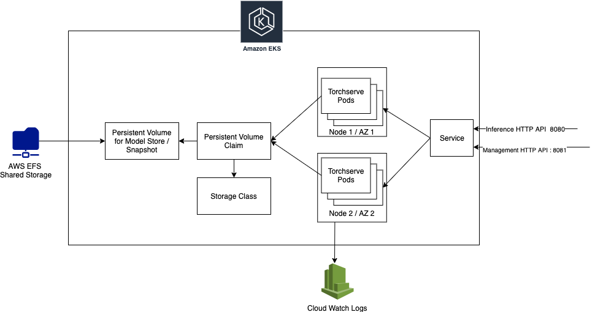
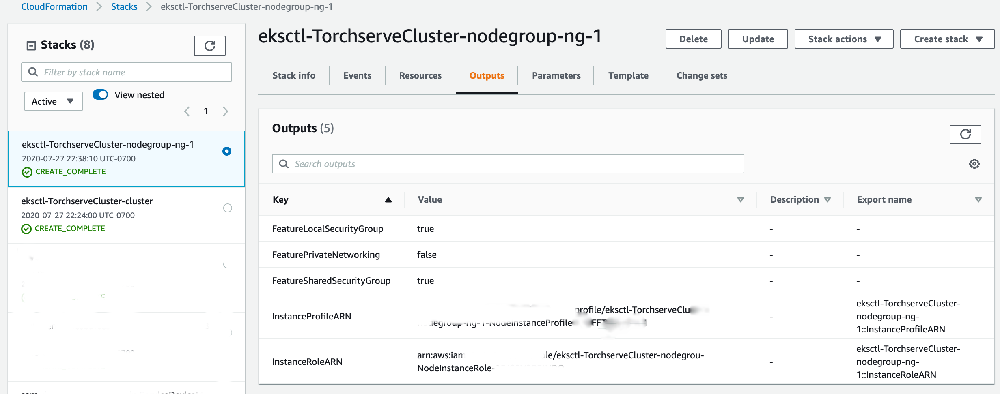
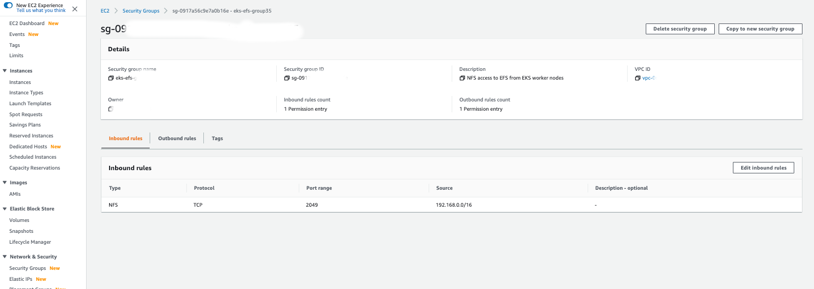
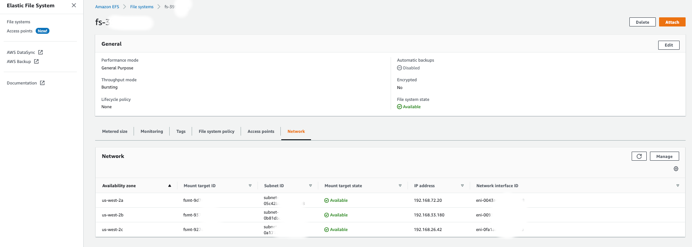

  # Torchserve on Elastic Kubernetes service (EKS)

  ## Overview

  This page demonstrates a Torchserve deployment in Kubernetes using Helm Charts. It uses the DockerHub Torchserve Image for the pods and a PersistentVolume for storing config / model files.

  

  In the following sections we would
  * Create a EKS Cluster for deploying Torchserve
  * Create a PersistentVolume backed by EFS to store models and config
  * Use Helm charts to deploy Torchserve

  All these steps scripts are written for AWS EKS with Ubuntu 18.04 for deployment, but could be easily adopted for Kubernetes offering from other vendors.

  ## Prerequisites

  We would need the following tools to be installed to setup the K8S Torchserve cluster.

  * AWS CLI - [Installation](https://docs.aws.amazon.com/cli/latest/userguide/install-cliv2-linux.html)
  * eksctl - [Installation](https://docs.aws.amazon.com/eks/latest/userguide/getting-started-eksctl.html)
  * kubectl - [Installation](https://kubernetes.io/docs/tasks/tools/install-kubectl/)
  * helm - [Installation](https://helm.sh/docs/intro/install/)
  * jq  - For JSON parsing in CLI

  

  ```bash
  sudo apt-get update
  
  # Install AWS CLI & Set Credentials
  curl "https://awscli.amazonaws.com/awscli-exe-linux-x86_64.zip" -o "awscliv2.zip"
  unzip awscliv2.zip
  sudo ./aws/install
  
  # Verify your aws cli installation
  aws --version
  
  # Setup your AWS credentials / region
  export AWS_ACCESS_KEY_ID=
  export AWS_SECRET_ACCESS_KEY=
  export AWS_DEFAULT_REGION=
  
  
  # Install eksctl
  curl --silent --location "https://github.com/weaveworks/eksctl/releases/latest/download/eksctl_$(uname -s)_amd64.tar.gz" | tar xz -C /tmp
  sudo mv /tmp/eksctl /usr/local/bin
  
  # Verify your eksctl installation
  eksctl version
  
  # Install kubectl
  curl -LO "https://storage.googleapis.com/kubernetes-release/release/$(curl -s https://storage.googleapis.com/kubernetes-release/release/stable.txt)/bin/linux/amd64/kubectl"
  chmod +x ./kubectl
  sudo mv ./kubectl /usr/local/bin/kubectl
  
  # Verify your kubectl installation
  kubectl version --client
  
  # Install helm
  curl -fsSL -o get_helm.sh https://raw.githubusercontent.com/helm/helm/master/scripts/get-helm-3
  chmod 700 get_helm.sh
  ./get_helm.sh
  
  
  # Install jq
  sudo apt-get install jq
  
  # Clone TS
  git clone https://github.com/pytorch/serve/
  cd kubernetes/EKS
  ```

  

  ## EKS Cluster setup

  In this section we decribe creating a EKS Kubernetes cluster with GPU nodes. If you have an existing EKS / Kubernetes cluster you may skip this section and skip ahead to PersistentVolume preparation. 

  Ensure you have your installed all required dependices & configured AWS CLI from the previous steps  appropriate permissions. The following steps would,

  * Create a EKS cluster
  * Install all the required driver for NVIDIA GPU.


  ### Creating a EKS cluster

  **EKS Optimized AMI Subscription**

  First subscribe to EKS-optimized AMI with GPU Support in the AWS Marketplace. Subscribe [here](https://aws.amazon.com/marketplace/pp/B07GRHFXGM). These hosts would be used for the EKS Node Group. 

  More details about these AMIs and configuring can be found [here](https://github.com/awslabs/amazon-eks-ami) and [here](https://eksctl.io/usage/custom-ami-support/)

  **Create a EKS Cluster**


  To create a cluster run the following command. 

  First update the `templates/eks_cluster.yaml` with 

  ```yaml
  apiVersion: eksctl.io/v1alpha5
  kind: ClusterConfig
  
  metadata:
    name: "TorchserveCluster"
    region: "us-west-2" # Update AWS Region
  
  nodeGroups:
    - name: ng-1
      instanceType: g4dn.xlarge # Update Node Type
      desiredCapacity: 3 # Update Node count
  ```

  

  Then run the following command

  ```eksctl create cluster -f templates/eks_cluster.yaml```

  

  Your output should look similar to 

  ```bash
  ubuntu@ip-172-31-50-36:~/serve/kubernetes$ eksctl create cluster -f templates/eks_cluster.yaml
  [ℹ]  eksctl version 0.24.0
  [ℹ]  using region us-west-2
  [ℹ]  setting availability zones to [us-west-2c us-west-2b us-west-2a]
  [ℹ]  subnets for us-west-2c - public:192.168.0.0/19 private:192.168.96.0/19
  [ℹ]  subnets for us-west-2b - public:192.168.32.0/19 private:192.168.128.0/19
  [ℹ]  subnets for us-west-2a - public:192.168.64.0/19 private:192.168.160.0/19
  [ℹ]  nodegroup "ng-1" will use "ami-0b6e3586ae536bd40" [AmazonLinux2/1.16]
  [ℹ]  using Kubernetes version 1.16
  [ℹ]  creating EKS cluster "TorchserveCluster" in "us-west-2" region with un-managed nodes
  [ℹ]  1 nodegroup (ng-1) was included (based on the include/exclude rules)
  [ℹ]  will create a CloudFormation stack for cluster itself and 1 nodegroup stack(s)
  [ℹ]  will create a CloudFormation stack for cluster itself and 0 managed nodegroup stack(s)
  [ℹ]  if you encounter any issues, check CloudFormation console or try 'eksctl utils describe-stacks --region=us-west-2 --cluster=TorchserveCluster'
  [ℹ]  Kubernetes API endpoint access will use default of {publicAccess=true, privateAccess=false} for cluster "TorchserveCluster" in "us-west-2"
  [ℹ]  2 sequential tasks: { create cluster control plane "TorchserveCluster", 2 sequential sub-tasks: { update CloudWatch logging configuration, create nodegroup "ng-1" } }
  [ℹ]  building cluster stack "eksctl-TorchserveCluster-cluster"
  [ℹ]  deploying stack "eksctl-TorchserveCluster-cluster"
  [✔]  configured CloudWatch logging for cluster "TorchserveCluster" in "us-west-2" (enabled types: api, audit, authenticator, controllerManager, scheduler & no types disabled)
  [ℹ]  building nodegroup stack "eksctl-TorchserveCluster-nodegroup-ng-1"
  [ℹ]  --nodes-min=1 was set automatically for nodegroup ng-1
  [ℹ]  --nodes-max=1 was set automatically for nodegroup ng-1
  [ℹ]  deploying stack "eksctl-TorchserveCluster-nodegroup-ng-1"
  [ℹ]  waiting for the control plane availability...
  [✔]  saved kubeconfig as "/home/ubuntu/.kube/config"
  [ℹ]  no tasks
  [✔]  all EKS cluster resources for "TorchserveCluster" have been created
  [ℹ]  adding identity "arn:aws:iam::ACCOUNT_ID:role/eksctl-TorchserveCluster-nodegrou-NodeInstanceRole" to auth ConfigMap
  [ℹ]  nodegroup "ng-1" has 0 node(s)
  [ℹ]  waiting for at least 1 node(s) to become ready in "ng-1"
  [ℹ]  nodegroup "ng-1" has 1 node(s)
  [ℹ]  node "ip-instance_id.us-west-2.compute.internal" is ready
  [ℹ]  as you are using a GPU optimized instance type you will need to install NVIDIA Kubernetes device plugin.
  [ℹ]  	 see the following page for instructions: https://github.com/NVIDIA/k8s-device-plugin
  [ℹ]  kubectl command should work with "/home/ubuntu/.kube/config", try 'kubectl get nodes'
  [✔]  EKS cluster "TorchserveCluster" in "us-west-2" region is ready
  ```

  

  This would create a EKS cluster named **TorchserveCluster**. This step would takes a considetable amount time to create EKS clusters. You would be able to track the progress in your cloudformation console. If you run in to any error inspect the events tab of the Cloud Formation UI.

  

  

  

  Verify that the cluster has been created with the following commands 

  ```bash
  eksctl get  clusters
  kubectl get service,po,daemonset,pv,pvc --all-namespaces
  ```

  Your output should look similar to,

  ```bash
  ubuntu@ip-172-31-55-101:~/serve/kubernetes$ eksctl get  clusters
  NAME			REGION
  TorchserveCluster	us-west-2
  
  ubuntu@ip-172-31-55-101:~/serve/kubernetes$ kubectl get service,po,daemonset,pv,pvc --all-namespaces
  NAMESPACE     NAME                 TYPE        CLUSTER-IP    EXTERNAL-IP   PORT(S)         AGE
  default       service/kubernetes   ClusterIP   10.100.0.1    <none>        443/TCP         27m
  kube-system   service/kube-dns     ClusterIP   10.100.0.10   <none>        53/UDP,53/TCP   27m
  
  NAMESPACE     NAME                           READY   STATUS    RESTARTS   AGE
  kube-system   pod/aws-node-2flf5             1/1     Running   0          19m
  kube-system   pod/coredns-55c5fcd78f-2h7s4   1/1     Running   0          27m
  kube-system   pod/coredns-55c5fcd78f-pm6n5   1/1     Running   0          27m
  kube-system   pod/kube-proxy-pp8t2           1/1     Running   0          19m
  
  NAMESPACE     NAME                        DESIRED   CURRENT   READY   UP-TO-DATE   AVAILABLE   NODE SELECTOR   AGE
  kube-system   daemonset.apps/aws-node     1         1         1       1            1           <none>          27m
  kube-system   daemonset.apps/kube-proxy   1         1         1       1            1           <none>          27m
  
  ```

  

  **NVIDIA Plugin**

  The NVIDIA device plugin for Kubernetes is a Daemonset that allows you to run GPU enabled containers. The instructions for installing the plugin can be found [here](https://github.com/NVIDIA/k8s-device-plugin#installing-via-helm-installfrom-the-nvidia-device-plugin-helm-repository)

  ```bash
  helm repo add nvdp https://nvidia.github.io/k8s-device-plugin
  helm repo update
  helm install \
      --version=0.7.1 \
      --generate-name \
      nvdp/nvidia-device-plugin
  ```

  To verify that the plugin has been installed execute the following command

  ```bash
  helm list
  ```

  Your output should look similar to

  ```bash
  NAME                           	NAMESPACE	REVISION	UPDATED                                	STATUS  	CHART                     	APP VERSION
  nvidia-device-plugin-1607068152	default  	1       	2020-12-04 13:19:16.207166144 +0530 IST	deployed	nvidia-device-plugin-0.7.1	0.7.1      
  ```

  ```bash
  kubectl get nodes "-o=custom-columns=NAME:.metadata.name,MEMORY:.status.allocatable.memory,CPU:.status.allocatable.cpu,GPU:.status.allocatable.nvidia\.com/gpu"
  ```

  should show something similar to:

  ```bash
  NAME                                          MEMORY       CPU     GPU
  ip-192-168-43-94.us-west-2.compute.internal   57213900Ki   7910m   1
  ```

  ## Setup PersistentVolume backed by EFS

  Torchserve Helm Chart needs a PersistentVolume with a PVC label `model-store-claim` prepared with a specific folder structure shown below. This PersistentVolume contains the snapshot & model files which are shared between multiple pods of the torchserve deployment.

      model-server/
      ├── config
      │   └── config.properties
      └── model-store
          ├── mnist.mar
          └── squeezenet1_1.mar

  **Create EFS Volume for the EKS Cluster**

  This section describes steps to prepare a EFS backed PersistentVolume that would be used by the TS Helm Chart. To prepare a EFS volume as a shareifjccgiced model / config store we have to create a EFS file system, Security Group, Ingress rule, Mount Targets to enable EFS communicate across NAT of the EKS cluster. 

  The heavy lifting for these steps is performed by ``setup_efs.sh`` script. To run the script, Update the following variables in `setup_efs.sh`

  ```bash
  CLUSTER_NAME=TorchserveCluster # EKS TS Cluser Name
  MOUNT_TARGET_GROUP_NAME="eks-efs-group"
  ```

  Then run `source ./setup_efs.sh`. This would also set all the env variables which might be used for deletion at a later time

  The output of the script should look similar to,

  

  ```bash
  Configuring TorchserveCluster
  Obtaining VPC ID for TorchserveCluster
  Obtained VPC ID - vpc-fff
  Obtaining CIDR BLOCK for vpc-fff
  Obtained CIDR BLOCK - 192.168.0.0/16
  Creating Security Group
  Created Security Group - sg-fff
  Configuring Security Group Ingress
  Creating EFS Fils System
  Created EFS - fs-ff
  {
      "FileSystems": [
          {
              "OwnerId": "XXXX",
              "CreationToken": "4ae307b6-62aa-44dd-909e-eebe0d0b19f3",
              "FileSystemId": "fs-88983c8d",
              "FileSystemArn": "arn:aws:elasticfilesystem:us-west-2:ff:file-system/fs-ff",
              "CreationTime": "2020-07-29T08:03:33+00:00",
              "LifeCycleState": "creating",
              "NumberOfMountTargets": 0,
              "SizeInBytes": {
                  "Value": 0,
                  "ValueInIA": 0,
                  "ValueInStandard": 0
              },
              "PerformanceMode": "generalPurpose",
              "Encrypted": false,
              "ThroughputMode": "bursting",
              "Tags": []
          }
      ]
  }
  Waiting 30s for before procedding
  Obtaining Subnets
  Obtained Subnets - subnet-ff
  Creating EFS Mount Target in subnet-ff
  {
      "OwnerId": "XXXX",
      "MountTargetId": "fsmt-ff",
      "FileSystemId": "fs-ff",
      "SubnetId": "subnet-ff",
      "LifeCycleState": "creating",
      "IpAddress": "192.168.58.19",
      "NetworkInterfaceId": "eni-01ce1fd11df545226",
      "AvailabilityZoneId": "usw2-az1",
      "AvailabilityZoneName": "us-west-2b",
      "VpcId": "vpc-ff"
  }
  Creating EFS Mount Target in subnet-ff
  {
      "OwnerId": "XXXX",
      "MountTargetId": "fsmt-ff",
      "FileSystemId": "fs-ff",
      "SubnetId": "subnet-ff",
      "LifeCycleState": "creating",
      "IpAddress": "192.168.5.7",
      "NetworkInterfaceId": "eni-03db930b204de6ab2",
      "AvailabilityZoneId": "usw2-az3",
      "AvailabilityZoneName": "us-west-2c",
      "VpcId": "vpc-ff"
  }
  Creating EFS Mount Target in subnet-ff
  {
      "OwnerId": "XXXX",
      "MountTargetId": "fsmt-ff",
      "FileSystemId": "fs-ff",
      "SubnetId": "subnet-ff",
      "LifeCycleState": "creating",
      "IpAddress": "192.168.73.152",
      "NetworkInterfaceId": "eni-0a31830833bf6b030",
      "AvailabilityZoneId": "usw2-az2",
      "AvailabilityZoneName": "us-west-2a",
      "VpcId": "vpc-ff"
  }
  EFS File System ID - YOUR-EFS-ID
  EFS File System DNS Name - YOUR-EFS-ID.efs..amazonaws.com
  Succesfully created EFS & Mountpoints
  ```

  

  Upon completion of the script it would emit a EFS volume DNS Name similar to `fs-ab1cd.efs.us-west-2.amazonaws.com` where `fs-ab1cd` is the EFS filesystem id.

  

  You should be able to see a Security Group in your AWS Console with Inbound Rules to a NFS (Port 2049)

  

  

  

  You should also find Mount Points in your EFS console for every region where there is a Node in the Node Group.

  

  

  

  

  **Prepare PersistentVolume for Deployment**

  We use the [ELF Provisioner Helm Chart](https://github.com/helm/charts/tree/master/stable/efs-provisioner) to create a PersistentVolume backed by EFS. Run the following command to set this up.

  ```bash
  helm repo add stable https://charts.helm.sh/stable
  helm repo update
  helm install stable/efs-provisioner --set efsProvisioner.efsFileSystemId=YOUR-EFS-FS-ID --set efsProvisioner.awsRegion=us-west-2 --set efsProvisioner.reclaimPolicy=Retain --generate-name
  ```

  

  you should get an output similar to 

  

  ```bash
  NAME: efs-provisioner-1596010253
  LAST DEPLOYED: Wed Jul 29 08:10:56 2020
  NAMESPACE: default
  STATUS: deployed
  REVISION: 1
  TEST SUITE: None
  NOTES:
  You can provision an EFS-backed persistent volume with a persistent volume claim like below:
  
  kind: PersistentVolumeClaim
  apiVersion: v1
  metadata:
    name: my-efs-vol-1
    annotations:
      volume.beta.kubernetes.io/storage-class: aws-efs
  spec:
    storageClassName: aws-efs
    accessModes:
      - ReadWriteMany
    resources:
      requests:
        storage: 1Mi
  
  ```

  

  Verify that your EFS Provisioner installation is succesfull by invoking ```kubectl get pods```. Your output should look similar to,

  

  ```bash
  ubuntu@ip-172-31-50-36:~/serve/kubernetes$ kubectl get pods
  NAME                                          READY   STATUS    RESTARTS   AGE
  efs-provisioner-1596010253-6c459f95bb-v68bm   1/1     Running   0          109s
  ```

 Update `templates/efs_pv_claim.yaml` - `resources.request.storage` with the size of your PVC claim based on the size of the models you plan to use.  Now run, ```kubectl apply -f templates/efs_pv_claim.yaml```. This would also create a pod named `pod/model-store-pod` with PersistentVolume mounted so that we can copy the MAR / config files in the same folder structure described above. 

  

  Your output should look similar to,

  ```bash
  ubuntu@ip-172-31-50-36:~/serve/kubernetes$ kubectl apply -f templates/efs_pv_claim.yaml
  persistentvolumeclaim/model-store-claim created
  pod/model-store-pod created
  ```

  

  Verify that the PVC / Pod is created  by excuting.   ```kubectl get service,po,daemonset,pv,pvc --all-namespaces``` 

  You should see

  * ```Running``` status for ```pod/model-store-pod```  
  * ```Bound``` status for ```default/model-store-claim``` and ```persistentvolumeclaim/model-store-claim```

  

  ```bash
  ubuntu@ip-172-31-50-36:~/serve/kubernetes$ kubectl get service,po,daemonset,pv,pvc --all-namespaces
  NAMESPACE     NAME                 TYPE        CLUSTER-IP    EXTERNAL-IP   PORT(S)         AGE
  default       service/kubernetes   ClusterIP   10.100.0.1    <none>        443/TCP         107m
  kube-system   service/kube-dns     ClusterIP   10.100.0.10   <none>        53/UDP,53/TCP   107m
  
  NAMESPACE     NAME                                              READY   STATUS    RESTARTS   AGE
  default       pod/efs-provisioner-1596010253-6c459f95bb-v68bm   1/1     Running   0          4m49s
  default       pod/model-store-pod                               1/1     Running   0          8s
  kube-system   pod/aws-node-xx8kp                                1/1     Running   0          99m
  kube-system   pod/coredns-5c97f79574-tchfg                      1/1     Running   0          107m
  kube-system   pod/coredns-5c97f79574-thzqw                      1/1     Running   0          106m
  kube-system   pod/kube-proxy-4l8mw                              1/1     Running   0          99m
  kube-system   pod/nvidia-device-plugin-daemonset-dbhgq          1/1     Running   0          94m
  
  NAMESPACE     NAME                                            DESIRED   CURRENT   READY   UP-TO-DATE   AVAILABLE   NODE SELECTOR   AGE
  kube-system   daemonset.apps/aws-node                         1         1         1       1            1           <none>          107m
  kube-system   daemonset.apps/kube-proxy                       1         1         1       1            1           <none>          107m
  kube-system   daemonset.apps/nvidia-device-plugin-daemonset   1         1         1       1            1           <none>          94m
  
  NAMESPACE   NAME                                                        CAPACITY   ACCESS MODES   RECLAIM POLICY   STATUS   CLAIM                       STORAGECLASS   REASON   AGE
              persistentvolume/pvc-baf0bd37-2084-4a08-8a3c-4f77843b4736   1Gi        RWX            Delete           Bound    default/model-store-claim   aws-efs                 8s
  
  NAMESPACE   NAME                                      STATUS   VOLUME                                     CAPACITY   ACCESS MODES   STORAGECLASS   AGE
  default     persistentvolumeclaim/model-store-claim   Bound    pvc-baf0bd37-2084-4a08-8a3c-4f77843b4736   1Gi        RWX            aws-efs        8s
  ```

  

  Now edit the TS config file `config.properties` that would be used for the deployment. Any changes to this config should also have corresponding changes in Torchserve Helm Chart that we install in the next section. This config would be used by every torchserve instance in worker pods.

  

  The default config starts **squeezenet1_1** and **mnist** from the model zoo with 3, 5 workers.

  

  ```yaml
  inference_address=http://0.0.0.0:8080
  management_address=http://0.0.0.0:8081
  NUM_WORKERS=1
  number_of_gpu=1
  number_of_netty_threads=32
  job_queue_size=1000
  model_store=/home/model-server/shared/model-store
  model_snapshot={"name":"startup.cfg","modelCount":2,"models":{"squeezenet1_1":{"1.0":{"defaultVersion":true,"marName":"squeezenet1_1.mar","minWorkers":3,"maxWorkers":3,"batchSize":1,"maxBatchDelay":100,"responseTimeout":120}},"mnist":{"1.0":{"defaultVersion":true,"marName":"mnist.mar","minWorkers":5,"maxWorkers":5,"batchSize":1,"maxBatchDelay":200,"responseTimeout":60}}}}
  ```

  

  Now copy the files over to PersistentVolume using the following commands.

  

  ```bash
  wget https://torchserve.s3.amazonaws.com/mar_files/squeezenet1_1.mar
  wget https://torchserve.s3.amazonaws.com/mar_files/mnist.mar
  
  kubectl exec --tty pod/model-store-pod -- mkdir /pv/model-store/
  kubectl cp squeezenet1_1.mar model-store-pod:/pv/model-store/squeezenet1_1.mar
  kubectl cp mnist.mar model-store-pod:/pv/model-store/mnist.mar
  
  
  kubectl exec --tty pod/model-store-pod -- mkdir /pv/config/
  kubectl cp config.properties model-store-pod:/pv/config/config.properties
  ```

  

  Verify that the files have been copied by executing ```kubectl exec --tty pod/model-store-pod -- find /pv/``` . You should get an output similar to,

  

  ```bash
  ubuntu@ip-172-31-50-36:~/serve/kubernetes$ kubectl exec --tty pod/model-store-pod -- find /pv/
  /pv/
  /pv/config
  /pv/config/config.properties
  /pv/model-store
  /pv/model-store/squeezenet1_1.mar
  /pv/model-store/mnist.mar
  ```

  

  Finally terminate the pod - `kubectl delete pod/model-store-pod`.

  

  ## Deploy TorchServe using Helm Charts

  
  The following table describes all the parameters for the Helm Chart.

  | Parameter          | Description              | Default                         |
  | ------------------ | ------------------------ | ------------------------------- |
  | `image`            | Torchserve Serving image | `pytorch/torchserve:latest-gpu` |
  | `management-port`  | TS Inference port        | `8080`                          |
  | `inference-port`   | TS Management port       | `8081`                          |
  | `replicas`         | K8S deployment replicas  | `1`                             |
  | `model-store`      | EFS mountpath            | `/home/model-server/shared/`    |
  | `persistence.size` | Storage size to request  | `1Gi`                           |
  | `n_gpu`            | Number of GPU in a TS Pod| `1`                             |
  | `n_cpu`            | Number of CPU in a TS Pod| `1`                             |
  | `memory_limit`     | TS Pod memory limit      | `4Gi`                           |
  | `memory_request`   | TS Pod memory request    | `1Gi`                           |


  Edit the values in `values.yaml` with the right parameters.  Somethings to consider,
  
  * Set torchserve_image to the `pytorch/torchserve:latest` if your nodes are CPU.
  * Set `persistence.size` based on the size of your models.
  * The value of `replicas` should be less than number of Nodes in the Node group.
  * `n_gpu` would be exposed to TS container by docker. This should be set to `number_of_gpu` in `config.properties` above.
  * `n_gpu` & `n_cpu` values are used on a per pod level and not in the entire cluster level

  ```yaml
  # Default values for torchserve helm chart.
  
  torchserve_image: pytorch/torchserve:latest-gpu
  
  namespace: torchserve
  
  torchserve:
    management_port: 8081
    inference_port: 8080
    pvd_mount: /home/model-server/shared/
    n_gpu: 1
    n_cpu: 1
    memory_limit: 4Gi
    memory_request: 1Gi
  
  deployment:
    replicas: 1 # Changes this to number of node in Node Group
  
  persitant_volume:
    size: 1Gi
  ```


  To install Torchserve, move to the Helm folder ```cd ../Helm``` and run ```helm install ts .```  
  

  ```bash
  ubuntu@ip-172-31-50-36:~/serve/kubernetes$ helm install ts .
  NAME: ts
  LAST DEPLOYED: Wed Jul 29 08:29:04 2020
  NAMESPACE: default
  STATUS: deployed
  REVISION: 1
  TEST SUITE: None
  ```
  

  Verify that torchserve has succesfully started by executing ```kubectl exec pod/torchserve-fff -- cat logs/ts_log.log``` on your torchserve pod. You can get this id by lookingup `kubectl get po --all-namespaces`

  

  Your output should should look similar to 

  ```bash
  ubuntu@ip-172-31-50-36:~/serve/kubernetes$ kubectl exec pod/torchserve-fff -- cat logs/ts_log.log
  2020-07-29 08:29:08,295 [INFO ] main org.pytorch.serve.ModelServer -
  Torchserve version: 0.1.1
  TS Home: /home/venv/lib/python3.6/site-packages
  Current directory: /home/model-server
  ......
  ```


  ## Test Torchserve Installation

  Fetch the Load Balancer Extenal IP by executing 

  ```bash
  kubectl get svc
  ```

  You should see an entry similar to 

  ```bash
  ubuntu@ip-172-31-65-0:~/ts/rel/serve$ kubectl get svc
  NAME         TYPE           CLUSTER-IP      EXTERNAL-IP                                                              PORT(S)                         AGE
  torchserve   LoadBalancer   10.100.142.22   your_elb.us-west-2.elb.amazonaws.com   8080:31115/TCP,8081:31751/TCP   14m
  ```

  Now execute the following commands to test Management / Prediction APIs
  ```bash
  curl http://your_elb.us-west-2.elb.amazonaws.com:8081/models
  
  # You should something similar to the following
  {
    "models": [
      {
        "modelName": "mnist",
        "modelUrl": "mnist.mar"
      },
      {
        "modelName": "squeezenet1_1",
        "modelUrl": "squeezenet1_1.mar"
      }
    ]
  }
  
  
  curl http://your_elb.us-west-2.elb.amazonaws.com:8081/models/squeezenet1_1
  
  # You should see something similar to the following
  [
    {
      "modelName": "squeezenet1_1",
      "modelVersion": "1.0",
      "modelUrl": "squeezenet1_1.mar",
      "runtime": "python",
      "minWorkers": 3,
      "maxWorkers": 3,
      "batchSize": 1,
      "maxBatchDelay": 100,
      "loadedAtStartup": false,
      "workers": [
        {
          "id": "9000",
          "startTime": "2020-07-23T18:34:33.201Z",
          "status": "READY",
          "gpu": true,
          "memoryUsage": 177491968
        },
        {
          "id": "9001",
          "startTime": "2020-07-23T18:34:33.204Z",
          "status": "READY",
          "gpu": true,
          "memoryUsage": 177569792
        },
        {
          "id": "9002",
          "startTime": "2020-07-23T18:34:33.204Z",
          "status": "READY",
          "gpu": true,
          "memoryUsage": 177872896
        }
      ]
    }
  ]
  
  
  wget https://raw.githubusercontent.com/pytorch/serve/master/docs/images/kitten_small.jpg
  curl -X POST  http://your_elb.us-west-2.elb.amazonaws.com:8080/predictions/squeezenet1_1 -T kitten_small.jpg
  
  # You should something similar to the following
  [
    {
      "lynx": 0.5370921492576599
    },
    {
      "tabby": 0.28355881571769714
    },
    {
      "Egyptian_cat": 0.10669822245836258
    },
    {
      "tiger_cat": 0.06301568448543549
    },
    {
      "leopard": 0.006023923866450787
    }
  ]
  ```
  

  ## Troubleshooting
  

  **Troubleshooting EKCTL Cluster Creation**

  Possible errors in this step may be a result of 

  * AWS Account limits. 
  * IAM Policy of the role used during cluster creation - [Minimum IAM Policy](https://eksctl.io/usage/minimum-iam-policies/)

  Inspect your Cloudformation console' events tab, to diagonize any possible issues. You should able be able to find the following resources at the end of this step in the respective AWS consoles

  * EKS Cluser in the EKS UI
  * AutoScaling Group of the Node Groups
  * EC2 Node correponding to the node groups.

  

  Also, take a look at [eksctl](https://eksctl.io/introduction/) website / [github repo](https://github.com/weaveworks/eksctl/issues) for any issues. 

  

  **Troubleshooting EFS Persitant Volume Creation** 

  

  Possible error in this step may be a result of one of the following. Your pod my be struck in *Init / Creating* forever / persitant volume claim may be in *Pending* forever.

  * Incorrect CLUSTER_NAME or Duplicate MOUNT_TARGET_GROUP_NAME in `setup_efs.sh` 

    * Rerun the script with a different `MOUNT_TARGET_GROUP_NAME` to avoid conflict with a previous run

  * Faulty execution of ``setup_efs.sh`` 

    * Look up the screenshots above for the expected AWS Console UI for Security group & EFS. If you dont see the Ingress permissions / Mount points created, Execute steps from ```setup_efs.sh``` to make sure that they complete as expected.  We need 1 Mount point for every region where Nodes would be deployed. *This step is very critical to the setup* . If you run to any errors the `aws-efs-csi` driver might throw errors which might be hard to diagonize.

  * EFS CSI Driver installation

    * Ensure that ```--set efsProvisioner.efsFileSystemId=YOUR-EFS-FS-ID --set efsProvisioner.awsRegion=us-west-2 --set efsProvisioner.reclaimPolicy=Retain --generate-name``` is set correctly 

    * You may inspect the values by running ``helm list`` and ```helm get all YOUR_RELEASE_ID``` to verify if the values used for the installation

    * You can execute the following commands to inspect the pods / events to debug EFS / CSI Issues

      ```bash
      kubectl get events --sort-by='.metadata.creationTimestamp'
      
      kubectl get pod --all-namespaces # Get the Pod ID
      
      kubectl logs pod/efs-provisioner-YOUR_POD
      kubectl logs pod/efs-provisioner-YOUR_POD
      kubectl describe pod/efs-provisioner-YOUR_POD
      ```

    * A more involved debugging step would involve installing a simple example app to verify EFS / EKS setup as described [here](https://docs.aws.amazon.com/eks/latest/userguide/efs-csi.html) (Section : *To deploy a sample application and verify that the CSI driver is working*)

    * More info about the driver can be found at 

      * [Github Page](https://github.com/kubernetes-sigs/aws-efs-csi-driver/) / [Helm Chart](https://github.com/kubernetes-incubator/external-storage/tree/master/aws/efs) / [EKS Workshop](https://www.eksworkshop.com/beginner/190_efs/efs-provisioner/) / [AWS Docs](https://aws.amazon.com/premiumsupport/knowledge-center/eks-persistent-storage/)

  

  

  **Troubleshooting Torchserve Helm Chart**

  

  Possible errors in this step may be a result of 

  * Incorrect values in ``values.yaml``
    * Changing values in `torchserve.pvd_mount`  would need corresponding change in `config.properties`
  * Invalid `config.properties`
    * You can verify these values by running this for local TS installation
  * TS Pods in *Pending* state
    * Ensure you have available Nodes in Node Group

  * Helm Installation
    * You may inspect the values by running ``helm list`` and `helm get all ts` to verify if the values used for the installation
    * You can uninstall / reinstall the helm chart by executing  `helm uninstall ts` and `helm install ts .`
    * If you get an error `invalid: data: Too long: must have at most 1048576 characters`, ensure that you dont have any stale files in your kubernetes dir. Else add them to .helmignore file.

  

  ## Deleting Resources

  * Delete EFS `aws efs delete-file-system --file-system-id $FILE_SYSTEM_ID`
  * Delete Security Groups ``aws ec2 delete-security-group --group-id $MOUNT_TARGET_GROUP_ID` 
  * Delete EKS cluster `eksctl delete cluster --name $CLUSTER_NAME`

If you run to any issue. Delete these manually from the UI. Note that, EKS cluster & node are deployed as CFN templates. 
  

  ## Roadmap
  * [] Autoscaling
  * [] Log / Metrics Aggregation using [AWS Container Insights](https://docs.aws.amazon.com/AmazonCloudWatch/latest/monitoring/ContainerInsights.html)
  * [] EFK Stack Integration
  * [] Readiness / Liveness Probes
  * [] Canary
  * [] Cloud agnostic Distributed Storage example
