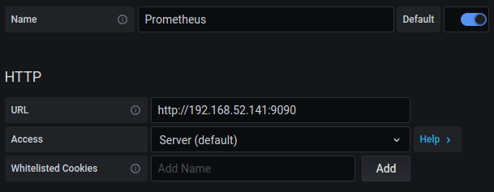

# Torchserve on Kubernetes

## Security Changes
TorchServe now enforces token authorization and model API control by default. Refer the following documentation for more information: [Token Authorization](https://github.com/pytorch/serve/blob/master/docs/token_authorization_api.md), [Model API control](https://github.com/pytorch/serve/blob/master/docs/model_api_control.md)

## Overview

This page demonstrates a Torchserve deployment in Kubernetes using Helm Charts. It uses the DockerHub Torchserve Image for the pods and a PersistentVolume for storing config / model files.

## Using Azure AKS Cluster

[AKS Cluster setup](./AKS/README.md##-TorchServe-on-Azure-Kubernetes-Service-(AKS))

## Using AWS EKS Cluster

[EKS Cluster setup](./EKS/README.md#-Torchserve-on-Elastic-Kubernetes-service-(EKS))

## Using Google GKE Cluster

[GKE Cluster setup](./GKE/README.md##-TorchServe-on-Google-Kubernetes-Engine-(GKE))

## Deploy TorchServe using Helm Charts

The following table describes all the parameters for the Helm Chart.

| Parameter          | Description              | Default                         |
| ------------------ | ------------------------ | ------------------------------- |
| `image`            | Torchserve Serving image | `pytorch/torchserve:latest-gpu` |
| `inference_port`   | TS Inference port        | `8080`                          |
| `management_port`  | TS Management port       | `8081`                          |
| `metrics_port`     | TS Metrics port          | `8082`                          |
| `replicas`         | K8S deployment replicas  | `1`                             |
| `model-store`      | EFS mountpath            | `/home/model-server/shared/`    |
| `persistence.size` | Storage size to request  | `1Gi`                           |
| `n_gpu`            | Number of GPU in a TS Pod| `1`                             |
| `n_cpu`            | Number of CPU in a TS Pod| `1`                             |
| `memory_limit`     | TS Pod memory limit      | `4Gi`                           |
| `memory_request`   | TS Pod memory request    | `1Gi`                           |

Edit the values in `values.yaml` with the right parameters.  Somethings to consider,

* Set torchserve_image to the `pytorch/torchserve:latest` if your nodes are CPU.
* Set `persistence.size` based on the size of your models.
* The value of `replicas` should be less than number of Nodes in the Node group.
* `n_gpu` would be exposed to TS container by docker. This should be set to `number_of_gpu` in `config.properties` above.
* `n_gpu` & `n_cpu` values are used on a per pod level and not in the entire cluster level

```yaml
# Default values for torchserve helm chart.

torchserve_image: pytorch/torchserve:latest-gpu

namespace: torchserve

torchserve:
  management_port: 8081
  inference_port: 8080
  metrics_port: 8082
  grpc_inference_port: 7070
  pvd_mount: /home/model-server/shared/
  n_gpu: 1
  n_cpu: 1
  memory_limit: 4Gi
  memory_request: 1Gi

deployment:
  replicas: 1 # Changes this to number of node in Node Group

persitant_volume:
  size: 1Gi
```

To install Torchserve run ```helm install ts .```

```bash
ubuntu@ip-172-31-50-36:~/serve/kubernetes/Helm$ helm install ts .
NAME: ts
LAST DEPLOYED: Wed Jul 29 08:29:04 2020
NAMESPACE: default
STATUS: deployed
REVISION: 1
TEST SUITE: None
```

Verify that torchserve has successfully started by executing ```kubectl exec pod/torchserve-fff -- cat logs/ts_log.log``` on your torchserve pod. You can get this id by lookingup `kubectl get po --all-namespaces`

Your output should should look similar to

```bash
ubuntu@ip-172-31-50-36:~/serve/kubernetes$ kubectl exec pod/torchserve-fff -- cat logs/ts_log.log
2020-07-29 08:29:08,295 [INFO ] main org.pytorch.serve.ModelServer -
Torchserve version: 0.1.1
TS Home: /home/venv/lib/python3.6/site-packages
Current directory: /home/model-server
......
```

## Test Torchserve Installation

Fetch the Load Balancer External IP by executing

```bash
kubectl get svc
```

You should see an entry similar to

```bash
ubuntu@ip-172-31-65-0:~/ts/rel/serve$ kubectl get svc
NAME         TYPE           CLUSTER-IP      EXTERNAL-IP                                                              PORT(S)                         AGE
torchserve   LoadBalancer   10.100.142.22   your-loadbalancer-address   8080:31115/TCP,8081:31751/TCP   14m
```

Now execute the following commands to test Management / Prediction APIs

```bash
curl http://your-loadbalancer-address:8081/models

# You should something similar to the following
{
  "models": [
    {
      "modelName": "mnist",
      "modelUrl": "mnist.mar"
    },
    {
      "modelName": "squeezenet1_1",
      "modelUrl": "squeezenet1_1.mar"
    }
  ]
}


curl http://your-loadbalancer-address:8081/models/squeezenet1_1

# You should see something similar to the following
[
  {
    "modelName": "squeezenet1_1",
    "modelVersion": "1.0",
    "modelUrl": "squeezenet1_1.mar",
    "runtime": "python",
    "minWorkers": 3,
    "maxWorkers": 3,
    "batchSize": 1,
    "maxBatchDelay": 100,
    "loadedAtStartup": false,
    "workers": [
      {
        "id": "9000",
        "startTime": "2020-07-23T18:34:33.201Z",
        "status": "READY",
        "gpu": true,
        "memoryUsage": 177491968
      },
      {
        "id": "9001",
        "startTime": "2020-07-23T18:34:33.204Z",
        "status": "READY",
        "gpu": true,
        "memoryUsage": 177569792
      },
      {
        "id": "9002",
        "startTime": "2020-07-23T18:34:33.204Z",
        "status": "READY",
        "gpu": true,
        "memoryUsage": 177872896
      }
    ]
  }
]


wget https://raw.githubusercontent.com/pytorch/serve/master/docs/images/kitten_small.jpg
curl -X POST  http://your-loadbalancer-address:8080/predictions/squeezenet1_1 -T kitten_small.jpg

# You should something similar to the following
[
  {
    "lynx": 0.5370921492576599
  },
  {
    "tabby": 0.28355881571769714
  },
  {
    "Egyptian_cat": 0.10669822245836258
  },
  {
    "tiger_cat": 0.06301568448543549
  },
  {
    "leopard": 0.006023923866450787
  }
]
```

## Metrics

## Install prometheus

```bash
helm repo add prometheus-community https://prometheus-community.github.io/helm-charts
helm install prometheus prometheus-community/prometheus
```

## Install grafana

```bash
helm repo add grafana https://grafana.github.io/helm-charts
helm install grafana grafana/grafana
```

## Add prometheus as data source in grafana

```bash
kubectl get pods

NAME                                             READY   STATUS    RESTARTS   AGE
grafana-cbd8775fd-6f8l5                          1/1     Running   0          4h12m
model-store-pod                                  1/1     Running   0          4h35m
prometheus-alertmanager-776df7bfb5-hpsp4         2/2     Running   0          4h42m
prometheus-kube-state-metrics-6df5d44568-zkcm2   1/1     Running   0          4h42m
prometheus-node-exporter-fvsd6                   1/1     Running   0          4h42m
prometheus-node-exporter-tmfh8                   1/1     Running   0          4h42m
prometheus-pushgateway-85948997f7-4s4bj          1/1     Running   0          4h42m
prometheus-server-f8677599b-xmjbt                2/2     Running   0          4h42m
torchserve-7d468f9894-fvmpj                      1/1     Running   0          4h33m

kubectl get pod prometheus-server-f8677599b-xmjbt -o jsonpath='{.status.podIPs[0].ip}'
192.168.52.141
```

## Expose grafana with loadbalancer

```bash
kubectl patch service grafana -p '{"spec": {"type": "LoadBalancer"}}'

kubectl get svc grafana -o jsonpath='{.status.loadBalancer.ingress[0].hostname}'
```

Get admin user password by running:

```bash
kubectl get secret --namespace default grafana -o jsonpath="{.data.admin-password}" | base64 --decode ; echo
```

## Login to grafana

<b>Username:</b> admin
<b>Password:</b> <--The password got from previous step-->

Open Grafana in browser with the url - `<http://your.grafana.loadbalancer.address:3000>`

Add Prometheus data source



The TS metrics will be available in Prometheus for Grafana dashboards.

## Logging

Follow the link for log aggregation with EFK Stack.\
[Log aggregation using EFK stack](https://www.digitalocean.com/community/tutorials/how-to-set-up-an-elasticsearch-fluentd-and-kibana-efk-logging-stack-on-kubernetes)

## Troubleshooting

### Troubleshooting Torchserve Helm Chart

#### Check configuration

* Incorrect values in ``values.yaml``
  * If you changed values in `torchserve.pvd_mount`, make sure `config.properties` was also updated to match the values.
* Invalid `config.properties`
  * You can verify these values by running this for local TS installation.

#### TS Pods hanging in *Pending* state

* Ensure you have available Nodes in Node Group.

#### Helm Installation Issues

* You may inspect the values by running ``helm list`` and `helm get all ts` to verify if the values used for the installation.
* You can uninstall / reinstall the helm chart by executing  `helm uninstall ts` and `helm install ts .`
* `helm install ts .` fails with `Error: create: failed to create: Request entity too large: limit is 3145728` or `invalid: data: Too long: must have at most 1048576 characters`.
  * Ensure that you don't have any stale files in your kubernetes directory where you are executing the command. If so, move them out of the directory or add them to .helmignore file.
* `kubectl get svc` does't show my torchserve service
  * Try reinstalling the helm chart by executing `helm uninstall ts` and `helm install ts .`
* "Error: unable to build kubernetes objects from release manifest: unable to recognize “”: no matches for kind “ClusterConfig” in version “eksctl.io/v1alpha5”"
  * Helm is picking up other .yaml files. Make sure you’ve added other files correctly to .helmignore. It should only run with values.yaml.
* `kubectl describe pod` shows error message "0/1 nodes are available: 1 Insufficient cpu."
  * Ensure that the `n_cpu` value in `values.yaml` is set to a number that can be supported by the nodes in the cluster.

## Autoscaling
  [Autoscaling with torchserve metrics](autoscale.md)

## Session Affinity with Multiple Torchserve pods

### Pre-requisites

 - Follow the instructions above and deploy Torchserve with more than 1 replica to the kubernetes cluster
 - Download Istio and add to path as shown [here](https://istio.io/latest/docs/setup/getting-started/#download)
 - Install Istio with below command
   - `istioctl install --set meshConfig.accessLogFile=/dev/stdout`

### Steps

Now we have multiple replicas of Torchserve running and istio installed. We can apply gateway, virtual service and destination rule to enable session affinity to the user requests.

 - Apply the istio gateway via `kubectl apply -f gateway.yaml`
   - This gateway exposes all the host behind it via port 80 as defined in the yaml file.
 - Apply the virtual service with command `kubectl apply -f virtual_service.yaml`
   - This with look for header named `protocol` in the incoming request and forward the request to Torchserve service. If the `protocol` header has a value `rest` then the request is forwarded to port `8080` of Torchserve service and if the `protocol` header has a value `grpc` then the request is forwarded to port `7070` for Torchserve service.
 - Apply the destination Rule using the command `kubectl apply -f destination_rule.yaml`.
   - The destination rule look for a http cookie with a key `session_id`. The request with `session_id` is served by the same pod that served the previous request with the same `session_id`

### HTTP Inference

- Fetch the external IP from istio-ingress gateway using the below command

```bash
ubuntu@ubuntu$ kubectl get svc -n istio-system
NAME                   TYPE           CLUSTER-IP      EXTERNAL-IP                                                               PORT(S)                                                   AGE
istio-ingressgateway   LoadBalancer   10.100.84.243   a918b2zzzzzzzzzzzzzzzzzzzzzz-1466623565.us-west-2.elb.amazonaws.com   15021:32270/TCP,80:31978/TCP,443:31775/TCP,70:31778/TCP   2d6h
```

- Make Request as shown below

```bash
curl -v -H "protocol: REST" --cookie "session_id="12345" http://a918b2d70dbddzzzzzzzzzzz49ec8cf03b-1466623565.us-west-2.elb.amazonaws.com:80/predictions/<model_name> -d "data=<input-string>"
```

### gRPC Inference

- Refer [grpc_api](../docs/grpc_api.md) to generate python files and run

```bash
python ts_scripts/torchserve_grpc_client.py infer <model_name> <input-string>
```


## Roadmap

* [] Log / Metrics Aggregation using [AWS Container Insights](https://docs.aws.amazon.com/AmazonCloudWatch/latest/monitoring/ContainerInsights.html)
* [] EFK Stack Integration
* [] Readiness / Liveness Probes
* [] Canary
* [] Cloud agnostic Distributed Storage example
