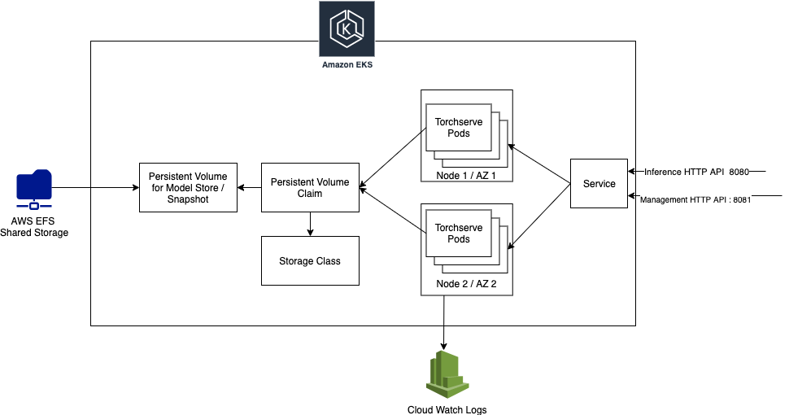

* ## Torchserve on Kubernetes

  ## Overview

  This page demonstrates a Torchserve deployment in Kubernetes using Helm Charts. It uses the DockerHub Torchserve Image for the pods and a PersistentVolume for storing config / model files.

  

  In the following sections we would 

  * Create a Cluster & Create a PersistentVolume to store models and config
  * Use Helm charts to deploy Torchserve

  ## Create a Cluster & Create a PersistentVolume to store models and config

  If you are using AWS EKS to deploy TorchServe, see [AWS document](EKS/README.md) to create a EKS Cluster and a PersistentVolume backed by EFS.
  If you are using Azure AKS to deploy TorchServe, see [Azure document](AKS/README.md) to do the same job.

  ## Deploy TorchServe using Helm Charts

  Enter the ServeInstall directory ```cd ServeInstall```

  The following table describes all the parameters for the Helm Chart.

  | Parameter          | Description               | Default                         |
  | ------------------ | ------------------------- | ------------------------------- |
  | `image`            | Torchserve Serving image  | `pytorch/torchserve:latest-gpu` |
  | `management-port`  | TS Inference port         | `8080`                          |
  | `inference-port`   | TS Management port        | `8081`                          |
  | `replicas`         | K8S deployment replicas   | `1`                             |
  | `model-store`      | EFS mountpath             | `/home/model-server/shared/`    |
  | `persistence.size` | Storage size to request   | `1Gi`                           |
  | `n_gpu`            | Number of GPU in a TS Pod | `1`                             |
  | `n_cpu`            | Number of CPU in a TS Pod | `1`                             |
  | `memory_limit`     | TS Pod memory limit       | `4Gi`                           |
  | `memory_request`   | TS Pod memory request     | `1Gi`                           |


  Edit the values in `values.yaml` with the right parameters.  Somethings to consider,

  * Set torchserve_image to the `pytorch/torchserve:latest` if your nodes are CPU.
  * Set `persistence.size` based on the size of your models.
  * The value of `replicas` should be less than number of Nodes in the Node group.
  * `n_gpu` would be exposed to TS container by docker. This should be set to `number_of_gpu` in `config.properties` above.
  * `n_gpu` & `n_cpu` values are used on a per pod level and not in the entire cluster level

  ```yaml
  # Default values for torchserve helm chart.
  
  torchserve_image: pytorch/torchserve:latest-gpu
  
  namespace: torchserve
  
  torchserve:
    management_port: 8081
    inference_port: 8080
    pvd_mount: /home/model-server/shared/
    n_gpu: 1
    n_cpu: 1
    memory_limit: 4Gi
    memory_request: 1Gi
  
  deployment:
    replicas: 1 # Changes this to number of node in Node Group
  
  persitant_volume:
    size: 1Gi
  ```


  To install Torchserve run ```helm install ts .```  


  ```bash
  ubuntu@ip-172-31-50-36:~/serve/kubernetes$ helm install ts .
  NAME: ts
  LAST DEPLOYED: Wed Jul 29 08:29:04 2020
  NAMESPACE: default
  STATUS: deployed
  REVISION: 1
  TEST SUITE: None
  ```


  Verify that torchserve has succesfully started by executing ```kubectl exec pod/torchserve-fff -- cat logs/ts_log.log``` on your torchserve pod. You can get this id by lookingup `kubectl get po --all-namespaces`

  

  Your output should should look similar to 

  ```bash
  ubuntu@ip-172-31-50-36:~/serve/kubernetes$ kubectl exec pod/torchserve-fff -- cat logs/ts_log.log
  2020-07-29 08:29:08,295 [INFO ] main org.pytorch.serve.ModelServer -
  Torchserve version: 0.1.1
  TS Home: /home/venv/lib/python3.6/site-packages
  Current directory: /home/model-server
  ......
  ```


  ## Test Torchserve Installation

  Fetch the Load Balancer Extenal IP by executing 

  ```bash
  kubectl get svc
  ```

  You should see an entry similar to 

  ```bash
  ubuntu@ip-172-31-65-0:~/ts/rel/serve$ kubectl get svc
  NAME         TYPE           CLUSTER-IP      EXTERNAL-IP                                                              PORT(S)                         AGE
  torchserve   LoadBalancer   10.100.142.22   your_elb.us-west-2.elb.amazonaws.com   8080:31115/TCP,8081:31751/TCP   14m
  ```

  Now execute the following commands to test Management / Prediction APIs

  ```bash
  curl http://your_elb.us-west-2.elb.amazonaws.com:8081/models
  
  # You should something similar to the following
  {
    "models": [
      {
        "modelName": "mnist",
        "modelUrl": "mnist.mar"
      },
      {
        "modelName": "squeezenet1_1",
        "modelUrl": "squeezenet1_1.mar"
      }
    ]
  }
  
  
  curl http://your_elb.us-west-2.elb.amazonaws.com.us-west-2.elb.amazonaws.com:8081/models/squeezenet1_1
  
  # You should see something similar to the following
  [
    {
      "modelName": "squeezenet1_1",
      "modelVersion": "1.0",
      "modelUrl": "squeezenet1_1.mar",
      "runtime": "python",
      "minWorkers": 3,
      "maxWorkers": 3,
      "batchSize": 1,
      "maxBatchDelay": 100,
      "loadedAtStartup": false,
      "workers": [
        {
          "id": "9000",
          "startTime": "2020-07-23T18:34:33.201Z",
          "status": "READY",
          "gpu": true,
          "memoryUsage": 177491968
        },
        {
          "id": "9001",
          "startTime": "2020-07-23T18:34:33.204Z",
          "status": "READY",
          "gpu": true,
          "memoryUsage": 177569792
        },
        {
          "id": "9002",
          "startTime": "2020-07-23T18:34:33.204Z",
          "status": "READY",
          "gpu": true,
          "memoryUsage": 177872896
        }
      ]
    }
  ]
  
  
  wget https://raw.githubusercontent.com/pytorch/serve/master/docs/images/kitten_small.jpg
  curl -X POST  http://your_elb.us-west-2.elb.amazonaws.com.us-west-2.elb.amazonaws.com:8080/predictions/squeezenet1_1 -T kitten_small.jpg
  
  # You should something similar to the following
  [
    {
      "lynx": 0.5370921492576599
    },
    {
      "tabby": 0.28355881571769714
    },
    {
      "Egyptian_cat": 0.10669822245836258
    },
    {
      "tiger_cat": 0.06301568448543549
    },
    {
      "leopard": 0.006023923866450787
    }
  ]
  ```


  ## Troubleshooting


  **Troubleshooting EKCTL Cluster Creation**

  Possible errors in this step may be a result of 

  * AWS Account limits. 
  * IAM Policy of the role used during cluster creation - [Minimum IAM Policy](https://eksctl.io/usage/minimum-iam-policies/)

  Inspect your Cloudformation console' events tab, to diagonize any possible issues. You should able be able to find the following resources at the end of this step in the respective AWS consoles

  * EKS Cluser in the EKS UI
  * AutoScaling Group of the Node Groups
  * EC2 Node correponding to the node groups.

  

  Also, take a look at [eksctl](https://eksctl.io/introduction/) website / [github repo](https://github.com/weaveworks/eksctl/issues) for any issues. 

  

  **Troubleshooting EFS Persitant Volume Creation** 

  

  Possible error in this step may be a result of one of the following. Your pod my be struck in *Init / Creating* forever / persitant volume claim may be in *Pending* forever.

  * Incorrect CLUSTER_NAME or Duplicate MOUNT_TARGET_GROUP_NAME in `setup_efs.sh` 

    * Rerun the script with a different `MOUNT_TARGET_GROUP_NAME` to avoid conflict with a previous run

  * Faulty execution of ``setup_efs.sh`` 

    * Look up the screenshots above for the expected AWS Console UI for Security group & EFS. If you dont see the Ingress permissions / Mount points created, Execute steps from ```setup_efs.sh``` to make sure that they complete as expected.  We need 1 Mount point for every region where Nodes would be deployed. *This step is very critical to the setup* . If you run to any errors the `aws-efs-csi` driver might throw errors which might be hard to diagonize.

  * EFS CSI Driver installation

    * Ensure that ```--set efsProvisioner.efsFileSystemId=YOUR-EFS-FS-ID --set efsProvisioner.awsRegion=us-west-2 --set efsProvisioner.reclaimPolicy=Retain --generate-name``` is set correctly 

    * You may inspect the values by running ``helm list`` and ```helm get all YOUR_RELEASE_ID``` to verify if the values used for the installation

    * You can execute the following commands to inspect the pods / events to debug EFS / CSI Issues

      ```bash
      kubectl get events --sort-by='.metadata.creationTimestamp'
      
      kubectl get pod --all-namespaces # Get the Pod ID
      
      kubectl logs pod/efs-provisioner-YOUR_POD
      kubectl logs pod/efs-provisioner-YOUR_POD
      kubectl describe pod/efs-provisioner-YOUR_POD
      ```

    * A more involved debugging step would involve installing a simple example app to verify EFS / EKS setup as described [here](https://docs.aws.amazon.com/eks/latest/userguide/efs-csi.html) (Section : *To deploy a sample application and verify that the CSI driver is working*)

    * More info about the driver can be found at 

      * [Github Page](https://github.com/kubernetes-sigs/aws-efs-csi-driver/) / [Helm Chart](https://github.com/kubernetes-incubator/external-storage/tree/master/aws/efs) / [EKS Workshop](https://www.eksworkshop.com/beginner/190_efs/efs-provisioner/) / [AWS Docs](https://aws.amazon.com/premiumsupport/knowledge-center/eks-persistent-storage/)

  

  

  **Troubleshooting Torchserve Helm Chart**

  

  Possible errors in this step may be a result of 

  * Incorrect values in ``values.yaml``
    * Changing values in `torchserve.pvd_mount`  would need corresponding change in `config.properties`
  * Invalid `config.properties`
    * You can verify these values by running this for local TS installation
  * TS Pods in *Pending* state
    * Ensure you have available Nodes in Node Group

  * Helm Installation
    * You may inspect the values by running ``helm list`` and `helm get all ts` to verify if the values used for the installation
    * You can uninstall / reinstall the helm chart by executing  `helm uninstall ts` and `helm install ts .`
    * If you get an error `invalid: data: Too long: must have at most 1048576 characters`, ensure that you dont have any stale files in your kubernetes dir. Else add them to .helmignore file.

  

  ## Deleting Resources

  * Delete EFS `aws efs delete-file-system --file-system-id $FILE_SYSTEM_ID`
  * Delete Security Groups ``aws ec2 delete-security-group --group-id $MOUNT_TARGET_GROUP_ID` 
  * Delete EKS cluster `eksctl delete cluster --name $CLUSTER_NAME`

If you run to any issue. Delete these manually from the UI. Note that, EKS cluster & node are deployed as CFN templates. 


  ## Roadmap

  * [] Autoscaling
  * [] Log / Metrics Aggregation using [AWS Container Insights](https://docs.aws.amazon.com/AmazonCloudWatch/latest/monitoring/ContainerInsights.html)
  * [] EFK Stack Integration
  * [] Readiness / Liveness Probes
  * [] Canary
  * [] Cloud agnostic Distributed Storage example