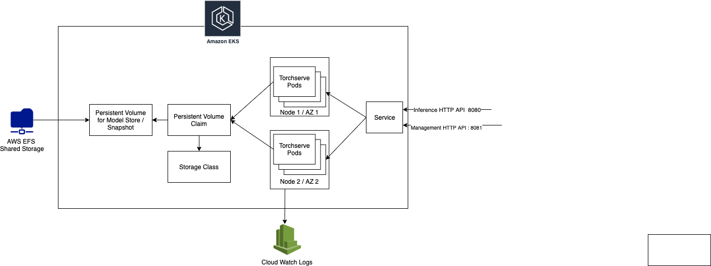

## Torchserve on Kubernetes

## Overview
 
This page demonstrates a Torchserve deployment in Kubernetes using Helm Charts. It uses the DockerHub Torchserve Image for the pods and a PersistentVolume for storing config / model files.



In the following sections we would 
* Create a EKS Cluster for deploying Torchserve
* Create a PersistentVolume backed by EFS to store models and config
* Use Helm charts to deploy Torchserve

## Prerequisites

We would need the following tools to be installed to setup the K8S Torchserve cluster.

* AWS CLI - [Installation](https://docs.aws.amazon.com/cli/latest/userguide/install-cliv2-linux.html)
* eksctl - [Installation](https://docs.aws.amazon.com/eks/latest/userguide/getting-started-eksctl.html)
* kubectl - [Installation](https://kubernetes.io/docs/tasks/tools/install-kubectl/)
* helm - [Installation](https://helm.sh/docs/intro/install/)

## EKS Cluster setup

Is you have an existing EKS / Kubernetes cluster you may skip this section and skip ahead to PersistentVolume preparation. 

Ensure you have your AWS CLI configured with the credentials of an account with appropriate permissions. The following steps would create a EKS cluster, install all the required driver for NVIDIA GPU.


### Creating a EKS cluster

**EKS Optimized AMI Subscription**

First subscribe to EKS-optimized AMI with GPU Support in the AWS Marketplace. Subscribe [here](https://aws.amazon.com/marketplace/pp/B07GRHFXGM). These hosts would be used for the EKS Node Group. 

**Create a EKS Cluster**

To create a cluster run the following command. 

```eksctl create cluster -f templates/eks_cluster.yaml```

This would create a EKS cluster named **TorchserveCluster**

**NVIDIA Plugin**

The NVIDIA device plugin for Kubernetes is a Daemonset that allows you to run GPU enabled containers. The instructions for installing the plugin can be found [here](https://github.com/NVIDIA/k8s-device-plugin#installing-via-helm-installfrom-the-nvidia-device-plugin-helm-repository)

```
helm repo add nvdp https://nvidia.github.io/k8s-device-plugin
helm repo update
helm install \
    --version=0.6.0 \
    --generate-name \
    nvdp/nvidia-device-plugin
```

## Setup PersistentVolume backed by EFS

Torchserve Helm Chart needs a PersistentVolume with a PVC label `model-store-claim` prepared with a specific folder structure shown below. This PersistentVolume contains the snapshot & model files which are shared between multiple pods of the torchserve deployment.

    model-server/
    ├── config
    │   └── config.properties
    └── model-store
        ├── mnist.mar
        └── squeezenet1_1.mar


**Create EFS Volume for the EKS Cluster**

This section describes steps to prepare a EFS backed PersistentVolume that would be used by the TS Helm Chart. To prepare a EFS volume as a shared model / config store we have to create a EFS file system, Security Group, Ingress rule, Mount Targets to enable EFS communicate across NAT of the EKS cluster. 

The heavy lifting for these steps is performed by ``setup_efs.sh`` script. To run the script, Update the following variables in `setup_efs.sh`

    CLUSTER_NAME=TorchserveCluster # EKS TS Cluser Name
    MOUNT_TARGET_GROUP_NAME="eks-efs-group"

Then run `./setup_efs.sh`

Upon completion of the script it would emit a EFS volume DNS Name similar to `fs-ab1cd.efs.us-west-2.amazonaws.com` where `fs-ab1cd` is the EFS filesystem id.

**Prepare PersistentVolume for Deployment**

We use the [ELF Provisioner Helm Chart](https://github.com/helm/charts/tree/master/stable/efs-provisioner) to create a PersistentVolume backed by EFS. Run the following command to set this up.

```
helm repo add stable https://kubernetes-charts.storage.googleapis.com
helm install stable/efs-provisioner --set efsProvisioner.efsFileSystemId=fs-ab1cd --set efsProvisioner.awsRegion=us-west-2 --set efsProvisioner.reclaimPolicy=Retain --generate-name
```

Now create a PersistentVolume by running 

```kubectl apply -f templates/efs_pv_claim.yaml```

This would also create a pod named `pod/model-store-pod` with PersistentVolume mounted so that we can copy the MAR / config files in the same folder structure described above. 

First create a TS config file that would be used for the deployment. Copy the following contents in to a file called `config.properties` in to the directory

    inference_address=http://0.0.0.0:8080
    management_address=http://0.0.0.0:8081
    NUM_WORKERS=1
    number_of_gpu=1
    number_of_netty_threads=32
    job_queue_size=1000
    model_store=/home/model-server/shared/model-store
    model_snapshot={"name":"startup.cfg","modelCount":2,"models":{"squeezenet1_1":{"1.0":{"defaultVersion":true,"marName":"squeezenet1_1.mar","minWorkers":3,"maxWorkers":3,"batchSize":1,"maxBatchDelay":100,"responseTimeout":120}},"mnist":{"1.0":{"defaultVersion":true,"marName":"mnist.mar","minWorkers":5,"maxWorkers":5,"batchSize":1,"maxBatchDelay":200,"responseTimeout":60}}}}

Now copy the files over to PersistentVolume using the following commands.

```
wget https://torchserve.s3.amazonaws.com/mar_files/squeezenet1_1.mar
wget https://torchserve.s3.amazonaws.com/mar_files/mnist.mar

kubectl exec --tty pod/model-store-pod -- mkdir /pv/model-store/
kubectl cp squeezenet1_1.mar model-store-pod:/pv/model-store/squeezenet1_1.mar
kubectl cp mnist.mar model-store-pod:/pv/model-store/mnist.mar


kubectl exec --tty pod/model-store-pod -- mkdir /pv/config/
kubectl cp config.properties model-store-pod:/pv/config/config.properties
```

Finally terminate the pod - `kubectl delete pod/model-store-pod`.


## Deploy TorchServe using Helm Charts

To install Torchserve for the repository, run the following command from the root of the PyTorch dir after populating the `Values.yaml` with the right parameters.

```helm install ts ./kubernetes/```


| Parameter | Description | Default |
|-----------|-------------|---------|
| `image` | Torchserve Serving image | `pytorch/torchserve:latest-gpu` |
| `management-port` | TS Inference port | `8080` |
| `inference-port` | TS Management port | `8081` |
| `replicas`| K8S deployment replicas | `1` |
| `model-store`| EFS mountpath | `/home/model-server/shared/` |
| `persistence.size`| Storage size to request | `1Gi` |
| `n_gpu`| Number of GPU | `1` |
| `n_cpu`| Number of CPU | `1` |
| `memory_limit`| TS Pod memory limit | `4Gi` |
| `memory_request`| TS Pod memory request | `1Gi` |


## Test Torchserve Installation

Fetch the Load Balancer Extenal IP by executing 

```
kubectl get svc
```

You should see an entry similar to 

```
ubuntu@ip-172-31-65-0:~/ts/rel/serve$ kubectl get svc
NAME         TYPE           CLUSTER-IP      EXTERNAL-IP                                                              PORT(S)                         AGE
torchserve   LoadBalancer   10.100.142.22   a28f287ac17ec472cacd83c0b1cae406-216059024.us-west-2.elb.amazonaws.com   8080:31115/TCP,8081:31751/TCP   14m
```

Now execute the following commands to test Management / Prediction APIs
```
curl http://a28f287ac17ec472cacd83c0b1cae406-216059024.us-west-2.elb.amazonaws.com:8081/models

# You should something similar to the following
{
  "models": [
    {
      "modelName": "mnist",
      "modelUrl": "mnist.mar"
    },
    {
      "modelName": "squeezenet1_1",
      "modelUrl": "squeezenet1_1.mar"
    }
  ]
}


curl http://a28f287ac17ec472cacd83c0b1cae406-216059024.us-west-2.elb.amazonaws.com:8081/models/squeezenet1_1/

# You should something similar to the following
[
  {
    "modelName": "squeezenet1_1",
    "modelVersion": "1.0",
    "modelUrl": "squeezenet1_1.mar",
    "runtime": "python",
    "minWorkers": 3,
    "maxWorkers": 3,
    "batchSize": 1,
    "maxBatchDelay": 100,
    "loadedAtStartup": false,
    "workers": [
      {
        "id": "9000",
        "startTime": "2020-07-23T18:34:33.201Z",
        "status": "READY",
        "gpu": true,
        "memoryUsage": 177491968
      },
      {
        "id": "9001",
        "startTime": "2020-07-23T18:34:33.204Z",
        "status": "READY",
        "gpu": true,
        "memoryUsage": 177569792
      },
      {
        "id": "9002",
        "startTime": "2020-07-23T18:34:33.204Z",
        "status": "READY",
        "gpu": true,
        "memoryUsage": 177872896
      }
    ]
  }
]


wget https://raw.githubusercontent.com/pytorch/serve/master/docs/images/kitten_small.jpg
curl -X POST  http://a28f287ac17ec472cacd83c0b1cae406-216059024.us-west-2.elb.amazonaws.com:8080/predictions/squeezenet1_1/ -T kitten_small.jpg

# You should something similar to the following
[
  {
    "lynx": 0.5370921492576599
  },
  {
    "tabby": 0.28355881571769714
  },
  {
    "Egyptian_cat": 0.10669822245836258
  },
  {
    "tiger_cat": 0.06301568448543549
  },
  {
    "leopard": 0.006023923866450787
  }
]
```


## Roadmap
* [] Autoscaling
* [] Log / Metrics Aggregation using [AWS Container Insights](https://docs.aws.amazon.com/AmazonCloudWatch/latest/monitoring/ContainerInsights.html)
* [] EFK Stack Integration
* [] Readiness / Liveness Probes
* [] Canary
* [] Cloud agnostic Distributed Storage example
