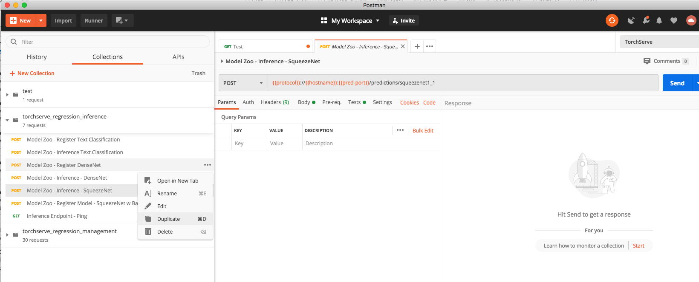

# TorchServe Regression Tests

This folder contains nightly regression tests execututed against TorchServe master.These tests use [POSTMAN](https://www.postman.com/downloads/) for exercising all the Management & Inference APIs.

### Latest Test Run Status

* CPU : 
* GPU : 
* Windows : 

Latest Test Logs : [CPU](https://torchserve-regression-test.s3.amazonaws.com/public/latest/test_exec.log) / [GPU](https://torchserve-regression-test-gpu.s3.amazonaws.com/public/latest/test_exec.log) / [Windows](https://torchserve-regression-test-win.s3.amazonaws.com/public/latest/test_exec.log)

Test Logs By Date - **Update Date in URL PATH of these links** : [CPU](https://torchserve-regression-test.s3.amazonaws.com/public/TS-NIGHTLY-REGRESSION-2020-12-11/tmp/test_exec.log) / [GPU](https://torchserve-regression-test-gpu.s3.amazonaws.com/public/TS-NIGHTLY-REGRESSION-2020-12-11/tmp/test_exec.log) / [Windows](https://torchserve-regression-test-win.s3.amazonaws.com/public/TS-NIGHTLY-REGRESSION-2020-12-11/test_exec.log)

For example update 2020-05-20 in https://torchserve-regression-test.s3.amazonaws.com/public/TS-NIGHTLY-REGRESSION-2020-05-20/tmp/test_exec.log with current date.

### Running the test manually.

Clone Torch Serve Repo & Build the Docker Image for the execition env.

```
git clone https://github.com/pytorch/serve
## optional
git checkout <branch_name>
```

### Build docker image

 - For CPU

```
cd serve/docker
./build_image.sh
```

This would build a docker Image with a pytorch/torchserve:dev-cpu in which we would run our Regression Tests.

```
docker run -it --user root pytorch/torchserve:dev-cpu /bin/bash
```

 - For GPU

```
cd serve/docker
./build_image.sh --gpu
```

This would build a docker Image with a pytorch/torchserve:dev-gpu in which we would run our Regression Tests.

```
docker run -it --gpus all --user root pytorch/torchserve:dev-gpu /bin/bash
```

In the Docker CLI execute the following cmds.

```
apt-get update 
apt-get install -y git wget sudo 
git clone https://github.com/pytorch/serve
cd serve 
git checkout <branch_name>
```
Install dependencies (if not already installed)
```bash
python ts_scripts/install_dependencies.py --environment=dev
```
> For GPU with Cuda 10.1, make sure to use argument `--cuda=cu101` to to the above command
Execute regression suite

To execute regression tests:
```bash
python test/regression_tests.py
```
You can view the results of test execution & the torchserve logs in the `test/artifacts/` directory

### Adding tests

To add to the tests, import a collection (in /postman) to Postman and add new requests.
Specifically to test for inference against a new model
* Open /postman/inference_data.json
* Add new json object with the new model url and payload.Refer [Datafile config](data_file_config.md) for details.




Afterwards, export the collection as a v2.1 collection and replace the existing exported collection.
To add a new suite of tests, add a new collection to /postman and update regression_tests.py to run the new collection and buildspec.yml to keep track of the report.
