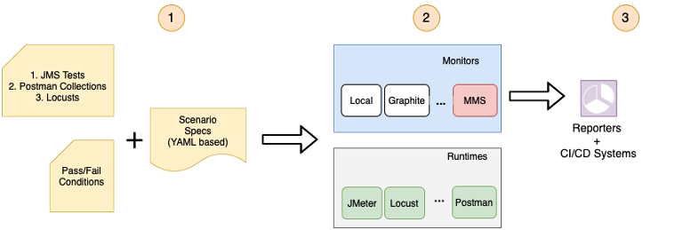
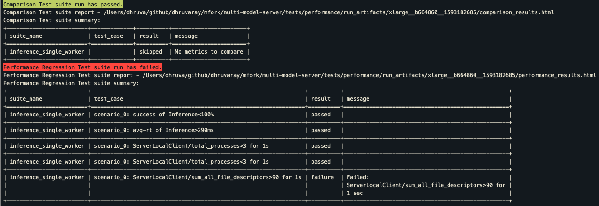

# Performance Regression Suite

## Motivation
The goal of this test suite is to ensure that performance regressions are detected early on. Ideally, with every commit 
made into the source control system. 

The salient features of the performance regression suite are

* Non-intrusive - Does not need any code-changes or instrumentation on the server being monitored. 
* It can be used to monitor a wide variety of server metrics - memory, cpu, io - in addition to 
traditional API level metrics such as latency, throughput etc. 
* It is easy to add custom metrics. For example, in Model server, `the number of workers spawned` would be an interesting 
metric to track. The platform allows for easy addition of these metrics.
* Test cases are specified in human readable yaml files. Every test case has a pass or fail status. This is determined 
by evaluating expressions specified in the test case. Every expression checks metrics against threshold values. For 
example, `memory consumed by all workers < 500M`, `number of worker processes < 3`.
* Test cases execute against compute environments. The threshold values are specific to the compute environment. It is
possible to specify multiple compute environments against which the test cases will run. It follows that each compute 
environment, will have its own threshold values.
* This suite leverages the open source [Taurus framework](https://gettaurus.org/). 
* This suite extends the Taurus framework in the following ways
   * Adds resource monitoring service. This allows Model Server specific metrics to be added. 
   * Environments as described earlier.
   * Specification of pass/fail criterion between two commits. For example, memory consumed by workers should not 
   increase by more than 10% between two commits for the given test case.
   * Custom reporting of results.
   
The building blocks of the performance regression suite and flow is captured in the following drawing

 

## Quickstart

### A. Installation
1. Install Taurus. Refer the [link](https://gettaurus.org/docs/Installation/) for more details on installation.
   ```bash   
    pip install bzt # Needs python3.6+
    ``` 
2. Install performance regression suite dependencies.
   ```bash 
    export MODEL_SERVER_HOME=<MODEL_SERVER_HOME_PATH>
    pip install -r $MODEL_SERVER_HOME/tests/performance/requirements.txt
    ``` 
3. Make sure that `git` is installed and the test suites are run from the Model Server working directory.

### B. Running the test suite
1. Make sure parameters set in [tests/global_config.yaml](tests/performance/tests/global_config.yaml) are correct.
2. To run the test suite execute [run_performance_suite.py](run_performance_suite.py) with the following 
parameters

   * `--artifacts-dir` or `-a` is a directory where the test case results will be stored. The default value is 
`$MODEL_SERVER_HOME/tests/performance/run_artifacts`.  

   * `--test-dir` or `-t` is a directory containing the test cases. The default value is 
`$MODEL_SERVER_HOME/tests/performance/tests`.
 
   * `--pattern` or `-p` glob pattern picks up certain test cases for execution within the `test-dir`. The default value picks up 
all test cases.
 
    * `--exclude-pattern` or `-x` glob pattern excludes certain test cases for execution within the `test-dir`. 
The default value excludes nothing.
 
   * `--env-name` or `-e` specifies the environment name to use while running the test cases. The environment name is the name of 
the file (minus the extension) found inside the environments folder in each test case. They encapsulate parameter 
values which are specific to the execution environment. This is a mandatory parameter.   

   * `--compare-local` or `--no-compare-local` specifies whether to do comparison with run artifacts data  available on local machine
   or the data available on S3 bucket.
   
   * `--compare-with` or `-c` specifies the commit id compare against.  The default value is 'HEAD~1'. The branch name, tag,
   can also be specified. The comparison happens if the run artifacts folder for the commit_id and env is available.
   


   The script does the following:  
   1. Starts the metrics monitoring server.
   2. Collects all the tests from test-dir satisfying the pattern, excluding exclude pattern and test starting with 'skip'
   3. Executes the collected tests
   4. Generates artifacts in the artifacts-dir against each test case.  
   5. Generate Pass Fail report for test cases
   6. Generate comparison report for specified commit id

3. Check the console logs, $artifacts-dir$/<run-dir>/performance_results.html report, comparison_result.csv, comparison_result.html 
and other artifacts.

**Steps are provided below**

```bash
export MODEL_SERVER_HOME=<MODEL_SERVER_HOME_PATH>
cd $MODEL_SERVER_HOME/tests/performance
 
# Note that Model server started and stopped by the individual test suite.
# check variables such as Model server PORT etc 
# vi tests/common/global_config.yaml 

#all tests
python -m run_performance_suite -e xlarge

#run a specific test 
python -m run_performance_suite -e xlarge -p inference_single_worker

```

### C. Understanding the test suite artifacts and reports
1. The $artifacts-dir/<run-dir>/performance_results.html is a summary report of the test run. 
2. Each test yaml is treated as a test suite. Each criteria in the test suite is treated as a test case. 
If the test suite does not specify any criteria, then the test suite is reported as skipped with 0 test cases.
3. For each test suite, a sub-directory is created containing relevant run artifacts. Important files in this directory are
   * metrics.csv -- contains the values of the various system-monitored metrics over time
   * metrics_agg.csv -- contains percentile values for columns in metrics.csv
   * finals_stats.csv -- contains the values of the various api metrics over time  
4. The $artifacts-dir/<run-dir>/comparison_results.html is a summary report which shows performance difference between
the last two commits.
5. The run completes with a console summary of the performance and comparision suites which have failed
 

### D. Understanding the test case components
A Test Case consists of the test.yaml, test.jmx, environments/*.yaml files and a global_config.yaml.
Below is the sample folder structure for 'api_description' test case:
```bash
tests
   -- api_description
      --- environments
          ---- xlarge.yaml
          ---- mac_xlarge.yaml
      --- api_description.jmx
      --- api_description.yaml
   -- global_config.yaml
```

1. global_config.yaml  
   - It is a master template for all_comm the test cases and is shared across all the tests.  
   - It contains all the common yaml sections, criteria, monitoring metrics etc.  
   - It also contain variables in the format ${variable} for metric thresholds and other test specific attributes.

2. environments/*.yaml  
   - A test case can have multiple environment files. If you have a environment dependent metrics you can create an environment
   yaml file. For ex. macos_xlarge, ubuntu_xlarge etc.  
   - The environment file contains values for all the variables mentioned in global_config.yaml and test.yaml.  

3. test.yaml  
   - The test.yaml is main yaml for a test case. Note the name of the yaml should be same as the test folder.  
   - It inherits the master template global_config.yaml.  
   And it usually contains the scenario, specific pre-processing commands (if any), and special criteria (if any) applicable for that test case only. 
   - If you want a behavior other than defined in the master template, It is possible to override sections of global_config.yaml in the individual test case. 
   The global_config.yaml's top-level sections can be overridden, merged, or appended based on below rules:  
        1. By default the dictionaries get merged.  
        2. If the dictionary key is prepended with '~' it will get overridden.  
        3. The list gets appended.  
4. test.jmx 
   -  The JMeter test scenario file. The test.yaml runs the scenarion mentioned in the .jmx file.


## Add a new test

Follow these three steps to add a new test case to the test suite.

1. Add scenario (a.k.a test suite)
2. Add metrics to monitor
3. Add pass/fail criteria (a.k.a test case)
4. Add compare criteria (a.k.a compare test cases)


#### 1. Add scenario (a.k.a test suite)
Create a folder for the test under `test_dir` location. A test generally comprises of a jmeter file - containing the 
load scenario and a yaml file which contains test scenarios specifying the conditions for failure or success. The
file-names should be identical to the folder name with their respective extensions. 

An example [jmeter script](tests/examples_starter/examples_starter.jmx) 
and a [scenario](tests/examples_starter/examples_starter.yaml) is provided as a template to get started.
    
Please note that various global configuration settings used by examples_starter.jmx script are specified in 
[tests/global_config.yaml](tests/performance/tests/global_config.yaml) file.
    
 ```tests/examples_starter/examples_starter.yaml
 execution:
 - concurrency: 1
   ramp-up: 1s
   hold-for: 40s
   scenario: Inference

 scenarios:
   Inference:
     script: examples_starter.jmx

 ```
    
To execute this test suite, run the following command
    
 ```bash
 export MODEL_SERVER_HOME=<MODEL_SERVER_HOME_PATH>
 cd $MODEL_SERVER_HOME/tests/performance
 python -m run_performance_suite -p examples_starter -e xlarge
 ```

**Note**:
Taurus provides support for different executors such as JMeter. Supported executor types can be found [here](https://gettaurus.org/docs/ExecutionSettings/).
Details about how to use an existing JMeter script are provided [here](https://gettaurus.org/docs/JMeter/). 


#### 2. Add metrics to monitor
Specify the metrics of interest in the services/monitoring section of the yaml.

1. Standalone monitoring server

   Use this technique if Model Server and the tests execute on different machines. Before running the test cases, 
   please start the [metrics_monitoring_server.py](metrics_monitoring_server.py) script. It will communicate server 
   metric data with the test client over sockets. The monitoring server runs on port 9009 by default.
    
   To start the monitoring server, run the following commands on the Model Server host:
    ```bash 
    export MODEL_SERVER_HOME=<MODEL_SERVER_HOME_PATH>
    pip install -r $MODEL_SERVER_HOME/tests/performance/requirements.txt
    python $MODEL_SERVER_HOME/tests/performance/metrics_monitoring_server.py --start
    ```     
      
   The monitoring section configuration is shown below. 
    
    ```yaml
    services:
      - module: monitoring
        server-agent:
          - address: <Model-Server-host>:9009 # metric monitoring service address
            label: Model-Server-inference-server  # Specified label will be used in reports instead of ip:port
            interval: 1s    # polling interval
            logging: True # those logs will be saved to "SAlogs_192.168.0.1_9009.csv" in the artifacts dir
            metrics: # metrics should be supported by monitoring service
              - sum_cpu_percent # cpu percent used by all the Model server processes and workers
              - sum_memory_percent
              - sum_num_handles
              - server_workers # no of Model Server workers
    ```
   The complete yaml can be found [here](tests/examples_remote_monitoring/examples_remote_monitoring.yaml)
    
   Use the command below to run the test suite.
    
    ```bash
    export MODEL_SERVER_HOME=<MODEL_SERVER_HOME_PATH>
    cd $MODEL_SERVER_HOME/tests/performance
    python -m run_performance_suite -p examples_remote_monitoring -e xlarge
    ```

2. Local monitoring plugin

   Use this technique if both Model Server and the tests run on the same host.   
   The monitoring section configuration is shown below.
    
    ```yaml
    modules:
      server_local_monitoring:
        # metrics_monitoring_taurus and dependencies should be in python path
        class : metrics_monitoring_taurus.Monitor # monitoring class.
    
    services:
      - module: server_local_monitoring # should be added in modules section
        ServerLocalClient: # keyword from metrics_monitoring_taurus.Monitor
        - interval: 1s
          metrics:
          - cpu
          - disk-space
          - mem
          - sum_memory_percent
    
    ```
   The complete yaml can be found [here](tests/examples_local_monitoring/examples_local_monitoring.yaml).
    
   Use the command below to run the test suite.
    
    ```bash
    export MODEL_SERVER_HOME=<MODEL_SERVER_HOME_PATH>
    cd $MODEL_SERVER_HOME/tests/performance
    python -m run_performance_suite -p examples_local_monitoring -e xlarge
    ```

#### 3. Add pass/fail criteria (a.k.a test case)

1. **Specify the pass/fail criteria**. Each pass-fail criterion maps to a test case in the generated report. We leverage the
pass-fail module from Taurus to achieve this functionality. More details can be found [here](https://gettaurus.org/docs/PassFail/).

   A sample criterion is shown below

    ```yaml
    reporting:
    - module: passfail
      criteria:
      - class: bzt.modules.monitoring.MonitoringCriteria
        subject: model-server/sum_num_handles
        condition: '>'
        threshold: 180
        timeframe: 1s
        fail: true
        stop: true
    
    ```

2. Specify the pass/fail criterion vis-a-vis a prior run. On completion, the test suite runner script compares the 
monitoring metrics with values from a previous run which was executed on same environment. The run results are stored 
in either a local folder or a S3 bucket based on the `compare-local` option. Metrics which have 'diff_percent' value 
specified in the pass/fail criterion are used for comparison with the previous run. 

   A sample criterion is shown below
    ```yaml
    reporting:
    - module: passfail
      criteria:
      - class: bzt.modules.monitoring.MonitoringCriteria
        subject: model-server/sum_num_handles
        condition: '>'
        threshold: 180
        timeframe: 1s
        fail: true
        stop: true
    
    ```
    Note that 
    1. At least one test suite run on the same environment should have happened in order to do the comparison.
    2. The $artifacts-dir$/<run-dir>/comparison_results.html is a summary report which shows performance difference 
    between the current run and user specified compare_with commit_id run.
    3. The test case fails if the diff_percent is greater than the specified value across runs.

3. Metrics available for pass-fail criteria  
  
   **System Metrics**
   > disk_used, memory_percent, read_count, write_count, read_bytes, write_byte

   | Syntax | Examples |
   | ------ | -------- |
   | system_{metricname} | system_disk_used, system_memory_percent, system_write_count |

   **Process Metrics**
   > cpu_percent, memory_percent, cpu_user_time, cpu_system_time, cpu_iowait_time, memory_rss, memory_vms, io_read_count, io_write_count, io_read_bytes, io_write_bytes, file_descriptors, threads

   - Frontend. Represents the Java process hosting the REST APIs 

     | Syntax | Examples |
     | ------ | -------- |
     | frontend_{metricname} | frontend_cpu_percent, frontend_memory_percent, frontend_cpu_iowait_time, frontend_memory_rss, frontend_io_write_bytes, frontend_threads |

   - Workers. Represents the python worker processes. Metrics for worker(s) are always available with an aggregate  
     > Aggregates  
     > sum, avg, min, max

     | Syntax | Examples |
     | ------ | -------- |
     | {aggregate}\_workers\_{metricname} | total_workers, sum_workers_memory_percent, avg_workers_iowait_time, min_workers_io_write_bytes, max_workers_threads |

   - All (Frontend + Workers). Represents aggregate metrics for both frontend and worker processes.
  
     | Syntax | Examples |
     | ------ | -------- |
     | {aggregate}\_all\_{metricname} | sum_all_memory_percent, avg_all_iowait_time, min_all_io_write_bytes, max_all_threads |

   - Miscellaneous
      * total_processes - Total number of processes spawned for frontend & workers
      * total_workers - Total number of workers spawned
      * orphans - Total number of orphan processes

4. Add compare criteria:  
There are two types of compare criteria you can add for metrics:
    1. diff_percent_run  
    This criteria is used to check the percent difference between first and last value of the metric for a run. 
    In other words it is used to verify if metrics values are same before and after the scenario run. 
    2. diff_percent_previous  
    Compare the metric aggregate values with previous run. Here we take aggregate min, max and avg of metric values for current run
    and previous run and check if percentage difference is not greater than diff_percent_previous. 

Note formula for percentage difference is abs(value1 - value2)/((value1 + value2)/2) * 100

## Guidelines for writing good test cases:
1. The 'timeframe' duration to check values for threshold criteria should be sufficiently large at least 5 sec. 
2. The duration specified using 'hold-for' property should also be sufficiently large at least 5 min.
3. When you use diff_percent_run, make sure that scenario (JMX script) results in deterministic state across different runs.

## Test Strategy & Cases
More details about our testing strategy and test cases can be found [here](TESTS.md) 

## FAQ

Q1. Is it possible to use the performance regression framework to test Model Server on Python2.7?

Yes. Even though, the performance regression framework needs Python 3.7+ (as Taurus requires Python 3.7+), there are two
possible ways to achieve this
* Please create a Python 2.7 virtual env which runs Model Server and a Python 3.7 virtual env which runs 
  the test framework and test cases.
* Alternatively, deploy the standalone monitoring agent on the Model Server instance and run the test cases against the remote
server. Note that the standalone monitoring agent works on both Python 2/3. 


